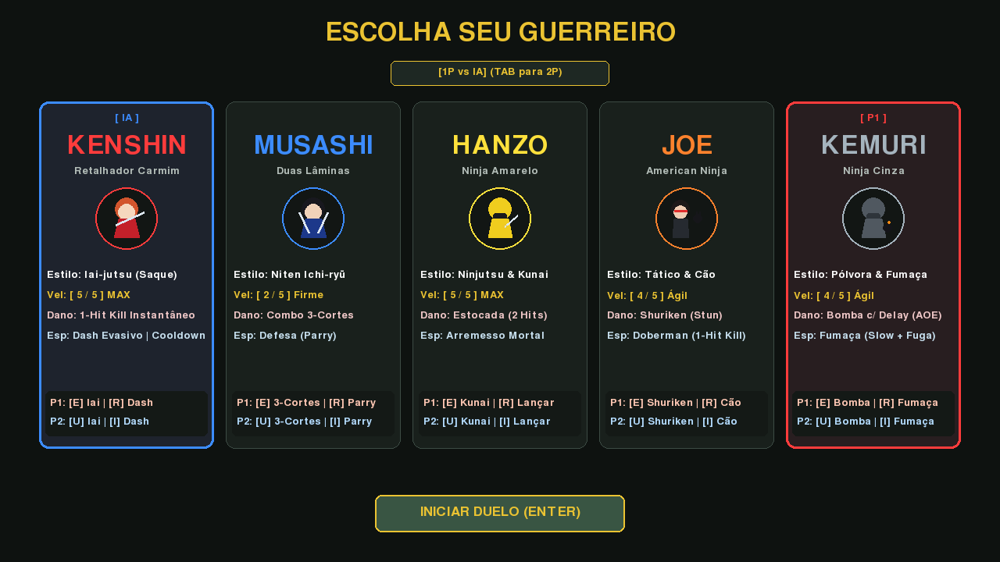
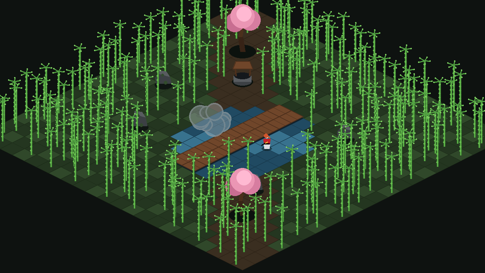

# Samurai Edge Demake

Um jogo de duelo isométrico 2.5D em pixel art tático, inspirado nos clássicos jogos de luta de espadas e demakes retrô.



---

## 🗡️ Visão Geral

Em um cenário isométrico ricamente detalhado com floresta de bambus cortáveis por golpes e explosões, laguinho com ponte, poço de pedra e cerejeiras em flor, dois guerreiros se enfrentam em duelos mortais onde precisão, alcance e timing definem a vitória.

O jogo suporta **Duelo 1P contra IA inteligente adaptativa** e **Modo 2 Jogadores Local** no mesmo teclado.



---

## 🥋 Guerreiros Selecionáveis

### 1. Kenshin (Retalhador Carmim)
- **Estilo**: Iai-jutsu (Saque Rápido)
- **Velocidade**: Máxima (5/5)
- **Ataque Primário [E / U]**: Avanço fulminante com corte Iai instantâneo (1-Hit Kill).
- **Secundário [R / I]**: Dash evasivo multidirecional.

### 2. Musashi (Duas Lâminas)
- **Estilo**: Niten Ichi-ryū
- **Velocidade**: Cadenciada (2/5)
- **Ataque Primário [E / U]**: Combo consecutivo de 3 golpes em rápida sucessão.
- **Secundário [R / I]**: Parry defensivo que apara ataques de espada, projéteis e cães de caça, atordoando o agressor.

### 3. Hanzo (Ninja Amarelo)
- **Estilo**: Ninjutsu & Kunai
- **Velocidade**: Máxima (5/5)
- **Ataque Primário [E / U]**: Estocada rápida de curta distância (requer 2 acertos para vencer).
- **Secundário [R / I]**: Arremesso fatal de Kunai (1-Hit Kill à distância). Se errar ou colidir com obstáculos, a kunai crava no solo e deve ser recuperada a pé.

### 4. Joe & Doberman (American Ninja)
- **Estilo**: Tático & Cão de Ataque
- **Velocidade**: Ágil (4/5)
- **Ataque Primário [E / U]**: Arremesso de Shurikens em leque rotativo que não matam, mas aplicam atordoamento tático (Stun).
- **Secundário [R / I]**: Comanda o Doberman companheiro em uma investida mortal (1-Hit Kill). Se o oponente acertar o cão durante o salto, o animal é nocauteado e fica fora de combate por 4.5 segundos.

### 5. Kemuri (Ninja Cinza)
- **Estilo**: Pólvora & Cortina de Fumaça
- **Velocidade**: Ágil (4/5)
- **Ataque Primário [E / U]**: Bomba explosiva com delay de pavio (1.5s) que causa detonação mortal em área (AOE) e corta todos os bambus circundantes.
- **Secundário [R / I]**: Bomba de fumaça instantânea que camufla o ninja com recuo evasivo e reduz a velocidade do oponente em 65% (Slow), permitindo escapar de combos.

---

## 🎮 Controles

| Ação | Jogador 1 (P1) | Jogador 2 (P2) |
| :--- | :--- | :--- |
| **Movimento** | `W, A, S, D` | `Setas Direcionais` |
| **Ataque Primário** | `E` | `U` |
| **Ação Secundária** | `R` | `I` |

- **Troca de Modo (1P vs IA / 2 Jogadores)**: `TAB` na tela de seleção.
- **Configurações de Controles**: Pressione `C` a qualquer momento para remapear teclas livremente.
- **Reiniciar Partida**: `Espaço`
- **Mudar Personagens / Voltar ao Menu**: `ESC`

---

## ⚙️ Instalação e Execução

### Pré-requisitos
- Python 3.10+
- `pygame-ce`

```bash
# Criar ambiente virtual
python3 -m venv venv
source venv/bin/activate

# Instalar dependências
pip install pygame-ce

# Executar o jogo
python3 main.py
```

### Executar Testes Automatizados
```bash
python3 test_game.py
```
