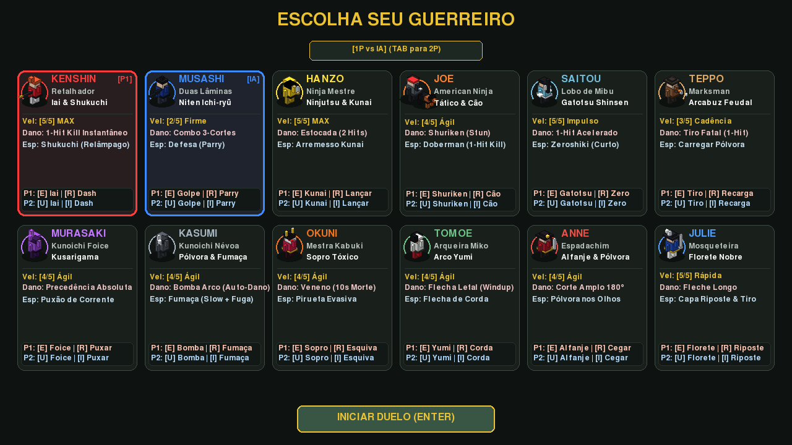
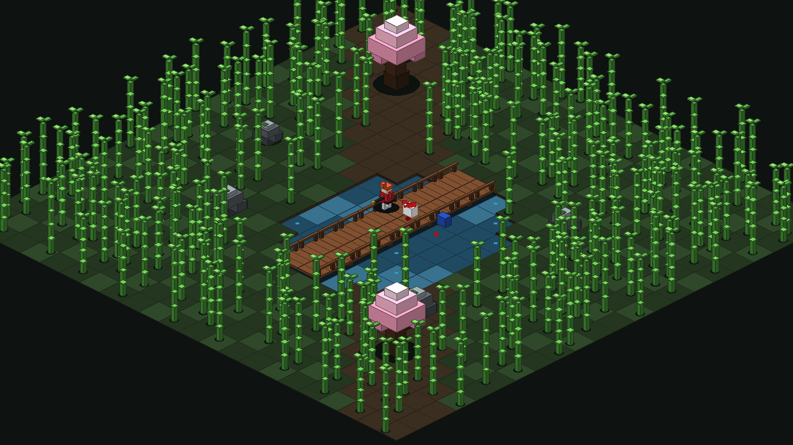

# Samurai Edge Demake

Um jogo de duelo isométrico em estilo **3D Voxel Art** tático, inspirado nos clássicos jogos de luta de espadas e demakes retrô com iluminação volumétrica direcional, violência cinematográfica de filme de samurai e elenco equilibrado.



---

## 📦 Downloads & Releases Prontas (GitHub Releases)

Você pode baixar os executáveis compilados diretamente na aba de **[Releases no GitHub](https://github.com/colletes/samurai-edge-demake/releases)**:

| Plataforma | Pacote de Download | Como Executar |
| :--- | :--- | :--- |
| 🍏 **macOS** | [`Samurai-Edge-Demake-macOS.zip`](https://github.com/colletes/samurai-edge-demake/releases/latest) | Descompacte e execute `SamuraiEdge.app`. Se o macOS exibir aviso de desenvolvedor não verificado: clique com botão direito $\to$ *Abrir*, ou execute no terminal: `xattr -cr /path/to/SamuraiEdge.app` |
| 🪟 **Windows** | [`Samurai-Edge-Demake-Windows.zip`](https://github.com/colletes/samurai-edge-demake/releases/latest) | Extraia a pasta zipada e dê dois cliques em `SamuraiEdge.exe` para jogar. |
| 🐧 **Linux** | [`Samurai-Edge-Demake-Linux.tar.gz`](https://github.com/colletes/samurai-edge-demake/releases/latest) | Extraia com `tar -xzvf Samurai-Edge-Demake-Linux.tar.gz` e execute `./SamuraiEdge/SamuraiEdge`. |

---

## 🎬 Violência Cinematográfica & Efeitos de Cinema Samurai (Kurosawa Noir)

- **Congelamento Dramático (Hitstop Freeze)**: Ao conectar um golpe letal, a simulação congela momentaneamente no impacto.
- **Filtro Kurosawa Noir**: Flash cinematográfico com tela desaturada em preto e branco de alto contraste e vinheta escura, preservando exclusivamente as partículas e voxels de sangue vermelho vivo.
- **Morte Atrasada (Delayed Death)**: A vítima permanece congelada em sua postura final por ~0.42s; após a pausa dramática de suspense, o corpo colapsa e se desfaz em peças volumétricas 3D com um gêiser de sangue contínuo.
- **Desmembramento e Física de Voxel Personalizados por Golpe**:
  - **Kenshin**: Corte diagonal estilo *Sanjuro* (tronco superior desliza e cai enquanto o inferior tomba).
  - **Murasaki & Doberman**: Decapitação limpa (cabeça é ejetada para o alto, rola e quica espalhando sangue).
  - **Kasumi**: Desintegração explosiva em 26 fragmentos chamuscados e ensanguentados.
  - **Okuni**: Dissolução cáustica em poça verde ácida em expansão.
  - **Saitou & Julie**: Perfuração transfixante torácica e tombo estirado para trás.
  - **Teppo**: *Headshot* explosivo com dispersão de fragmentos ósseos.
  - **Anne**: Corte transversal horizontal amplo bipartido.
- **Sangue Persistente no Solo**: Gotas e poças de sangue permanecem manchando os tablados da ponte e a terra da arena até o fim do round.



---

## 🗡️ Visão Geral

Ambientado em uma arena construída inteiramente em voxels 3D (estilo *3D Dot Game Heroes*, *Voxatron* e *Crossy Road*), com floresta de bambus em colunas de voxels cortáveis, lago com margens em desnível, ponte de madeira com guarda-corpo elevado, poço de cantaria tradicional com telhado de telhas e cerejeiras de sakura com copa volumétrica. Dois guerreiros se enfrentam em duelos mortais onde precisão, alcance e timing definem a vitória.

A cada round, os combatentes iniciam em **posições aleatórias da arena** com distância mínima garantida de **$\ge 7.0$ tiles** para evitar acertos melee no primeiro frame. Além disso, **indicadores piscantes `[ P1 ]` e `[ P2 ]`** surgem sobre a cabeça dos lutadores no início de cada round com setas vetoriais para orientar instantaneamente suas posições.

O jogo suporta **Duelo 1P contra IA inteligente adaptativa** e **Modo 2 Jogadores Local** no mesmo teclado com navegação e confirmação 100% independentes no menu de seleção (`P1: WASD + E/Espaço`, `P2: Setas + U/Enter`).

---

## 🥋 Guerreiros Selecionáveis (12 Combatentes: 6 Mulheres e 6 Homens)

### 1. Kenshin (Retalhador Carmim) [M]
- **Estilo**: Iai-jutsu & Shukuchi (Passo Relâmpago 縮地)
- **Velocidade**: Máxima (5/5)
- **Ataque Primário [E / U]**: *Iai Flash* - Avanço fulminante com corte instantâneo (1-Hit Kill).
- **Secundário [R / I]**: *Shukuchi* - Passo de velocidade divina (28.0 tiles/s) deixando pós-imagens translúcidas (*zanzou*) e cortando bambus pelo caminho.

### 2. Musashi (Duas Lâminas) [M]
- **Estilo**: Niten Ichi-ryū
- **Velocidade**: Cadenciada (2/5)
- **Ataque Primário [E / U]**: Combo consecutivo de 3 cortes em rápida sucessão.
- **Secundário [R / I]**: Parry defensivo que apara ataques de espada, projéteis (kunais, balas, flechas) e cães de caça, atordoando o agressor.

### 3. Hanzo (Ninja Mestre) [M]
- **Estilo**: Ninjutsu & Kunai
- **Velocidade**: Máxima (5/5)
- **Ataque Primário [E / U]**: Estocada rápida de curta distância (requer 2 acertos para vencer).
- **Secundário [R / I]**: Arremesso fatal de Kunai (1-Hit Kill à distância). Se errar ou colidir com obstáculos, crava no solo e deve ser recuperada a pé.

### 4. Joe & Doberman (American Ninja) [M]
- **Estilo**: Tático & Cão de Ataque
- **Velocidade**: Ágil (4/5)
- **Ataque Primário [E / U]**: Arremesso de Shurikens que não matam, mas aplicam atordoamento tático (Stun).
- **Secundário [R / I]**: Comanda o Doberman em uma investida mortal (1-Hit Kill). Se o oponente acertar o cão durante o salto, o animal é nocauteado temporariamente.

### 5. Hajime Saitou (Líder Shinsengumi) [M]
- **Estilo**: Gatotsu (Estocada de Aceleração Crescente)
- **Velocidade**: Impulso Progressivo (5/5)
- **Ataque Primário [E / U]**: **Gatotsu**: Inicia na velocidade base e ganha aceleração contínua até velocidade supersônica (19.0 tiles/s), cortando bambus. Perde manobrabilidade lateral e sofre inércia de frenagem (*Braking State*) se errar (whiff), além de stun ao bater em rochas ou sofrer Parry.
- **Secundário [R / I]**: **Gatotsu Zeroshiki**: Estocada rápida à queima-roupa desferida do corpo a corpo, sem corrida de impulso.

### 6. Teppo / Tanegashima (Marksman) [M]
- **Estilo**: Arcabuzeiro Feudal de Mecha
- **Velocidade**: Cadenciada (3/5)
- **Ataque Primário [E / U]**: Disparo supersônico fatal de arcabuz (1-Hit Kill). Consome a munição da arma e gera recuo de pólvora.
- **Secundário [R / I] (Hold)**: **Carregar Pólvora**: Segure a tecla de ação secundária para dosar a pólvora e socar a munição (1.75s). Toque na tecla para executar um salto evasivo tático para trás (*Backstep*) com fumaça sem cancelar a recarga.

### 7. Murasaki (Kunoichi da Foice) [F]
- **Estilo**: Kusarigama & Foice de Precedência (Rabo de cavalo longo arroxeado)
- **Velocidade**: Ágil (4/5)
- **Ataque Primário [E / U]**: Corte de foice (*Kama Strike*) com **Precedência Absoluta** sobre qualquer outro ataque (anula e vence contra qualquer golpe adversário simultâneo sem Clash).
- **Secundário [R / I]**: Puxão de corrente (*Kusarigama Hook*) que agarra o oponente e o puxa rapidamente para perto, enquanto o alvo permanece livre para contra-atacar.

### 8. Kasumi (Kunoichi da Névoa) [F]
- **Estilo**: Pólvora & Cortina de Fumaça (Trança lateral prateada)
- **Velocidade**: Ágil (4/5)
- **Ataque Primário [E / U]**: **Bomba em Arco 3D**: Projétil balístico em arco tridimensional (até 2 bombas ativas no mapa). Detona por contato imediato com qualquer lutador ou após queima do pavio (1.5s). Causa explosão fatal em área com **fogo amigo / auto-dano**: Kasumi pode explodir a si mesma por descuido!
- **Secundário [R / I]**: Bomba de fumaça instantânea que camufla a kunoichi com recuo evasivo e reduz a velocidade do oponente em 65% (Slow).

### 9. Okuni (Mestra Kabuki) [F]
- **Estilo**: Sopro Tóxico & Pirueta Evasiva (Maquiagem Kumadori e grampos kanzashi dourados)
- **Velocidade**: Ágil (4/5)
- **Ataque Primário [E / U]**: **Sopro Venenoso**: Cospe uma nuvem de toxina concentrada. Ao atingir o rival, o oponente recebe um **boost de velocidade (+40%)**, mas entra em uma **contagem regressiva fatal de 10 segundos**!
- **Secundário [R / I]**: **Pirueta Kabuki**: Após envenenar o oponente, Okuni perde a capacidade de atacar e deve sobreviver utilizando piruetas e esquivas acrobáticas multidirecionais enquanto o adversário enfurecido corre contra o tempo.

### 10. Tomoe (Arqueira Miko) [F]
- **Estilo**: Kyudo Tradicional & Flecha de Corda (Laço cerimonial e hakama escarlate)
- **Velocidade**: Ágil (4/5)
- **Ataque Primário [E / U]**: **Retesamento de Arco Yumi**: Entra em windup preparatório (0.42s) com barra de mira precisa sobre a cabeça; ao concluir, dispara uma flecha mortal de longo alcance (1-Hit Kill).
- **Secundário [R / I]**: **Flecha de Corda**: Cancela imediatamente o windup do arco e dispara uma flecha com corda guia que se fixa no cenário e puxa a arqueira velozmente pelo mapa.

### 11. Anne (A Espadachim Pirata) [F]
- **Estilo**: Bucaneira do Extremo Oriente (Tricórnio de capitã, sobretudo bordô e fivelas douradas)
- **Velocidade**: Ágil (4/5)
- **Ataque Primário [E / U]**: **Corte de Alfanje 180° (Cutlass Cleave)**: Golpe horizontal varrendo um semi-círculo completo de 180 graus com 1.35 tiles de raio, punindo rolagens laterais.
- **Secundário [R / I]**: **Pólvora nos Olhos (Gunpowder Blind)**: Arremessa pólvora abrasiva à queima-roupa no rosto do rival, aplicando atordoamento (Stun 0.85s) enquanto salta com um recuo evasivo.

### 12. Julie (A Mosqueteira Nobre) [F]
- **Estilo**: Florete Francês & Capa (Casaca azul-real, gola de renda e pluma branca ondulante)
- **Velocidade**: Rápida (5/5)
- **Ataque Primário [E / U]**: **Estocada Fleche (Fleche Thrust)**: Lunge linear instantâneo de longo alcance (1.30 tiles) com o florete de aço, com recuperação quase imediata (0.14s).
- **Secundário [R / I]**: **Capa Riposte & Pederneira**: Entra em guarda defensiva de capa (apara golpes) e dispara um tiro rápido surpresa de pistola flintlock.

---

## 🎮 Controles

| Ação | Jogador 1 (P1) | Jogador 2 (P2) |
| :--- | :--- | :--- |
| **Movimento** | `W, A, S, D` ou `Analógico / D-Pad` | `Setas Direcionais` ou `Analógico / D-Pad` |
| **Ataque Primário** | `E` ou `Botão A / ✕ / 1` | `U` ou `Botão A / ✕ / 1` |
| **Ação Secundária** | `R` ou `Botão B / ○ / 2` | `I` ou `Botão B / ○ / 2` |

- **Troca de Modo (1P vs IA / 2 Jogadores)**: `TAB` ou `Botão B/○` na tela de seleção.
- **Configurações de Controles**: Pressione `C` ou `Start / Options` a qualquer momento para abrir as configurações.
- **Reiniciar Partida**: `Espaço` ou `Back / Touchpad` no controle.
- **Mudar Personagens / Voltar ao Menu**: `ESC` ou toque no botão de topo.

---

## 📱 Controles Touchscreen & Multi-Touch

O jogo inclui controles virtuais táteis na tela:
- **Joystick Analógico Virtual** no polegar esquerdo (com suporte a posicionamento dinâmico e zona morta calibrada).
- **Botões Táteis de Ataque e Especial** no polegar direito com multi-touch nativo (`FINGERDOWN`, `FINGERMOTION`, `FINGERUP`), permitindo movimentar e desferir golpes simultaneamente.
- **Toque Contínuo (Hold)**: Permite recargas seguradas (como o Teppo Rifleman).
- **Display Scaler Responsivo**: Renderização canônica 1280x720 adaptável a qualquer aspecto de smartphone (16:9, 19.5:9, 20:9 e tablets).

---

## 🎮 Suporte a Gamepads (Controles)

Reconhecimento automático de hardware via `pygame-ce` e SDL:
- **Xbox**: Xbox 360, Xbox One, Xbox Series X/S (Glifos: `A`, `B`, `X`, `Y`).
- **PlayStation**: PS4 DualShock 4 e PS5 DualSense (Glifos: `✕`, `○`, `▢`, `△`).
- **Genéricos**: DirectInput, controles USB e arcade sticks (Glifos: `1`, `2`, `3`, `4`).
- **Suporte a 2 Controles**: Jogue com 2 gamepads simultâneos para duelos locais multiplayer.
- **Feedback Háptico**: Vibração (Rumble) em acertos críticos e finalizações.

---

## 📦 Deploy Mobile (Android & iOS)

### Android (APK / AAB)
Configuração pronta via **Buildozer** (`buildozer.spec`):
```bash
# Compilar APK Debug
./deploy/android/build_apk.sh

# Ou via Docker (sem necessidade de instalar SDK/NDK localmente)
./deploy/android/build_apk.sh --docker
```
Veja o guia completo em [`deploy/android/README.md`](file:///Users/thiagocarvalho/Documents/Sample%20Game/deploy/android/README.md).

### iOS (iPhone / iPad & Xcode)
Estrutura pronta para compilação nativa com sua **Apple Developer Account**:
```bash
# Gerar o projeto nativo do Xcode
./deploy/ios/setup_ios_project.sh
```
Abra `build/samuraiedge-ios/samuraiedge-ios.xcodeproj` no Xcode, selecione seu Team de desenvolvimento e instale no aparelho ou submeta para o TestFlight. Veja o guia em [`deploy/ios/README.md`](file:///Users/thiagocarvalho/Documents/Sample%20Game/deploy/ios/README.md).

---

## ⚙️ Instalação e Execução no Desktop

### Pré-requisitos
- Python 3.10+
- `pygame-ce>=2.5.0`

```bash
# Criar ambiente virtual
python3 -m venv venv
source venv/bin/activate

# Instalar dependências
pip install -r requirements.txt

# Executar o jogo
python3 main.py
```

### Executar Testes Automatizados
```bash
# Testes do Sistema do Jogo
python3 test_game.py

# Testes de Controles, Touchscreen e Scaler
python3 tests/test_controllers_and_touch.py
```

---

## 📄 Licença de Software

Este projeto é regido por uma licença proprietária de uso pessoal (*Source-Available / Personal Non-Commercial Use*).
- Permissão concedida para download e execução pessoal e não comercial.
- Todos os direitos de comercialização, publicação e exploração comercial são reservados exclusivamente a **Thiago Carvalho**.
- Proibido o uso, cópia ou incorporação do código-fonte em outros softwares sem autorização expressa e por escrito do autor.
Consulte o arquivo [`LICENSE`](file:///Users/thiagocarvalho/Documents/Sample%20Game/LICENSE) para os termos completos.
