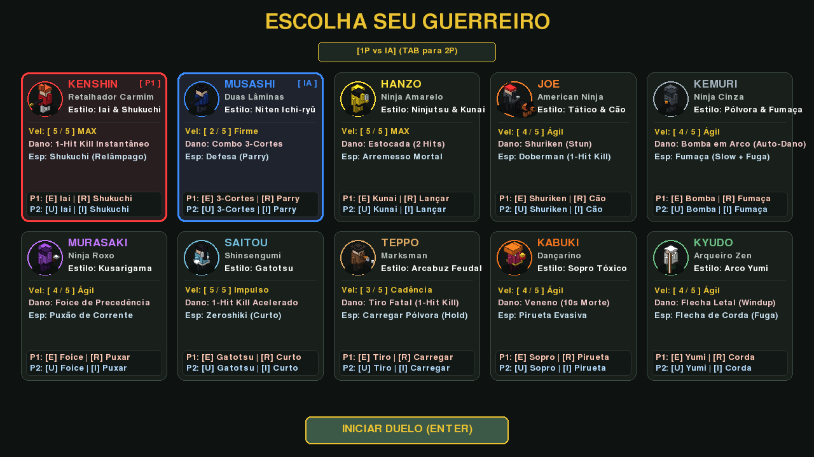
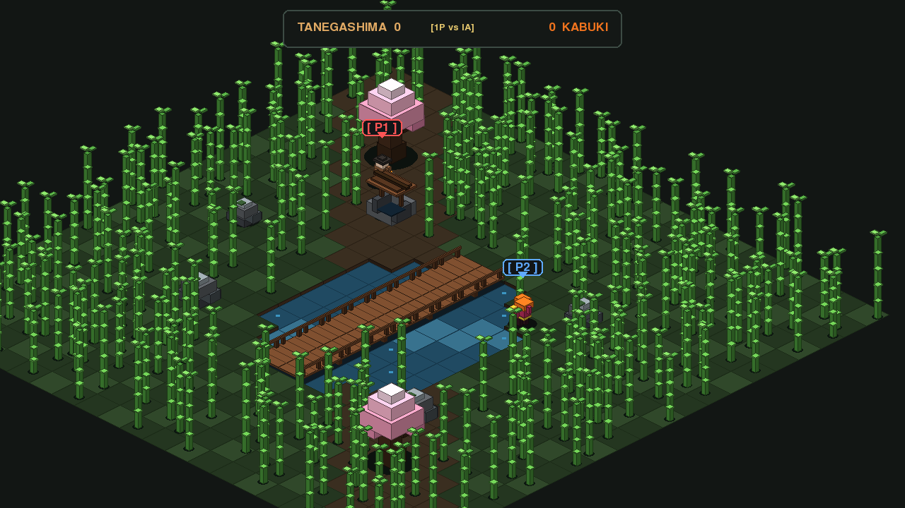

# Samurai Edge Demake

Um jogo de duelo isométrico em estilo **3D Voxel Art** tático, inspirado nos clássicos jogos de luta de espadas e demakes retrô com iluminação volumétrica direcional.



---

## 🗡️ Visão Geral

Ambientado em uma arena construída inteiramente em voxels 3D (estilo *3D Dot Game Heroes*, *Voxatron* e *Crossy Road*), com floresta de bambus em colunas de voxels cortáveis, lago com margens em desnível, ponte de madeira com guarda-corpo elevado, poço de cantaria tradicional com telhado de telhas e cerejeiras de sakura com copa volumétrica. Dois guerreiros se enfrentam em duelos mortais onde precisão, alcance e timing definem a vitória.

A cada round, os combatentes iniciam em **posições aleatórias da arena** com distância mínima garantida de **$\ge 7.0$ tiles** para evitar acertos melee no primeiro frame. Além disso, **indicadores piscantes `[ P1 ]` e `[ P2 ]`** surgem sobre a cabeça dos lutadores no início de cada round com setas vetoriais para orientar instantaneamente suas posições.

O jogo suporta **Duelo 1P contra IA inteligente adaptativa** e **Modo 2 Jogadores Local** no mesmo teclado com navegação e confirmação 100% independentes no menu de seleção (`P1: WASD + E/Espaço`, `P2: Setas + U/Enter`).



---

## 🥋 Guerreiros Selecionáveis (10 Combatentes)

### 1. Kenshin (Retalhador Carmim)
- **Estilo**: Iai-jutsu & Shukuchi (Passo Relâmpago 縮地)
- **Velocidade**: Máxima (5/5)
- **Ataque Primário [E / U]**: *Iai Flash* - Avanço fulminante com corte instantâneo (1-Hit Kill).
- **Secundário [R / I]**: *Shukuchi* - Passo de velocidade divina (28.0 tiles/s) deixando pós-imagens translúcidas (*zanzou*) e cortando bambus pelo caminho.

### 2. Musashi (Duas Lâminas)
- **Estilo**: Niten Ichi-ryū
- **Velocidade**: Cadenciada (2/5)
- **Ataque Primário [E / U]**: Combo consecutivo de 3 cortes em rápida sucessão.
- **Secundário [R / I]**: Parry defensivo que apara ataques de espada, projéteis (kunais, balas, flechas) e cães de caça, atordoando o agressor.

### 3. Hanzo (Ninja Amarelo)
- **Estilo**: Ninjutsu & Kunai
- **Velocidade**: Máxima (5/5)
- **Ataque Primário [E / U]**: Estocada rápida de curta distância (requer 2 acertos para vencer).
- **Secundário [R / I]**: Arremesso fatal de Kunai (1-Hit Kill à distância). Se errar ou colidir com obstáculos, crava no solo e deve ser recuperada a pé.

### 4. Joe & Doberman (American Ninja)
- **Estilo**: Tático & Cão de Ataque
- **Velocidade**: Ágil (4/5)
- **Ataque Primário [E / U]**: Arremesso de Shurikens que não matam, mas aplicam atordoamento tático (Stun).
- **Secundário [R / I]**: Comanda o Doberman em uma investida mortal (1-Hit Kill). Se o oponente acertar o cão durante o salto, o animal é nocauteado temporariamente.

### 5. Kemuri (Ninja Cinza)
- **Estilo**: Pólvora & Cortina de Fumaça
- **Velocidade**: Ágil (4/5)
- **Ataque Primário [E / U]**: **Bomba em Arco 3D**: Projétil balístico em arco tridimensional (até 2 bombas ativas no mapa). Detona por contato imediato com qualquer lutador ou após queima do pavio (1.5s). Causa explosão fatal em área com **fogo amigo / auto-dano**: Kemuri pode explodir a si mesmo por descuido!
- **Secundário [R / I]**: Bomba de fumaça instantânea que camufla o ninja com recuo evasivo e reduz a velocidade do oponente em 65% (Slow).

### 6. Murasaki (Ninja Roxo)
- **Estilo**: Kusarigama & Foice de Precedência
- **Velocidade**: Ágil (4/5)
- **Ataque Primário [E / U]**: Corte de foice (*Kama Strike*) com **Precedência Absoluta** sobre qualquer outro ataque (anula e vence contra qualquer golpe adversário simultâneo sem Clash).
- **Secundário [R / I]**: Puxão de corrente (*Kusarigama Hook*) que agarra o oponente e o puxa rapidamente para perto, enquanto o alvo permanece livre para contra-atacar.

### 7. Hajime Saitou (Líder Shinsengumi)
- **Estilo**: Gatotsu (Estocada de Aceleração Crescente)
- **Velocidade**: Impulso Progressivo (5/5)
- **Ataque Primário [E / U]**: **Gatotsu**: Inicia na velocidade base e ganha aceleração contínua até velocidade supersônica (19.0 tiles/s), cortando bambus. Perde manobrabilidade lateral e sofre inércia de frenagem (*Braking State*) se errar (whiff), além de stun ao bater em rochas ou sofrer Parry.
- **Secundário [R / I]**: **Gatotsu Zeroshiki**: Estocada rápida à queima-roupa desferida do corpo a corpo, sem corrida de impulso.

### 8. Teppo / Tanegashima (Rifleman)
- **Estilo**: Arcabuzeiro Feudal de Mecha
- **Velocidade**: Cadenciada (3/5)
- **Ataque Primário [E / U]**: Disparo supersônico fatal de arcabuz (1-Hit Kill). Consome a munição da arma e gera recuo de pólvora.
- **Secundário [R / I] (Hold)**: **Carregar Pólvora**: Segure a tecla de ação secundária para dosar a pólvora e socar a munição (1.75s). Toque na tecla para executar um salto evasivo tático para trás (*Backstep*) com fumaça sem cancelar a recarga.

### 9. Kabuki (Dançarino do Sopro Venenoso)
- **Estilo**: Sopro Tóxico & Pirueta Evasiva
- **Velocidade**: Ágil (4/5)
- **Ataque Primário [E / U]**: **Sopro Venenoso**: Cospe uma nuvem de toxina concentrada. Ao atingir o rival, o oponente recebe um **boost de velocidade (+40%)**, mas entra em uma **contagem regressiva fatal de 10 segundos**!
- **Secundário [R / I]**: **Pirueta Kabuki**: Após envenenar o oponente, o Kabuki perde a capacidade de atacar e deve sobreviver utilizando piruetas e esquivas acrobáticas multidirecionais enquanto o adversário enfurecido corre contra o tempo.

### 10. Kyudo (Mestre do Arco Yumi)
- **Estilo**: Kyudo Tradicional & Flecha de Corda
- **Velocidade**: Ágil (4/5)
- **Ataque Primário [E / U]**: **Retesamento de Arco Yumi**: Entra em windup preparatório (0.42s) com barra de mira precisa sobre a cabeça; ao concluir, dispara uma flecha mortal de longo alcance (1-Hit Kill).
- **Secundário [R / I]**: **Flecha de Corda**: Cancela imediatamente o windup do arco e dispara uma flecha com corda guia que se fixa no cenário e puxa o arqueiro velozmente pelo mapa, permitindo uma dinâmica intensa de gato e rato.

---

## 🎮 Controles

| Ação | Jogador 1 (P1) | Jogador 2 (P2) |
| :--- | :--- | :--- |
| **Movimento** | `W, A, S, D` | `Setas Direcionais` |
| **Ataque Primário** | `E` | `U` |
| **Ação Secundária** | `R` | `I` |

- **Troca de Modo (1P vs IA / 2 Jogadores)**: `TAB` na tela de seleção.
- **Configurações de Controles**: Pressione `C` a qualquer momento para remapear teclas livremente.
- **Reiniciar Partida**: `Espaço`
- **Mudar Personagens / Voltar ao Menu**: `ESC`

---

## ⚙️ Instalação e Execução

### Pré-requisitos
- Python 3.10+
- `pygame-ce`

```bash
# Criar ambiente virtual
python3 -m venv venv
source venv/bin/activate

# Instalar dependências
pip install pygame-ce

# Executar o jogo
python3 main.py
```

### Executar Testes Automatizados
```bash
python3 test_game.py
```
