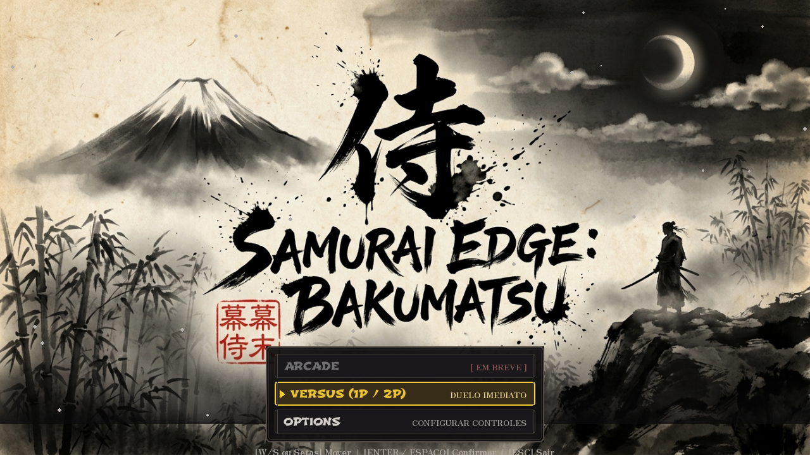
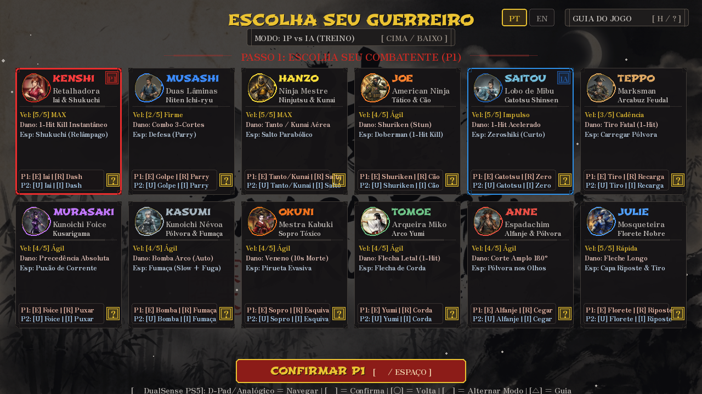
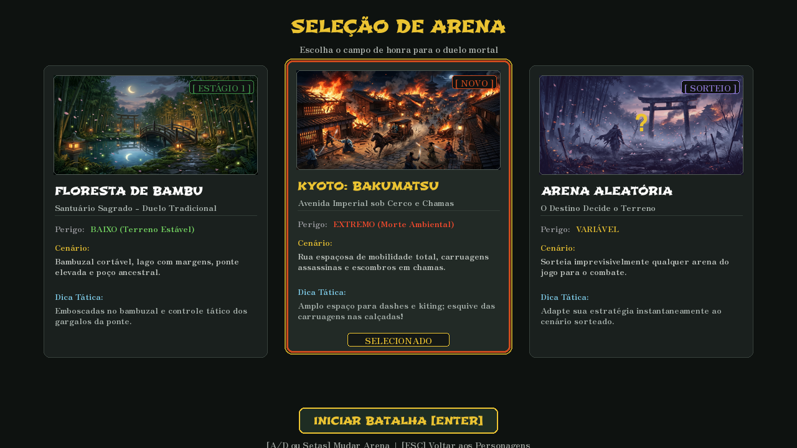
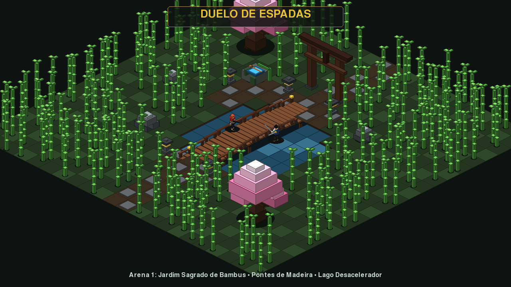
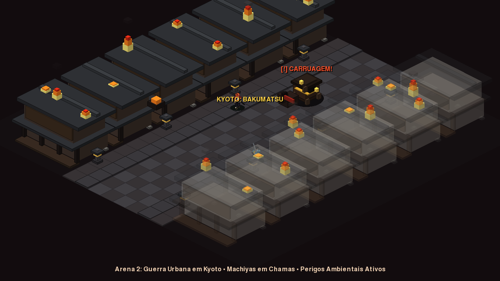
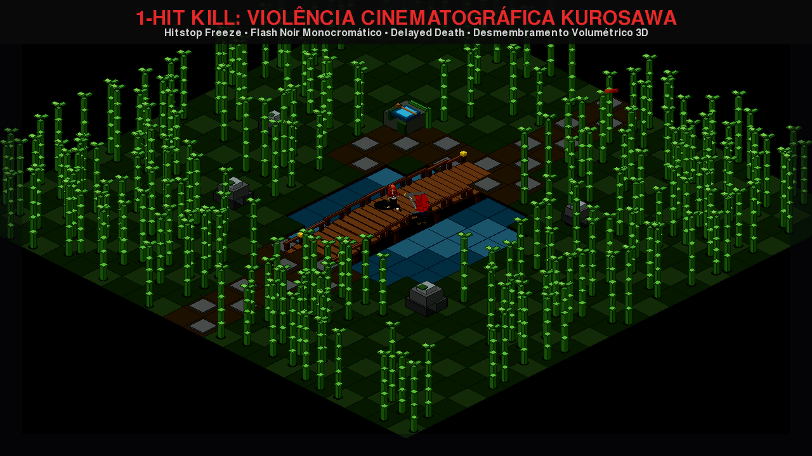
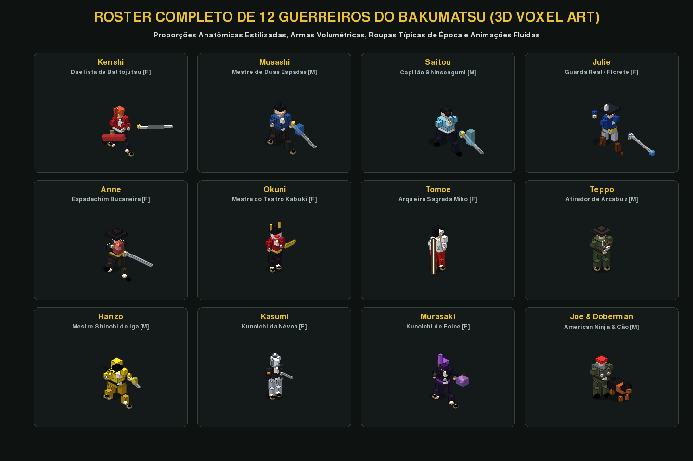
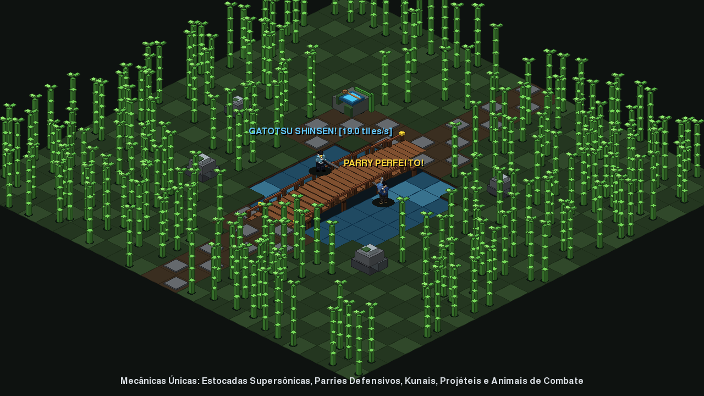
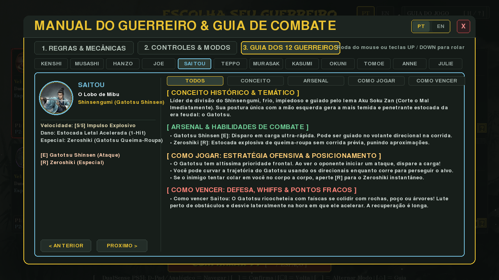
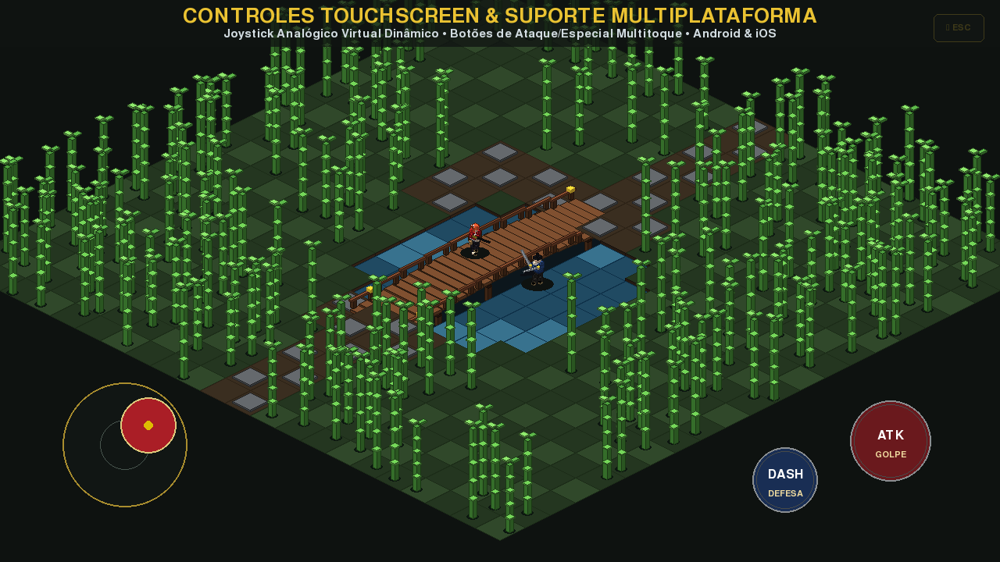

# Samurai Edge Demake

[](https://www.python.org/downloads/)
[](https://pyga.me/)
[](https://github.com/colletes/samurai-edge-demake/releases)
[](https://github.com/colletes/samurai-edge-demake/releases)
[](LICENSE)

A tactical isometric lethal dueling game in **3D Voxel Art** and **HD-2D**, inspired by the unforgiving realism of classics like *Bushido Blade*, Akira Kurosawa's samurai cinema, and retro demake aesthetics. Featuring volumetric dismemberment physics, dynamic procedural lighting, interactive atmospheric hazards, a blade clash QTE system, cloth physics, and a finely balanced roster of 12 warriors across 12 distinct arenas.





---

## 📦 1. Downloads & Pre-compiled Releases

You can download pre-compiled executable packages directly from the **[Official GitHub Releases](https://github.com/colletes/samurai-edge-demake/releases)**:

| Platform | Download Package | How to Run |
| :--- | :--- | :--- |
| 🍏 **macOS** | [`Samurai-Edge-Demake-macOS.zip`](https://github.com/colletes/samurai-edge-demake/releases/latest) | Unzip and run the executable or use the `iniciar.command` shortcut. If macOS displays an unverified developer warning: right-click $\to$ *Open*, or run in terminal: `xattr -cr SamuraiEdge.app` |
| 🪟 **Windows** | [`Samurai-Edge-Demake-Windows.zip`](https://github.com/colletes/samurai-edge-demake/releases/latest) | Extract the zip folder and double-click `SamuraiEdge.exe`. |
| 🐧 **Linux** | [`Samurai-Edge-Demake-Linux.tar.gz`](https://github.com/colletes/samurai-edge-demake/releases/latest) | Extract via `tar -xzvf Samurai-Edge-Demake-Linux.tar.gz` and run `./SamuraiEdge/SamuraiEdge`. |
| 🤖 **Android** | `SamuraiEdge.apk` | Build guide and instructions in [`deploy/android/README.md`](deploy/android/README.md). |
| 📱 **iOS** | Native Xcode Project | Configured Xcode project ready for deployment in [`deploy/ios/README.md`](deploy/ios/README.md). |

---

## ⚔️ 2. Game Mechanics & Historical Setting

### Historical Setting: The Twilight of the Edo Period (Bakumatsu)
Set during the turbulent mid-19th century **Bakumatsu** era in feudal Japan—the end of the samurai shogunate and the rapid reopening of Japan to Western trade. 
Warriors from conflicting allegiances clash across diverse historical battlegrounds:
- **Traditional Swordsmen & Slashers**: Masters of *Iaijutsu*, the dual-wielding *Niten Ichi-ryū*, and elite captains of the *Shinsengumi*.
- **Shinobi & Kunoichi Clans**: Shadow assassins of Iga and Koga wielding deadly *Kusarigama* sickles, shurikens, and ceramic bombs.
- **Miko Archers & Kabuki Masters**: Shinto shrine protectors and lethal theatrical acrobats wielding razor steel fans and toxic breath.
- **Feudal Firearms**: Veteran marksmen wielding matchlock *Tanegashima* arquebuses.
- **Foreign Combatants**: Buccaneer privateers and French royal musketeers arriving through the ports of Nagasaki and Yokohama.



---

### 🗺️ The 12 Dynamic Combat Arenas

Each arena features unique environmental hazards, destructible elements, tactical surfaces, atmospheric lighting, and shared wind dynamics:

1. **🎋 Sacred Bamboo Forest (`bamboo`)**:
   - *Features*: Sliceable bamboo stalks that cut open lines of sight, a serene Zen lake, a stone well (*Tsukubai*), and an arched wooden bridge (*Taiko-bashi*).
   - *Hazards & Tactics*: Water slows movement by 45%, turning warriors into vulnerable targets. Narrow bridge chokepoints favor linear thrusts.
2. **🔥 Kyoto: Burning Bakumatsu (`kyoto`)**:
   - *Features*: Wide cobblestone imperial avenues lined with burning *machiya* townhouses and dynamic spark lighting.
   - *Hazards & Tactics*: **Runaway Carriage** crosses the street at breakneck speed (14.0 tiles/s), instantly trampling unwary fighters. Falling flaming debris demands constant positional awareness.
3. **🌊 Ganryū Island (`ganryu_island`)**:
   - *Features*: Coastal shore with stranded wooden boats, plank crossings, and tidal sands.
   - *Hazards & Tactics*: **Tide Surge** covers the beach with rising waters; navigate fissures and wooden planks to preserve footing.
4. **🏯 Iga Rooftops (`iga_rooftops`)**:
   - *Features*: Three tiled rooftops connected by narrow timber beams over shadowy alleys.
   - *Hazards & Tactics*: Lethal pit drops between buildings. Requires agile dashes, Hanzo's parabolic jump, or Kenshi's *Shukuchi* to cross wide gaps safely.
5. **🏴‍☠️ Storm Pirate Deck (`pirate_deck`)**:
   - *Features*: Ship deck battered by ocean waves, masts, cargo barrels, and deck cannons.
   - *Hazards & Tactics*: **Ship Roll** tilts the arena, sliding combatants across the listing deck. Strike cannons to light fuses and sweep the deck with cannonfire.
6. **⛓️ Cave of Shadows (`shadow_cave`)**:
   - *Features*: Subterranean cavern with ancient Jizo statues, massive stone pillars, and hanging iron chains.
   - *Hazards & Tactics*: **Chain Pendulum** sweeps back and forth across the cavern; watch floor shadows to dodge the deadly swing. Jizo statues block projectiles.
7. **🌫️ Temple in the Mist (`mist_temple`)**:
   - *Features*: Ancient mountain temple enveloped in volumetric fog, pine trees, and a shallow koi pond.
   - *Hazards & Tactics*: **Firework Mortars** rain down explosive artillery marked by warning ground circles. Pond water impairs dash mobility.
8. **⛺ Forest Camp (`forest_camp`)**:
   - *Features*: Hidden woodland encampment with palisades, tents, watchtowers, and supply crates.
   - *Hazards & Tactics*: Concealed **Snare Traps** in disturbed soil immobilize fighters; supply crates provide durable projectile cover.
9. **💥 Nagashino Field (`nagashino_field`)**:
   - *Features*: Historic battlefield with wooden cavalry palisades, wet mud, and clan war banners (*Nobori*).
   - *Hazards & Tactics*: **Powder Barrels** ignite upon weapon strikes, bullets, or bombs, dealing devastating area-of-effect blast damage.
10. **🎭 Kabuki Stage (`kabuki_stage`)**:
    - *Features*: Traditional theatrical stage with a *hanamichi* walkway, painted folding screens, and striped Kabuki curtains.
    - *Hazards & Tactics*: **Revolving Stage Disc** steadily spins combatants, shifting positioning without direct damage; screens absorb projectile impacts.
11. **⛩️ Mountain Shrine (`mountain_shrine`)**:
    - *Features*: Ascending avenue of Torii gates, sacred Kyudo archery targets, and a giant bronze shrine bell.
    - *Hazards & Tactics*: No lethal environmental traps. Strike the shrine bell to clear smoke screens and dispel toxic mist clouds.
12. **👑 Baroque Court (`baroque_court`)**:
    - *Features*: Manicured palace grounds with checkered marble tiles, ornamental hedges, classical statues, and a marble fountain.
    - *Hazards & Tactics*: Hazard-free architectural duel. Hedges and marble statues provide solid cover; fountain basin slows crossing fighters.




---

### Core Combat Mechanics: Lethal Bushido (1-Hit Kill System)

- **One-Strike Lethality**: There are no bloated health bars or repetitive 50-hit juggle combos. A single clean sword slash, accurately placed arrow, or point-blank firearm shot is instantly lethal *(Musashi features a unique 3-HP endurance system balancing dual-blade defense)*. Every advance requires deliberation, patience, and precise spacing.
- **Cinematic Violence (Kurosawa Noir)**:
  - **Hitstop Freeze**: Instantaneous dramatic micro-freeze upon lethal impact.
  - **High-Contrast Monochrome Flash**: Desaturates the world into stark black-and-white, highlighting vivid crimson blood sprays in homage to Akira Kurosawa classics (*Sanjuro*, *Yojimbo*).
  - **Delayed Death**: Victims freeze in suspended shock for ~0.4s before collapsing into geysers of blood and 3D volumetric voxel dismemberment.
  - **Persistent Bloodstains**: Blood splatters remain permanently on wooden decks, stone roads, and grass for the duration of the match.
- **Blade Clash QTE System (New in v1.4.0)**:
  - When two weapon strikes meet simultaneously at equal priority, fighters lock weapons in a fierce **Clash**. Rapidly mash the attack button to overpower your opponent and stagger them backwards!
- **Match Flow & Best-of-3 Format**:
  - Rounds begin with dramatic banner announcements (`DUEL 1`, `FINAL DUEL`).
  - First fighter to 2 round victories claims the match.
  - **Random Spawns & Start Indicators**: Fighters spawn $\ge 7.0$ tiles apart in fair tactical positions, with flashing `[ P1 ]` and `[ P2 ]` indicators overhead.



---

## 🎯 3. Objective & Game Modes

The objective is pure and uncompromising: **cut down your opponent before they strike you**.

- **Best-of-3 Rounds** (First to 2 Kills).
- **Available Modes**:
  - 👤 **1 Player (1P vs Adaptive AI)**: Challenge an AI engine programmed with distinct tactical behaviors for each of the 12 fighters (spacing control, bamboo ambushes, parry reflexes, baiting, and projectile kiting).
  - 👥 **2 Players Local (Versus 1v1)**: Face off locally on the same machine using shared keyboard configurations or two independent gamepads.

---

## 🥋 4. Complete Guide to the 12 Warriors

The roster features **12 warriors (6 female, 6 male)**, each offering distinct weapon ranges, mobility speeds, attack arcs, recovery windows, and counter strategies.

```
       [ SAMURAI EDGE ROSTER ]
Male Warriors:   Kenshi | Musashi | Hanzo | Joe & Doberman | Saitou | Teppo
Female Warriors: Murasaki | Kasumi | Okuni | Tomoe | Anne | Julie
```



---

### 1. Kenshi — The Slasher [F]
*Master of Iaijutsu and Lightning Quickdraw.*
- **Style**: Hiten Mitsurugi-ryū | **Speed**: [5/5] Maximum
- **Primary Attack [E / U]**: *Iai Flash* — Lightning-fast dashing draw cut (1-Hit Kill) that slices bamboo stalks in its path.
- **Secondary Action [R / I]**: *Shukuchi* — Divine rapid step (28.0 tiles/s) leaving trailing translucent afterimages (*zanzou*).
- **Offensive Strategy**: Use *Shukuchi* to instantly close distance the moment an opponent misses. *Iai Flash* holds overwhelming linear forward priority.
- **How to Counter**: After executing *Iai Flash*, Kenshi enters a brief *Noto* (sheathing) recovery animation. If she whiffs, punish immediately! Keep stone obstacles between you and her dash line.

---

### 2. Musashi — Dual Blade Master [M]
*Legendary tactician of the Niten Ichi-ryū school.*
- **Style**: Niten Ichi-ryū (Katana & Wakizashi) | **Speed**: [2/5] Measured
- **Durability**: **3 HP (Musashi-Exclusive)** — The only fighter who can absorb up to 2 non-fatal strikes, rewarding calculated close-quarters defense.
- **Primary Attack [E / U]**: *Dual Blade Combo* — Rapid 3-slash cross-cutting sequence with extended reach across all 3 tiers (+11% reach), covering wide evasion angles.
- **Secondary Action [R / I]**: *Perfect Parry* — Defensive counter stance that deflects swords, kunais, arrows, and attack dogs, staggering the attacker.
- **Offensive Strategy**: Pressure opponents with the threat of your parry. When they hesitate, step forward with your extended dual-blade combo to pin them down.
- **How to Counter**: Never strike Musashi head-on predictably! Bait his parry window, or punish him with ranged zoning (Arquebus, Bow, Bombs).

---

### 3. Hanzo — Iga Master Shinobi [M]
*Superb agility and deadly long-range kunai projectiles.*
- **Style**: Ninjutsu & Kunai | **Speed**: [5/5] Maximum
- **Primary Attack [E / U]**: *Quick Tanto Thrust* — Rapid short-range dagger jab (requires 2 hits to eliminate).
- **Secondary Action [R / I]**: *Kunai Throw / Parabolic Jump* — Throws a lethal flying kunai (1-Hit Kill at range). If it strikes stone or misses, it embeds into the terrain and must be retrieved on foot.
- **Offensive Strategy**: Stay agile, align with your opponent's movement axis, and throw the kunai for a clean kill. If you miss, use max speed to retrieve it or finish with the tanto.
- **How to Counter**: The kunai travels in a straight line. Move diagonally or zig-zag, using bamboo trunks and stone lanterns as ballistic shields.

---

### 4. Joe — The American Ninja & Doberman [M]
*Tactical tandem combat paired with a trained war dog.*
- **Style**: Western Ninjutsu & Tactical K9 | **Speed**: [4/5] Fast
- **Primary Attack [E / U]**: *Shuriken Stun* — High-velocity thrown metal star. Non-lethal, but inflicts immediate hitstun on impact.
- **Secondary Action [R / I]**: *Doberman Command* — Commands the war hound to lunge forward in a ferocious charge, landing a lethal bite (1-Hit Kill).
- **Offensive Strategy**: The classic pincer tactic: throw the shuriken to stun the enemy, then immediately trigger the Doberman command to execute the immobilized target.
- **How to Counter**: The dog charges in a predictable linear path. Wide sweeping strikes can knock the dog unconscious mid-lunge. Keep direct pressure focused on Joe.

---

### 5. Hajime Saitou — The Wolf of Mibu [M]
*Legendary 3rd Division Captain of the Shinsengumi.*
- **Style**: Shinsengumi (Mizoguchi-ha Ittō-ryū) | **Speed**: [5/5] Explosive Charge
- **Primary Attack [E / U]**: *Gatotsu Shinsen* — Relentless lunging thrust accelerating up to supersonic speed (19.0 tiles/s), slicing through bamboo across the arena. Can be steered slightly while charging.
- **Secondary Action [R / I]**: *Gatotsu Zeroshiki* — Instant point-blank thrust delivered from neutral without any charging distance.
- **Offensive Strategy**: *Gatotsu* boasts tremendous frontal priority. If the opponent attempts to flank your recovery, pivot instantly and unleash *Zeroshiki*.
- **How to Counter**: *Gatotsu* suffers poor turning control at top speed and staggers Saitou if he collides with solid rocks or wells. Fight near obstacles and side-step at the last split-second.



---

### 6. Teppo — Feudal Arquebus Marksman [M]
*Gunpowder revolution on the battlefields of Sengoku and Bakumatsu.*
- **Style**: Tanegashima Matchlock | **Speed**: [3/5] Cadenced
- **Primary Attack [E / U]**: *Matchlock Shot / Rifle Butt Strike* — When loaded, fires a devastating bullet (1-Hit Kill). When empty, swings the heavy oak stock to stun and knock back the foe.
- **Secondary Action [R / I]**: *Reload Powder (Hold) / Evasive Leap (Tap)* — Holding the button reloads the matchlock; tapping it triggers an evasive backward leap with smoke cover.
- **Offensive Strategy**: Teppo starts every round unloaded! Follow the floating golden arrow and compass HUD to the nearest powder keg, load your round, and control the distance.
- **How to Counter**: Never give Teppo room to reach powder barrels! Rush him down from second one. If he manages to load, stay behind dense stone boulders.

---

### 7. Murasaki — Sickle Kunoichi [F]
*Feline agility with the Kusarigama and absolute attack precedence.*
- **Style**: Kusarigamajutsu (Sickle & Weighted Chain) | **Speed**: [4/5] Agile
- **Primary Attack [E / U]**: *Kama Strike* — A lethal strike possessing **Absolute Precedence**: cleanly overrides and beats any simultaneous enemy frontal attack without triggering a clash.
- **Secondary Action [R / I]**: *Chain Pull* — Casts the weighted iron chain forward; if it catches the foe, drags them directly into melee range.
- **Offensive Strategy**: Control the neutral zone with the chain. Pull the opponent inward and immediately slice them with the sickle. In simultaneous trades, your strike always wins.
- **How to Counter**: The chain has fixed cast and reel recovery times. If she misses, advance along a diagonal angle and punish her open recovery. Never contest a simultaneous frontal melee strike against her.

---

### 8. Kasumi — Mist Kunoichi [F]
*Mistress of deception, ceramic bombs, and dense smoke screens.*
- **Style**: Gunpowder & Art of Smoke | **Speed**: [4/5] Elusive
- **Primary Attack [E / U]**: *3D Arcing Ceramic Bomb* — Lobs a bomb in a parabolic arc over obstacles (up to 2 active). Detonates on impact or after a 1.5s fuse, dealing area splash damage (includes self-damage!).
- **Secondary Action [R / I]**: *Smoke Screen* — Detonates a dense smoke canister at her feet, concealing her silhouette and slowing anyone entering the cloud by 65%.
- **Offensive Strategy**: Lob bombs over high rocks and bamboo thickets to flush out camping enemies. Drop smoke screens in narrow chokepoints like bridges.
- **How to Counter**: Stay right in her face! If Kasumi throws a bomb at point-blank range, the explosion will catch and kill her as well.

---

### 9. Okuni — Kabuki Theatre Master [F]
*Deadly theatrical acrobatics and lethal countdown venom.*
- **Style**: Tessen-jutsu & Dance of Venom | **Speed**: [4/5] Acrobat
- **Primary Attack [E / U]**: *Toxic Breath* — Exhales a cloud of crimson poisonous mist. Catching an opponent triggers an unavoidable **10-SECOND FATAL DEATH COUNTDOWN**!
- **Secondary Action [R / I]**: *Kawarimi Decoy / Pirouette* — Acrobatic leap leaving behind a wooden log dummy (*kawarimi*) that absorbs incoming strikes.
- **Offensive Strategy**: Your win condition is unique: infect the opponent with venom early, then disengage! Evade, leap over obstacles with *Kawarimi*, and watch the 10-second timer expire.
- **How to Counter**: If poisoned, your clock is ticking! You gain a temporary adrenaline fury speed boost: abandon defensive play and rush Okuni down before the timer hits zero.

---

### 10. Tomoe — The Miko Archer [F]
*Sacred precision of the traditional Japanese asymmetric Yumi longbow.*
- **Style**: Sacred Kyudo | **Speed**: [4/5] Agile
- **Primary Attack [E / U]**: *Yumi Bow Draw* — Enters steady aiming stance with an overhead charge bar; releasing looses a high-speed fatal arrow with the longest range in the game.
- **Secondary Action [R / I]**: *Grappling String Arrow* — Cancels bow draw and shoots a rope-tethered arrow that anchors to terrain and pulls Tomoe rapidly to safety.
- **Offensive Strategy**: Maintain maximum distance. Use the grappling string arrow to zip away when cornered, and loose arrows into narrow transit corridors.
- **How to Counter**: Tomoe cannot move while drawing the bow (*windup*). Close in using zig-zag movement and environmental cover until you are within striking range.

---

### 11. Anne — The Sea Wolf [F]
*Buccaneer privateer wielding sweeping cutlass arcs.*
- **Style**: Buccaneer Cutlass | **Speed**: [4/5] Resolute
- **Primary Attack [E / U]**: *180° Cutlass Slash* — Sweeping horizontal slash covering a full 180-degree semi-circle with a 1.35-tile radius, punishing lateral rolls.
- **Secondary Action [R / I]**: *Gunpowder in the Eyes* — Flings abrasive black powder into the opponent's face at close range, blinding and stunning them while performing an evasive backstep.
- **Offensive Strategy**: Close in, blind your foe with powder, and unleash the wide 180° cutlass sweep while they are disoriented.
- **How to Counter**: The powder toss has very short reach. Keep spacing at mid-range and utilize longer linear thrusts (like Julie's Foil or Saitou's Gatotsu) to punish her from outside her sweep radius.

---

### 12. Julie — Flower of the Royal Guard [F]
*European nobility with surgical French fencing precision.*
- **Style**: French Fencing (Foil & Cloak) | **Speed**: [5/5] Elite Speed
- **Primary Attack [E / U]**: *Flèche Thrust* — Instantaneous linear lunge with extended reach (1.30 tiles) and near-instant recovery (0.14s).
- **Secondary Action [R / I]**: *Cloak Riposte & Flintlock* — Defensive parrying stance with a weighted silk cloak, followed by a surprise flintlock pistol countershot upon deflecting a blow.
- **Offensive Strategy**: The *Flèche* outranges conventional katanas. Keep the enemy at the tip of your blade. If they retaliate, activate the cloak riposte to parry and shoot.
- **How to Counter**: The *Flèche* travels in a very narrow straight corridor. Clean sidesteps expose Julie's back for easy punishment. Watch for the cloak posture to avoid triggering her countershot.

---

### 📖 In-Game Strategy Manual & Fighter Dossiers (`F1` or `[ ? ]`)

Press `F1` on keyboard, click the `[ ? ]` button on any warrior card during character selection, or press the help button on your gamepad to open the official in-game strategy manual:
- **Full Dossiers for All 12 Warriors**: Lore, weapon schools, primary attacks, and tactical specials.
- **Stats & Graphs**: Speed, attack range, cadence, and fighting style.
- **Offensive & Defensive Guides**: Comprehensive tactical advice on how to play each warrior and how to counter their vulnerabilities (*How to Counter*).
- **Live 3D Voxel Preview**: Interactive rotating 3D voxel model of the selected fighter.
- **Fully Bilingual**: Real-time instantaneous language switching between **Portuguese (PT-BR)** and **English (EN)**.



---

## 🎮 5. Controls & Options

### Keyboard Mapping

| Action | Player 1 (P1) | Player 2 (P2) |
| :--- | :--- | :--- |
| **Movement** | `W, A, S, D` | `Arrow Keys (↑, ←, ↓, →)` |
| **Primary Attack** | `E` | `U` |
| **Secondary Action / Special** | `R` | `I` |
| **Dodge (Roll / Dash)** | `T` | `O` |
| **Confirm Selection** | `E` or `Space` | `U` or `Enter` |
| **Mode Switch (1P vs AI / 2P Local)** | `TAB` | `TAB` |
| **Settings Menu** | `C` | `C` |
| **In-Game Help & Strategy Manual** | `F1` | `F1` |
| **Rematch / Reset Round** | `Space` | `Space` |
| **Return to Menu / Pause / Exit** | `ESC` | `ESC` |

---

### Native Gamepad Support
The game automatically detects and calibrates gamepads via USB or Bluetooth with controller-aware on-screen prompts:
- **Xbox (360, One, Series X/S)**: D-Pad / Left Stick for movement, `A` for Attack, `B` for Special.
- **PlayStation (DualShock 4, DualSense PS5)**: D-Pad / Left Stick for movement, `✕` for Attack, `○` for Special.
- **Nintendo Switch / Generic Arcade USB**: Automatic SDL mapping.
- **Simultaneous Dual Gamepads**: Plug in two controllers for instant local couch multiplayer.
- **Haptic Vibration (Rumble)**: Dynamic force-feedback on lethal strikes, clashes, and explosions.

---

### Touchscreen & Mobile Controls
When launched on smartphones or tablets (Android & iOS), the engine activates an intuitive touch overlay:
- **Dynamic Floating Virtual Joystick**: Anchors dynamically under your left thumb wherever you touch.
- **Tactile Action Buttons**: Positioned under your right thumb, featuring dynamic action labels and full multi-touch support.
- **Continuous Hold Gestures**: Smoothly supports holding down reload inputs (such as Teppo's gunpowder loading) without interrupting movement.
- **Adaptive Display Scaler**: Seamless presentation across 16:9, 19.5:9, 20:9, and tablet aspect ratios without distortion.



---

### Settings & Audio Menu (`C` or `Start`)
- **Language (i18n)**: Instant dynamic switching between **English (EN)** and **Português do Brasil (PT-BR)**.
- **Visuals & Effects Quality**: Toggle between High (volumetric fog, particle trails, dynamic reflections) and Low performance profiles.
- **Character Style & Cel-Shading**: Selectable character rendering styles including cel-shading outlines for Kenshi and Murasaki.
- **Touchscreen Mode**: `Auto` (detects touch input), `On` (always visible), or `Off`.
- **Audio & Haptics**: Dedicated volume sliders for lossless WAV sound effects, high-fidelity stage BGM, and haptic vibration intensity.

---

## 🛠️ 6. Installation & Running from Source

### Prerequisites
- Python 3.10 or higher
- `pip` and Python virtual environment (`venv`)

```bash
# 1. Clone the repository
git clone https://github.com/colletes/samurai-edge-demake.git
cd samurai-edge-demake

# 2. Create and activate a virtual environment
python3 -m venv venv
source venv/bin/activate  # On Windows: venv\Scripts\activate

# 3. Install core dependencies
pip install -r requirements.txt

# 3.1 (Optional) Cinematic Opening Video Support
# Without these packages, the game runs normally by skipping the opening video.
# On macOS, use "opencv-python-headless" (NOT "opencv-python") to avoid SDL collisions:
pip install --no-deps opencv-python-headless==4.10.0.84 sounddevice numpy
pip install --no-deps pyvidplayer2==0.9.37

# 4. Launch the game
python3 main.py

# macOS quick shortcut: you can also double-click:
# ./iniciar.command
```

### Running the Automated Test Suite
```bash
# Run all automated system tests
./venv/bin/python test_game.py

# Run controller and touchscreen response tests
./venv/bin/python tests/test_controllers_and_touch.py
```

---

## 📄 7. License

This project is distributed under a **Proprietary Personal Non-Commercial License** (*Source-Available / Personal Non-Commercial License*).
- You are granted permission to download, execute, modify locally, and study the source code for personal, educational, and non-commercial purposes.
- All copyrights, publication rights, commercial exploitation, and distribution of official builds are reserved exclusively by **Thiago Carvalho**.
- Copying, redistributing, or incorporating this codebase into commercial products without prior written permission is strictly prohibited.
See the [`LICENSE`](LICENSE) file for complete legal terms.
