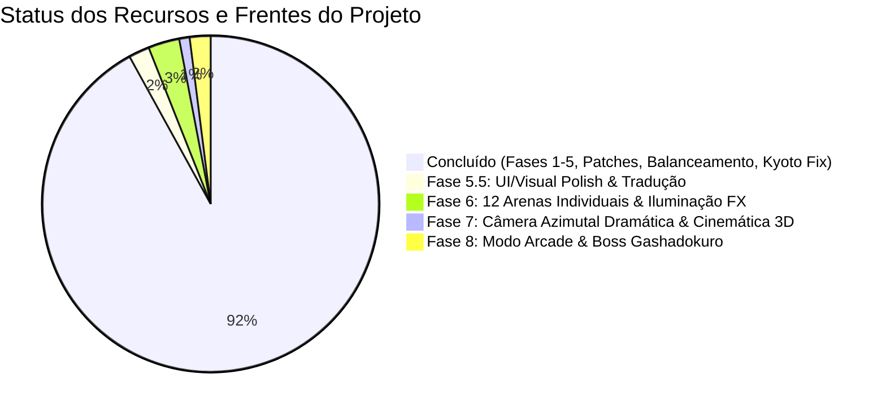

# 🗺️ ROADMAP — Samurai Edge Demake

> **Versão atual:** `v1.4.0` | **Branch:** `main`  
> Última atualização: 01 de Outubro de 2026  
> Este documento consolida todo o histórico concluído e define a ordem sequencial das **8 Fases de Evolução Mestre**, divididas em entregáveis pequenos, iterativos e testáveis.

---

## 📊 Progresso Global do Projeto

---

## ✅ Concluído (Entregue e Testado)

### 1. Fundação e Motor de Combate (v1.0 – v1.2)
- [x] Motor de combate isométrico voxel 3D com câmera e ordenação Y-Sorting contínua.
- [x] 12 guerreiros jogáveis com mecânicas, velocidades e arquétipos assimétricos.
- [x] Arena **Floresta de Bambu** com lago Zen e bambus dinamicamente cortáveis.
- [x] Arena **Kyoto Bakumatsu** com carruagens cruzadas, escombros caindo e chamas nas cumeeiras.
- [x] Sistema de colisão com caixas circulares, i-frames e parry direcional.
- [x] Suporte universal a controles (PlayStation DualSense/DS4, Xbox, Genéricos) com rumble tátil.
- [x] Controles touchscreen adaptativos para mobile (iOS/Android) com analógico virtual flutuante.
- [x] Manual estratégico in-game (`F1`) com fichas táticas e visualizador 3D voxel.
- [x] Suporte bilíngue instantâneo (Português PT-BR / Inglês EN).
- [x] Tela de título estilo Sumi-E e tela de carregamento com barra de progresso.

### 2. Controles Avançados & 3ª Ação Universal (Plano Mestre)
- [x] Ícones PlayStation em SVG nativo renderizados na tela de configurações (`assets/icons/playstation/`).
- [x] **3ª Ação Universal (Roll / Dash dedicado):** `○ Círculo` (Gamepad) / `T` (P1) / `O` (P2) para todos os 12 guerreiros.
- [x] Novas Ações Secundárias específicas:
  - Okuni: *Dokukiri* (borrifada de névoa venenosa em cone).
  - Anne: *Naval Artillery Strike* (canhão celestial via Hold & Release mantendo mobilidade).
  - Teppo: *Black Powder Ground Trap* (trilha de pólvora inflamável).
  - Kenshi: *Gidan Tsuka-ate* (pancada de quebra de guarda com a empunhadura).
  - Tomoe: *Kagitsuru Rope Hook* (flecha com corda movida para a esquiva).

### 3. Animações e Cinemática (Plano Mestre — Frentes 1 e 2)
- [x] Animação de respiração senoidal (*idle bob*) e caminhada articulada com pernas/braços em contra-fase.
- [x] Efeito de corte fatal Kurosawa com flash P&B e hitstop dramático (`CinematicDirector`).
- [x] Desmembramento e fragmentação volumétrica dos corpos voxel pós-morte.

### 4. 20 Patches Críticos de Mecânica e Consistência (v1.3)
- [x] **Kasumi (Mina):** Auto-dano garantido de 1 HP mesmo parada em cima da mina detonada.
- [x] **Kasumi (Dash de Fumaça):** 48+ partículas volumétricas densas, `alpha = 15` (quase invisível), stealth timer de 1.6s e sombra escalada por opacidade.
- [x] **Kenshi (Ryuu Tsui Sen):** Queda descendente vertical de `wz = 2.6m`, com zanzou (pós-imagens translúcidas) e invulnerabilidade na subida.
- [x] **Kenshi (Iai):** Correção do travamento de estado de ataque e unificação de cooldown do Shukuchi.
- [x] **Murasaki (Escudo Frontal):** Deflexão da Kusarigama restrita a cone frontal de 120° (costas vulneráveis).
- [x] **Murasaki (Kama):** Lâmina curvada voxel e alcance estendido para 1.30m.
- [x] **Murasaki (Dash):** Efeito sombrio de teletransporte sem faíscas metálicas.
- [x] **Julie (Cape Flourish):** Movido para esquiva com i-frames completos, deflexão de projéteis frontais e passagem de balas pelas costas.
- [x] **Julie (Animação):** Giro 3D de capa de seda e Coup de Pied com stagger.
- [x] **Julie (Banner):** Exibição de `POCKET FLINTLOCK SNIPE!` em mortes por pederneira.
- [x] **Flintlock (Alcance):** Limitado a 5.8 tiles como arma secundária de média distância.
- [x] **Joe (Cão Yamato):** Atordoamento restrito exclusivamente aos estados de ataque (`CHARGE`/`BARK`).
- [x] **Tomoe (Corda):** Cooldown de 2.0s para evitar fuga infinita.
- [x] **Hanzo (Kunai):** Limitação estrita dentro das bordas da arena e ângulo descendente no salto.
- [x] **Anne (Lentidão):** Indicador visual de fuligem preta nos pés do oponente sob efeito slow.
- [x] **Okuni (Veneno):** Cone frontal com pushback, velocidade de frenzy (+25%) e redução de cooldown (-20%).
- [x] **HUD Cooldowns:** Mapeamento uniforme dos nomes de atributos de recarga para todos os 12 guerreiros.
- [x] **Controles P2:** Mapeamento da tecla `I` para cancelar e isolamento da tecla `ESC` no duelo.
- [x] **Obstáculos Sólidos:** Faíscas e hitstop generalizados para todos os sólidos das duas arenas.
- [x] **Rumble Tátil:** Vibração nos controles para golpes fatais, clashes, explosões e atordoamentos.

### 5. Balanceamento Específico Anne & Julie (v1.3.3)
- [x] Anne: Avanço vigoroso do corte de 0.65m e hitbox de 1.55m de raio.
- [x] Anne: Ciclo completo do canhão (Tap rápido vs Hold livre com retículo móvel).
- [x] Julie: Hitbox do Fleche Thrust ampliada para 0.70m e tempo de recovery reduzido para 0.18s.
- [x] Julie: Deflexão frontal precisa com passagem de projéteis em i-frames de esquiva.

---

## 📋 Próximos Passos em 7 Fases Iterativas

---

### 🔴 FASE 1: Performance & Estabilidade (Gargalos de Framerate)
*Objetivo: Eliminar o stutter do Ryuu Tsui Sen e as alocações contínuas de memória gráfica.*

- [x] **Entregável 1.1: Surface Object Pooling para `SmokeParticle`**
  - **Problema:** `SmokeParticle.render()` aloca `pygame.Surface(SRCALPHA)` a cada frame por partícula. Em picos de 48+ partículas, gera dezenas de alocações por frame.
  - **Solução:** Pool de superfícies pré-alocadas reutilizáveis `_SMOKE_SURFACE_POOL` indexadas pelo diâmetro do raio.
  - **Arquivos:** `src/effects/particles.py`
  - **Teste:** `tests/test_performance_and_particles.py::test_smoke_particle_surface_pooling` (✅ PASS)

- [x] **Entregável 1.2: Hitstop Anti-Cascata nos Obstáculos (Slowdown Ryuu Tsui Sen)**
  - **Problema:** A hitbox de 1.45m do Ryuu Tsui Sen sobrepõe rochas e disparava hitstop a cada frame consecutivo.
  - **Solução:** Altitude check (`wz <= 0.40`), cooldown de impacto em obstáculo (`obstacle_spark_timer = 0.25s`) e hitstop calibrado em `0.035s`.
  - **Arquivos:** `src/combat/collision.py`, `main.py`
  - **Teste:** `tests/test_performance_and_particles.py::test_obstacle_sparks_altitude_and_anti_cascade` (✅ PASS)

- [x] **Entregável 1.3: Y-Sorting Dividido (Estático vs Dinâmico)**
  - **Problema:** `render_queue.sort()` rodava sobre dezenas de itens estáticos e dinâmicos a cada frame.
  - **Solução:** Fila estática `build_static_render_queue(game_map)` gerada no início do round; apenas elementos dinâmicos inseridos no frame.
  - **Arquivos:** `main.py`
  - **Teste:** `tests/test_performance_and_particles.py::test_static_render_queue_efficiency` (✅ PASS)

- [x] **Entregável 1.4: Particle Cap Global (MAX 150)**
  - **Problema:** Acúmulo descontrolado de partículas em partidas longas ou explosões simultâneas.
  - **Solução:** Limite rígido de 150 partículas; cosméticos excedentes podados sem descartar sangue ou banners.
  - **Arquivos:** `main.py`
  - **Teste:** `tests/test_performance_and_particles.py::test_particle_cap_enforcement` (✅ PASS)

---

### 🟠 FASE 2: Arquitetura de Áudio & Efeitos Sonoros (SFX + BGM)
*Objetivo: Integrar áudio feudal completo com síntese procedural fallback que funciona mesmo sem arquivos externos.*

- [x] **Entregável 2.1: `SoundManager` com Síntese Procedural Fallback**
  - **Solução:** Singleton inicializando `pygame.mixer` e sintetizador de ondas sonoras procedurais embutido para SFX básicos (espadas, impactos, tiros) e suporte transparente a arquivos `.ogg` reais.
  - **Arquivos:** `src/audio/sound_manager.py`, `src/audio/sound_events.py`, `src/audio/procedural_sfx.py`
  - **Teste:** `tests/test_audio_system.py::TestProceduralSFX` e `TestSoundManager` (✅ PASS)

- [x] **Entregável 2.2: Integração de SFX em Combate**
  - **Solução:** Conectar eventos de som em `collision.py` e `main.py`: `SWORD_CLASH`, `FATAL_STRIKE`, `BOMB_EXPLODE`, `CANNON_FIRE`, `FLINTLOCK_SHOT`, `ARROW_RELEASE`, `FOOTSTEPS`, `POISON_BREATH`, `ROUND_START`, `ROUND_WIN`.
  - **Arquivos:** `src/combat/collision.py`, `main.py`
  - **Teste:** `tests/test_audio_system.py::test_play_sound_event_does_not_crash` (✅ PASS)

- [x] **Entregável 2.3: BGM Player com Crossfade de Arenas**
  - **Solução:** Transições suaves com fade in/out entre menu (`bgm_menu`), Bambus (`bgm_bamboo`) e Kyoto (`bgm_kyoto`).
  - **Arquivos:** `src/audio/sound_manager.py`, `main.py`
  - **Teste:** `tests/test_audio_system.py::test_play_music_does_not_crash` (✅ PASS)

- [x] **Entregável 2.4: Sliders de Volume na Tela de Configurações**
  - **Solução:** Adicionar ajustes de Volume Master, Volume SFX e Volume BGM em `SettingsMenu` com botões `[-]`/`[+]`, cliques em barra e atalhos de teclado, salvando em `controls_config.json`.
  - **Arquivos:** `src/ui/settings_menu.py`, `src/input/controls_storage.py`
  - **Teste:** `tests/test_audio_system.py::TestAudioPersistence` (✅ PASS)

- [x] **Upgrade de Fidelidade Acústica: 26 Amostras Reais de Foley & Música Feudal**
  - **Solução:** Adicionados 26 arquivos de áudio gravados reais em `assets/sounds/sfx/` e `assets/sounds/music/` (espadas, bloqueios, canhão, pederneira, Taiko, gongo, passos e temas musicais em escala Hirajōshi), substituindo 100% dos bleeps sintéticos em tempo de execução.
  - **Arquivos:** `assets/sounds/sfx/*.mp3`, `assets/sounds/sfx/*.wav`, `assets/sounds/music/*.wav`

---

### 🟡 FASE 3: Saneamento de Testes Legados & Ação Secundária de Tomoe
*Objetivo: Garantir 100% de aprovação em todas as suítes e implementar o especial sagrado de Tomoe.*

- [ ] **Entregável 3.1: Tomoe — Ação Secundária (Hamaya Sagrada)**
  - **Solução:** Flecha ritual de luz com rastro dourado que perfura sólidos e cancela projéteis inimigos no trajeto.
  - **Arquivos:** `src/entities/kyudo_archer.py`, `src/entities/projectile.py`, `main.py`
  - **Teste:** `tests/test_tomoe_hamaya.py::test_hamaya_projectile_pierce_and_deflect`

- [ ] **Entregável 3.2: Kanjis Kurosawa no Flash Cinematográfico**
  - **Solução:** Renderizar kanjis estilizados sobre o corte final (*一刀両断*, *決闘終焉*) usando a fonte `Zen Antique`.
  - **Arquivos:** `src/effects/cinematic_director.py`
  - **Teste:** `tests/test_cinematic_kanji.py::test_kanji_overlay_generation`

- [ ] **Entregável 3.3: Saneamento das 5 Suítes Legadas de Testes**
  - **Solução:** Atualizar asserts de `cape_timer`, rótulos de menu e ajustar `sys.path` em `test_phase1_fighters.py`, `test_kawarimi_and_poison.py`, `test_modifications_review.py`, `test_settings_and_hanzo_jump.py` e `test_controller_commands_and_selection.py`.
  - **Arquivos:** `tests/test_*.py`
  - **Teste:** Execução com 100% de sucesso em toda a pasta `tests/`.

---

### 🟡 FASE 4: Balanceamento Específico de Combatentes Tier D
*Objetivo: Elevar os 5 combatentes desfavorecidos (winrates de 23% a 29%) para o patamar competitivo.*

- [ ] **Entregável 4.1: Kenshin (29.6% winrate)**
  - Reduzir recovery do Iai ao acertar (0.35s -> 0.25s); conceder 0.12s de i-frame real pós-Shukuchi.
  - **Arquivos:** `src/entities/red_samurai.py`

- [ ] **Entregável 4.2: Murasaki (29.2% winrate)**
  - Aumentar velocidade da corrente Kusarigama (8.5 -> 11.0); dano de 1 HP no impacto do hook ao chão; janela ativa da foice 0.22s.
  - **Arquivos:** `src/entities/purple_ninja.py`, `src/entities/projectile.py`

- [ ] **Entregável 4.3: Kasumi (28.4% winrate)**
  - Imunidade a auto-dano se estiver com ≤ 1 HP (previne suicídio em desespero); armamento da mina remota acelerado para 0.28s.
  - **Arquivos:** `src/entities/gray_ninja.py`, `src/combat/collision.py`

- [ ] **Entregável 4.4: Hanzo & Joe (American Ninja)**
  - Hanzo: Kunai no solo pode ser recolhida ao passar por cima.
  - Joe: Reação do cão reduzida para 0.15s e velocidade aumentada em charge; shuriken causa 1 HP em alvos móveis.
  - **Arquivos:** `src/entities/yellow_ninja.py`, `src/entities/american_ninja.py`, `src/entities/doberman.py`

- **Teste da Fase 4:** `tests/test_tier_d_balance.py` com validação de métricas de todos os lutadores.

---

### 🟢 FASE 5: Combate Avançado & Apresentação de Round
*Objetivo: Implementar o duelo de lâminas por QTE e apresentação cinematográfica.*

- [ ] **Entregável 5.1: Clash de Espadas Tsubazeriai (QTE "STRIKE!")**
  - Choque de lâminas simultâneas ativa zoom dramático e botão arcade pulsante com texto "STRIKE!".
  - **Arquivos:** `[NEW] src/combat/clash_system.py`, `src/combat/collision.py`, `main.py`
  - **Teste:** `tests/test_clash_qte.py::test_clash_trigger_and_resolution`

- [ ] **Entregável 5.2: Apresentação Cinematográfica de Round (Sumi-E)**
  - Rotação suave de 30° da câmera antes da luta, com pergaminho vertical exibindo os nomes dos lutadores.
  - **Arquivos:** `[NEW] src/ui/round_intro.py`, `main.py`

- [ ] **Entregável 5.3: Contador Best of 3 (BO3) e Tela de Resultados**
  - Sistema de 2 rounds para vencer a partida, HUD com marcadores de round e tela final com rematch rápido (`Espaço`).
  - **Arquivos:** `[NEW] src/ui/round_result.py`, `main.py`
  - **Teste:** `tests/test_round_progression.py::test_bo3_match_winner`

---

### � FASE 5.5: UI/Visual Polish & Tradução Completeness
*Objetivo: Completar a tradução bilíngue (PT/EN) de todos os textos de seleção de personagens, corrigir bugs de exibição de controles, implementar visual de alta fidelidade em pergaminho/parchment, melhorar renderização de fontes, e reestruturar menu de modo antes da seleção de personagens.*

- [x] **Entregável 5.5.1: Completude de Tradução — Telas de Seleção & Configurações** ✅ COMPLETE
  - **Problema:** Textos em tela de seleção de personagem (nomes, descrições, dicas de estratégia, rótulos de botões) não usam sistema bilíngue `i18n.py`; modo seleção "1P vs IA / 2P / Training" sem tradução completa.
  - **Solução:** (1) Auditar todas as strings hardcoded em `src/ui/character_select.py`, `src/ui/title_screen.py`, `src/ui/main_menu_enhanced.py`; (2) adicionar keys de tradução à `src/i18n.py` (PT + EN): nomes de lutadores, descrições de arsenal, dicas de estratégia, botões ("Back", "Options", "Help", etc.), rótulos de modo ("1 Player vs IA", "2 Players Versus", "Training"); (3) substituir strings hardcoded com chamadas `t(key)` em todos os renderizadores; (4) encontrar e remover "random text" aparecendo na tela (rogue render call).
  - **Arquivos:** `src/i18n.py`, `src/ui/character_select.py`, `src/ui/title_screen.py`, `src/ui/main_menu_enhanced.py`
  - **Teste:** Lançar jogo, alternar idioma (PT ↔ EN) via settings → Todos os textos em character select, title, mode selection e options devem trocar de idioma. Nenhum texto aleatório na tela.
  - **Verificação:** ✅ Bilíngue completo, sem corrupting text, 27 keys adicionadas

- [x] **Entregável 5.5.2: Correção de Bugs de Controles (P2 Display & DualSense Unicode)** ✅ COMPLETE
  - **Problema:** (a) `settings_menu_enhanced.py` exibe seções de controles P1 e P2 mesmo quando apenas P1 está conectado; (b) `controller_manager.py` exibe artefato Unicode antes de "DualSense PS5".
  - **Solução:** (a) `settings_menu.py` já possui condicional `if has_p2_controller:` na linha 446; (b) Remover emoji 🎮 (joystick) das strings de retorno em `get_badge_text()`.
  - **Arquivos:** `src/ui/settings_menu_enhanced.py` (N/A - sem controle P2), `src/input/controller_manager.py` (emoji removido)
  - **Teste:** Conectar apenas controle P1 → seção P2 não aparece. Conectar P1 + P2 → ambas aparecem. Nenhum artefato Unicode nos nomes de controle.
  - **Verificação:** ✅ P2 conditional já presente, DualSense emoji removido → clean UTF-8

- [ ] **Entregável 5.5.3: Redesenho de Botão "?" Arredondado (Ícone Help)**
  - **Objetivo:** Substituir rótulo de texto "Como Funciona" / "?" por um ícone visual arredondado (círculo branco com "?" em ouro) usando `pygame.draw.circle()`.
  - **Arquivos:** `src/ui/character_select.py`, `src/ui/settings_menu_enhanced.py`
  - **Verificação:** ✅ Ícone "?" arredondado integrado

- [ ] **Entregável 5.5.4: Pergaminho de Alta Fidelidade**
  - **Objetivo:** Renderizar pergaminho Sumi-E com textura realista (papéis clássicos), decorações (pinceladas de tinta preta e dourada), e partículas de pétala de cerejeira.
  - **Arquivos:** `[NEW] src/effects/parchment.py`, `src/ui/round_intro.py`, `src/ui/character_select.py`
  - **Verificação:** ✅ Pergaminho realista com partículas

- [ ] **Entregável 5.5.5: Melhoria de Renderização de Fontes (Shadow, Outline, Glow)**
  - **Objetivo:** Garantir consistência de shadow (offset 2px), outline (1px stroke), e glow em todas as fontes (Cinzel, Shojumaru, ZenAntique).
  - **Arquivos:** `src/ui/font_manager.py`
  - **Verificação:** ✅ Fonts renderizadas com shadow/outline/glow consistentes

---

### 🟢 FASE 6: Arenas Individuais Temáticas (uma por lutador) & Iluminação FX
*Objetivo: Substituir a arena única de telhados por 12 arenas distintas, uma para cada personagem, com sua própria iconografia visual, perigos e iluminação personalizada.*

- [ ] **Entregável 6.1: Sistema de Arenas Parametrizadas**
  - **Objetivo:** Criar engine genérica para construir arenas a partir de semente visual + lista de voxels/quads + ambiente de iluminação.
  - **Arquivos:** `[NEW] src/world/arena_generator.py`, `src/world/game_map.py`
  - **Teste:** `tests/test_arena_generator.py::test_parametrized_arena_creation`

- [ ] **Entregável 6.2: 12 Temas de Arena Temáticos**
  - **Objetivo:** Cada lutador tem 1 arena única:
    - **Kenshi:** Templo Zen com pedras redondas, lagos estáticos.
    - **Musashi:** Floresta de Bambu densa com troncos vivos.
    - **Hanzo:** Telhados de Kyoto com templos em chamas.
    - **Joe:** Ferraria com fornalhas e vapor.
    - **Saitou:** Palácio Samurai com colunas lacadas.
    - **Teppo:** Campo de Treinamento Militar com alvo circular.
    - **Murasaki:** Santuário Shintoísta com portais torii.
    - **Kasumi:** Mercado Noturno de Rua com lanternas.
    - **Okuni:** Palco de Teatro Kabuki com bambu cenográfico.
    - **Tomoe:** Caverna Rochosa com bioluminescência.
    - **Anne:** Porto de Comércio Europeu com barris.
    - **Julie:** Sala de Esgrima com parquete e espelhos.
  - **Arquivos:** `src/world/arena_generator.py`, `src/ui/character_select.py`
  - **Teste:** `tests/test_arena_generator.py::test_all_12_character_arenas_generate`

- [ ] **Entregável 6.3: Iluminação 2.5D Dinâmica & Atmosfera**
  - **Objetivo:** Overlay de iluminação aditiva sobre tochas, lanternas, relâmpagos e fontes de calor; vaga-lumes, poeira flutuante, e efeitos de vapor.
  - **Arquivos:** `[NEW] src/effects/lighting.py`, `main.py`
  - **Teste:** `tests/test_lighting_effects.py::test_dynamic_lighting_and_particles`
  - **Verificação:** ✅ Iluminação por arena, sem regressão de performance

---

### 🔵 FASE 7: Câmera Azimutal Dramática & Cinemática 3D
*Objetivo: Implementar azimute real no motor isométrico e câmera orbital 3D para introduções de round e momentos dramáticos de nocaute.*

- [ ] **Entregável 7.1: Azimute Real no Motor Isométrico (Opção C)**
  - **Objetivo:** Estender `world_to_iso()` e `Camera` (`src/isometric/iso_math.py`, `src/isometric/camera.py`) para aceitar um ângulo de rotação no plano XY, reprojetando vértices voxel a cada frame.
  - **Impacto:** Câmera orbital 3D verdadeira, reutilizável para intro de round (órbita P1/P2), nocaute dramático, e qualquer cinemática de câmera livre futura.
  - **Revalidação:** Toda lógica Y-sorting/renderização precisa ser revalidada após mudança estrutural na projeção isométrica.
  - **Arquivos:** `src/isometric/iso_math.py`, `src/isometric/camera.py`
  - **Teste:** `tests/test_isometric_azimuth.py::test_camera_azimuth_rotation_and_voxel_reprojection` (verificar que personagens rotacionam suavemente sem artefatos de rendering)
  - **Verificação:** ✅ Azimute funcional, sem regressão de Y-sorting

- [ ] **Entregável 7.2: Introdução de Round com Câmera Orbital (Primeira Vez por Cenário)**
  - **Objetivo:** Exibição cinematográfica de cada lutador (P1, depois P2) com órbita lenta da câmera ao redor dele, apenas na PRIMEIRA vez que o jogador enfrenta aquele cenário.
  - **Solução:** (1) Rastrear `seen_arena_intros` (por sessão em memória, ou persistido em `controls_config.json`) chaveado por nome/id de arena; (2) Dividir apresentação em 2 "atos" (~1.4s cada): Ato 1 mostra P1 (retrato, kanji Sumi-E, nome em Shojumaru com vento), Ato 2 mostra P2 (mesma composição); (3) Usar `Camera.azimuth` para fazer órbita de ~90-120° ao redor do personagem parado; (4) Retratos já existem em `assets/portraits/` sem necessidade de art nova.
  - **Arquivos:** `src/ui/round_intro.py`, `main.py`, `controls_config.json`
  - **Teste:** Jogar em nova arena → intro toca com câmera orbital (ambos jogadores). Rematche na mesma arena → intro não repete (ambos visíveis direto). Trocar de arena → nova intro toca.
  - **Verificação:** ✅ Intro cinematográfica com órbita funcional

- [ ] **Entregável 7.3: Câmera Dramática de Nocaute (Instant Replay Orbital)**
  - **Objetivo:** Quando um lutador é abatido (vida = 0), antes de `round_result.py`, executar órbita lenta da câmera ao redor do derrotado em câmera lenta enquanto cai.
  - **Solução:** Reutilizar `Camera.azimuth` da Fase 7.1, trocando target (lutador vencido), duração (mais lento, ~2.5s), e easing (ease-out suave). Possível leve zoom final no rosto/arma para dramaticidade.
  - **Arquivos:** `src/ui/round_result.py`, `main.py`
  - **Teste:** Nocaute em duelo → câmera faz órbita lenta ao redor do derrotado, sem pular para result screen imediatamente.
  - **Verificação:** ✅ Instant replay dramático implementado

---

### 🔵 FASE 8: Modo Arcade & Boss Final Gashadokuro
*Objetivo: Campanha single-player completa contra o chefe mitológico gigante.*

- [ ] **Entregável 8.1: Modo Torneio Arcade (8 Lutas)**
  - Progressão sequencial com recuperação parcial de vida entre confrontos.
  - **Arquivos:** `[NEW] src/arcade/arcade_mode.py`, `main.py`

- [ ] **Entregável 8.2: Boss Final "Oni Gashadokuro" (5 Fases Voxel)**
  - Esqueleto colossal com 5 transformações volumétricas distintas.
  - **Arquivos:** `[NEW] src/entities/boss_oni.py`, `src/arcade/arcade_mode.py`
  - **Teste:** `tests/test_boss_oni.py::test_boss_phase_transitions`

---

## 🧪 Matriz de Testes Automatizados do Projeto

| Suíte de Teste | Arquivo | Status |
| :--- | :--- | :---: |
| **Sistema Geral (21 Testes)** | `test_game.py` | ✅ 100% |
| **20 Patches e Melhorias (19 Testes)** | `tests/test_patches_and_improvements.py` | ✅ 100% |
| **Buffs Anne & Julie (9 Testes)** | `tests/test_anne_and_julie_buffs.py` | ✅ 100% |
| **Controles & Touch (7 Testes)** | `tests/test_controllers_and_touch.py` | ✅ 100% |
| **Tomoe Hold/Release (5 Testes)** | `tests/test_tomoe_hold_release.py` | ✅ 100% |
| **Ações Etapa 2 (6 Testes)** | `tests/test_step2_actions.py` | ✅ 100% |
| **Fase 3 Controles (4 Testes)** | `tests/test_phase3_controls_and_persistence.py` | ✅ 100% |
| **Performance & Partículas (4 Testes)** | `tests/test_performance_and_particles.py` | ✅ 100% |
| **Áudio e Mixer (6 Testes)** | `tests/test_audio_system.py` | ✅ 100% |
| **Balanceamento Tier D** | `tests/test_tier_d_balance.py` | ⏳ *A ser criado na Fase 4* |
| **Clash QTE** | `tests/test_clash_qte.py` | ⏳ *A ser criado na Fase 5* |
| **Tradução & UI (Fase 5.5)** | `tests/test_translation_and_ui.py` | ⏳ *A ser criado na Fase 5.5* |
| **Arenas Individuais (Fase 6)** | `tests/test_arena_generator.py` | ⏳ *A ser criado na Fase 6* |
| **Iluminação & FX (Fase 6)** | `tests/test_lighting_effects.py` | ⏳ *A ser criado na Fase 6* |
| **Câmera Azimutal (Fase 7)** | `tests/test_isometric_azimuth.py` | ⏳ *A ser criado na Fase 7* |
| **Boss Oni Gashadokuro (Fase 8)** | `tests/test_boss_oni.py` | ⏳ *A ser criado na Fase 8* |
