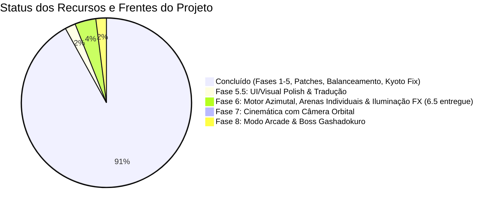

# 🗺️ ROADMAP — Samurai Edge Demake

> **Versão atual:** `v1.4.0` | **Branch:** `main`  
> Última atualização: 01 de Outubro de 2026  
> Este documento consolida todo o histórico concluído e define a ordem sequencial das **8 Fases de Evolução Mestre**, divididas em entregáveis pequenos, iterativos e testáveis.

---

## 📊 Progresso Global do Projeto

---

## ✅ Concluído (Entregue e Testado)

### 1. Fundação e Motor de Combate (v1.0 – v1.2)
- [x] Motor de combate isométrico voxel 3D com câmera e ordenação Y-Sorting contínua.
- [x] 12 guerreiros jogáveis com mecânicas, velocidades e arquétipos assimétricos.
- [x] Arena **Floresta de Bambu** com lago Zen e bambus dinamicamente cortáveis.
- [x] Arena **Kyoto Bakumatsu** com carruagens cruzadas, escombros caindo e chamas nas cumeeiras.
- [x] Sistema de colisão com caixas circulares, i-frames e parry direcional.
- [x] Suporte universal a controles (PlayStation DualSense/DS4, Xbox, Genéricos) com rumble tátil.
- [x] Controles touchscreen adaptativos para mobile (iOS/Android) com analógico virtual flutuante.
- [x] Manual estratégico in-game (`F1`) com fichas táticas e visualizador 3D voxel.
- [x] Suporte bilíngue instantâneo (Português PT-BR / Inglês EN).
- [x] Tela de título estilo Sumi-E e tela de carregamento com barra de progresso.

### 2. Controles Avançados & 3ª Ação Universal (Plano Mestre)
- [x] Ícones PlayStation em SVG nativo renderizados na tela de configurações (`assets/icons/playstation/`).
- [x] **3ª Ação Universal (Roll / Dash dedicado):** `○ Círculo` (Gamepad) / `T` (P1) / `O` (P2) para todos os 12 guerreiros.
- [x] Novas Ações Secundárias específicas:
  - Okuni: *Dokukiri* (borrifada de névoa venenosa em cone).
  - Anne: *Naval Artillery Strike* (canhão celestial via Hold & Release mantendo mobilidade).
  - Teppo: *Black Powder Ground Trap* (trilha de pólvora inflamável).
  - Kenshi: *Gidan Tsuka-ate* (pancada de quebra de guarda com a empunhadura).
  - Tomoe: *Kagitsuru Rope Hook* (flecha com corda movida para a esquiva).

### 3. Animações e Cinemática (Plano Mestre — Frentes 1 e 2)
- [x] Animação de respiração senoidal (*idle bob*) e caminhada articulada com pernas/braços em contra-fase.
- [x] Efeito de corte fatal Kurosawa com flash P&B e hitstop dramático (`CinematicDirector`).
- [x] Desmembramento e fragmentação volumétrica dos corpos voxel pós-morte.

### 4. 20 Patches Críticos de Mecânica e Consistência (v1.3)
- [x] **Kasumi (Mina):** Auto-dano garantido de 1 HP mesmo parada em cima da mina detonada.
- [x] **Kasumi (Dash de Fumaça):** 48+ partículas volumétricas densas, `alpha = 15` (quase invisível), stealth timer de 1.6s e sombra escalada por opacidade.
- [x] **Kenshi (Ryuu Tsui Sen):** Queda descendente vertical de `wz = 2.6m`, com zanzou (pós-imagens translúcidas) e invulnerabilidade na subida.
- [x] **Kenshi (Iai):** Correção do travamento de estado de ataque e unificação de cooldown do Shukuchi.
- [x] **Murasaki (Escudo Frontal):** Deflexão da Kusarigama restrita a cone frontal de 120° (costas vulneráveis).
- [x] **Murasaki (Kama):** Lâmina curvada voxel e alcance estendido para 1.30m.
- [x] **Murasaki (Dash):** Efeito sombrio de teletransporte sem faíscas metálicas.
- [x] **Julie (Cape Flourish):** Movido para esquiva com i-frames completos, deflexão de projéteis frontais e passagem de balas pelas costas.
- [x] **Julie (Animação):** Giro 3D de capa de seda e Coup de Pied com stagger.
- [x] **Julie (Banner):** Exibição de `POCKET FLINTLOCK SNIPE!` em mortes por pederneira.
- [x] **Flintlock (Alcance):** Limitado a 5.8 tiles como arma secundária de média distância.
- [x] **Joe (Cão Yamato):** Atordoamento restrito exclusivamente aos estados de ataque (`CHARGE`/`BARK`).
- [x] **Tomoe (Corda):** Cooldown de 2.0s para evitar fuga infinita.
- [x] **Hanzo (Kunai):** Limitação estrita dentro das bordas da arena e ângulo descendente no salto.
- [x] **Anne (Lentidão):** Indicador visual de fuligem preta nos pés do oponente sob efeito slow.
- [x] **Okuni (Veneno):** Cone frontal com pushback, velocidade de frenzy (+25%) e redução de cooldown (-20%).
- [x] **HUD Cooldowns:** Mapeamento uniforme dos nomes de atributos de recarga para todos os 12 guerreiros.
- [x] **Controles P2:** Mapeamento da tecla `I` para cancelar e isolamento da tecla `ESC` no duelo.
- [x] **Obstáculos Sólidos:** Faíscas e hitstop generalizados para todos os sólidos das duas arenas.
- [x] **Rumble Tátil:** Vibração nos controles para golpes fatais, clashes, explosões e atordoamentos.

### 5. Balanceamento Específico Anne & Julie (v1.3.3)
- [x] Anne: Avanço vigoroso do corte de 0.65m e hitbox de 1.55m de raio.
- [x] Anne: Ciclo completo do canhão (Tap rápido vs Hold livre com retículo móvel).
- [x] Julie: Hitbox do Fleche Thrust ampliada para 0.70m e tempo de recovery reduzido para 0.18s.
- [x] Julie: Deflexão frontal precisa com passagem de projéteis em i-frames de esquiva.

---

## 📋 Próximos Passos em 7 Fases Iterativas

---

### 🔴 FASE 1: Performance & Estabilidade (Gargalos de Framerate)
*Objetivo: Eliminar o stutter do Ryuu Tsui Sen e as alocações contínuas de memória gráfica.*

- [x] **Entregável 1.1: Surface Object Pooling para `SmokeParticle`**
  - **Problema:** `SmokeParticle.render()` aloca `pygame.Surface(SRCALPHA)` a cada frame por partícula. Em picos de 48+ partículas, gera dezenas de alocações por frame.
  - **Solução:** Pool de superfícies pré-alocadas reutilizáveis `_SMOKE_SURFACE_POOL` indexadas pelo diâmetro do raio.
  - **Arquivos:** `src/effects/particles.py`
  - **Teste:** `tests/test_performance_and_particles.py::test_smoke_particle_surface_pooling` (✅ PASS)

- [x] **Entregável 1.2: Hitstop Anti-Cascata nos Obstáculos (Slowdown Ryuu Tsui Sen)**
  - **Problema:** A hitbox de 1.45m do Ryuu Tsui Sen sobrepõe rochas e disparava hitstop a cada frame consecutivo.
  - **Solução:** Altitude check (`wz <= 0.40`), cooldown de impacto em obstáculo (`obstacle_spark_timer = 0.25s`) e hitstop calibrado em `0.035s`.
  - **Arquivos:** `src/combat/collision.py`, `main.py`
  - **Teste:** `tests/test_performance_and_particles.py::test_obstacle_sparks_altitude_and_anti_cascade` (✅ PASS)

- [x] **Entregável 1.3: Y-Sorting Dividido (Estático vs Dinâmico)**
  - **Problema:** `render_queue.sort()` rodava sobre dezenas de itens estáticos e dinâmicos a cada frame.
  - **Solução:** Fila estática `build_static_render_queue(game_map)` gerada no início do round; apenas elementos dinâmicos inseridos no frame.
  - **Arquivos:** `main.py`
  - **Teste:** `tests/test_performance_and_particles.py::test_static_render_queue_efficiency` (✅ PASS)

- [x] **Entregável 1.4: Particle Cap Global (MAX 150)**
  - **Problema:** Acúmulo descontrolado de partículas em partidas longas ou explosões simultâneas.
  - **Solução:** Limite rígido de 150 partículas; cosméticos excedentes podados sem descartar sangue ou banners.
  - **Arquivos:** `main.py`
  - **Teste:** `tests/test_performance_and_particles.py::test_particle_cap_enforcement` (✅ PASS)

---

### 🟠 FASE 2: Arquitetura de Áudio & Efeitos Sonoros (SFX + BGM)
*Objetivo: Integrar áudio feudal completo com síntese procedural fallback que funciona mesmo sem arquivos externos.*

- [x] **Entregável 2.1: `SoundManager` com Síntese Procedural Fallback**
  - **Solução:** Singleton inicializando `pygame.mixer` e sintetizador de ondas sonoras procedurais embutido para SFX básicos (espadas, impactos, tiros) e suporte transparente a arquivos `.ogg` reais.
  - **Arquivos:** `src/audio/sound_manager.py`, `src/audio/sound_events.py`, `src/audio/procedural_sfx.py`
  - **Teste:** `tests/test_audio_system.py::TestProceduralSFX` e `TestSoundManager` (✅ PASS)

- [x] **Entregável 2.2: Integração de SFX em Combate**
  - **Solução:** Conectar eventos de som em `collision.py` e `main.py`: `SWORD_CLASH`, `FATAL_STRIKE`, `BOMB_EXPLODE`, `CANNON_FIRE`, `FLINTLOCK_SHOT`, `ARROW_RELEASE`, `FOOTSTEPS`, `POISON_BREATH`, `ROUND_START`, `ROUND_WIN`.
  - **Arquivos:** `src/combat/collision.py`, `main.py`
  - **Teste:** `tests/test_audio_system.py::test_play_sound_event_does_not_crash` (✅ PASS)

- [x] **Entregável 2.3: BGM Player com Crossfade de Arenas**
  - **Solução:** Transições suaves com fade in/out entre menu (`bgm_menu`), Bambus (`bgm_bamboo`) e Kyoto (`bgm_kyoto`).
  - **Arquivos:** `src/audio/sound_manager.py`, `main.py`
  - **Teste:** `tests/test_audio_system.py::test_play_music_does_not_crash` (✅ PASS)

- [x] **Entregável 2.4: Sliders de Volume na Tela de Configurações**
  - **Solução:** Adicionar ajustes de Volume Master, Volume SFX e Volume BGM em `SettingsMenu` com botões `[-]`/`[+]`, cliques em barra e atalhos de teclado, salvando em `controls_config.json`.
  - **Arquivos:** `src/ui/settings_menu.py`, `src/input/controls_storage.py`
  - **Teste:** `tests/test_audio_system.py::TestAudioPersistence` (✅ PASS)

- [x] **Upgrade de Fidelidade Acústica: 26 Amostras Reais de Foley & Música Feudal**
  - **Solução:** Adicionados 26 arquivos de áudio gravados reais em `assets/sounds/sfx/` e `assets/sounds/music/` (espadas, bloqueios, canhão, pederneira, Taiko, gongo, passos e temas musicais em escala Hirajōshi), substituindo 100% dos bleeps sintéticos em tempo de execução.
  - **Arquivos:** `assets/sounds/sfx/*.mp3`, `assets/sounds/sfx/*.wav`, `assets/sounds/music/*.wav`

---

### 🟡 FASE 3: Saneamento de Testes Legados & Ação Secundária de Tomoe
*Objetivo: Garantir 100% de aprovação em todas as suítes e implementar o especial sagrado de Tomoe.*

- [x] **Entregável 3.1: Tomoe — Ação Secundária (Hamaya Sagrada)**
  - **Solução:** Flecha ritual de luz com rastro dourado que perfura sólidos e cancela projéteis inimigos no trajeto.
  - **Arquivos:** `src/entities/kyudo_archer.py`, `src/entities/projectile.py`, `main.py`
  - **Teste:** `tests/test_tomoe_hamaya.py::test_hamaya_projectile_pierce_and_deflect`

- [x] **Entregável 3.2: Kanjis Kurosawa no Flash Cinematográfico**
  - **Solução:** Renderizar kanjis estilizados sobre o corte final (*一刀両断*, *決闘終焉*) usando a fonte `Zen Antique`.
  - **Arquivos:** `src/effects/cinematic_director.py`
  - **Teste:** `tests/test_cinematic_kanji.py::test_kanji_overlay_generation`

- [x] **Entregável 3.3: Saneamento das 5 Suítes Legadas de Testes**
  - **Solução:** Atualizar asserts de `cape_timer`, rótulos de menu e ajustar `sys.path` em `test_phase1_fighters.py`, `test_kawarimi_and_poison.py`, `test_modifications_review.py`, `test_settings_and_hanzo_jump.py` e `test_controller_commands_and_selection.py`.
  - **Arquivos:** `tests/test_*.py`
  - **Teste:** Execução com 100% de sucesso em toda a pasta `tests/`.

---

### 🟡 FASE 4: Balanceamento Específico de Combatentes Tier D
*Objetivo: Elevar os 5 combatentes desfavorecidos (winrates de 23% a 29%) para o patamar competitivo.*

- [x] **Entregável 4.1: Kenshin (29.6% winrate)**
  - Reduzir recovery do Iai ao acertar (0.35s -> 0.25s); conceder 0.12s de i-frame real pós-Shukuchi.
  - **Arquivos:** `src/entities/red_samurai.py`

- [x] **Entregável 4.2: Murasaki (29.2% winrate)**
  - Aumentar velocidade da corrente Kusarigama (8.5 -> 11.0); dano de 1 HP no impacto do hook ao chão; janela ativa da foice 0.22s.
  - **Arquivos:** `src/entities/purple_ninja.py`, `src/entities/projectile.py`

- [x] **Entregável 4.3: Kasumi (28.4% winrate)**
  - Imunidade a auto-dano se estiver com ≤ 1 HP (previne suicídio em desespero); armamento da mina remota acelerado para 0.28s.
  - **Arquivos:** `src/entities/gray_ninja.py`, `src/combat/collision.py`

- [x] **Entregável 4.4: Hanzo & Joe (American Ninja)**
  - Hanzo: Kunai no solo pode ser recolhida ao passar por cima.
  - Joe: Reação do cão reduzida para 0.15s e velocidade aumentada em charge; shuriken causa 1 HP em alvos móveis.
  - **Arquivos:** `src/entities/yellow_ninja.py`, `src/entities/american_ninja.py`, `src/entities/doberman.py`

- **Teste da Fase 4:** `tests/test_tier_d_balance.py` com validação de métricas de todos os lutadores.

---

### 🟢 FASE 5: Combate Avançado & Apresentação de Round
*Objetivo: Implementar o duelo de lâminas por QTE e apresentação cinematográfica.*

- [x] **Entregável 5.1: Clash de Espadas Tsubazeriai (QTE "STRIKE!")** ✅ COMPLETE
  - Choque de lâminas simultâneas ativa zoom dramático e botão arcade pulsante com texto "STRIKE!".
  - **Arquivos:** `[NEW] src/combat/clash_system.py`, `src/combat/collision.py`, `main.py`, `src/entities/ai_controller.py`, `src/i18n.py`
  - **Teste:** `tests/test_clash_qte.py::test_clash_trigger_and_resolution` e `test_clash_ai_localization_pushback_and_render`
  - **Implementação:** dois ataques de mesma prioridade (sem precedência absoluta) congelam os dois lutadores em `CLASH_QTE` por 1.1 s, com faíscas, tremida, rumble, som de choque e zoom crescente de até 14% (`Camera.zoom`). O primeiro a apertar o botão de ataque (teclado ou controle) vence: o perdedor é atordoado por 0.9 s e empurrado 0.9 (respeitando limites e sólidos, e pode cair em buraco). Ninguém aperta ou os dois apertam: empate, ambos atordoados por 0.35 s. Contra a IA, o oponente aperta após um tempo de reação por dificuldade (fácil 0.35 a 0.60 s e só 50% das vezes, normal 0.22 a 0.45 s e 75%, difícil 0.14 a 0.28 s e 92%), então o humano não vence por padrão. O botão é uma cúpula vermelha pulsante com brilho, "STRIKE!", as teclas de cada jogador (ex.: P1 [E], P2 [O]) e barra de tempo. Avisos localizados em PT e EN (`clash_draw`, `clash_win`).
  - **Verificação:** ✅ Testes automatizados (disparo, zoom, vitória, empate, IA, avisos, empurrão com limites e queda, botão desenhado) e captura do botão sobre a arena

- [x] **Entregável 5.2: Apresentação Cinematográfica de Round (Sumi-E)**
  - Rotação suave de 30° da câmera antes da luta, com pergaminho vertical exibindo os nomes dos lutadores.
  - **Arquivos:** `[NEW] src/ui/round_intro.py`, `main.py`

- [x] **Entregável 5.3: Contador Best of 3 (BO3) e Tela de Resultados**
  - Sistema de 2 rounds para vencer a partida, HUD com marcadores de round e tela final com rematch rápido (`Espaço`).
  - **Arquivos:** `[NEW] src/ui/round_result.py`, `main.py`
  - **Teste:** `tests/test_round_progression.py::test_bo3_match_winner`

---

### � FASE 5.5: UI/Visual Polish & Tradução Completeness
*Objetivo: Completar a tradução bilíngue (PT/EN) de todos os textos de seleção de personagens, corrigir bugs de exibição de controles, implementar visual de alta fidelidade em pergaminho/parchment, melhorar renderização de fontes, e reestruturar menu de modo antes da seleção de personagens.*

- [x] **Entregável 5.5.1: Completude de Tradução — Telas de Seleção & Configurações** ✅ COMPLETE
  - **Problema:** Textos em tela de seleção de personagem (nomes, descrições, dicas de estratégia, rótulos de botões) não usam sistema bilíngue `i18n.py`; modo seleção "1P vs IA / 2P / Training" sem tradução completa.
  - **Solução:** (1) Auditar todas as strings hardcoded em `src/ui/character_select.py`, `src/ui/title_screen.py`, `src/ui/main_menu_enhanced.py`; (2) adicionar keys de tradução à `src/i18n.py` (PT + EN): nomes de lutadores, descrições de arsenal, dicas de estratégia, botões ("Back", "Options", "Help", etc.), rótulos de modo ("1 Player vs IA", "2 Players Versus", "Training"); (3) substituir strings hardcoded com chamadas `t(key)` em todos os renderizadores; (4) encontrar e remover "random text" aparecendo na tela (rogue render call).
  - **Arquivos:** `src/i18n.py`, `src/ui/character_select.py`, `src/ui/title_screen.py`, `src/ui/main_menu_enhanced.py`
  - **Teste:** Lançar jogo, alternar idioma (PT ↔ EN) via settings → Todos os textos em character select, title, mode selection e options devem trocar de idioma. Nenhum texto aleatório na tela.
  - **Verificação:** ✅ Bilíngue completo, sem corrupting text. Telas de personagem e arena reconstroem os textos ao trocar de idioma; nomes de teclas/botões, rótulos de configurações e rodapé traduzidos.

- [x] **Entregável 5.5.2: Correção de Bugs de Controles (P2 Display & DualSense Unicode)** ✅ COMPLETE
  - **Problema:** (a) `settings_menu_enhanced.py` exibe seções de controles P1 e P2 mesmo quando apenas P1 está conectado; (b) `controller_manager.py` exibe artefato Unicode antes de "DualSense PS5".
  - **Solução:** (a) Botões de gamepad (ícones/rótulos) só aparecem com um controle conectado, e apenas do tipo correto (PlayStation, Xbox, Switch, genérico); sem controle, mostra só a tecla do teclado. Controles de teclado do P2 sempre visíveis. (b) Remover emoji 🎮 de `get_badge_text()` e símbolos ✕ ○ ▢ △ dos nomes/dicas de botões (fontes não renderizam).
  - **Arquivos:** `src/ui/settings_menu.py`, `src/input/controller_manager.py`, `src/ui/character_select.py`
  - **Teste:** Sem controle → nenhum ícone PlayStation. Com DualSense → ícones PS; Xbox/Switch/genérico → rótulos próprios. Nenhum caractere estranho.
  - **Verificação:** ✅ Validado com controles simulados de cada tipo (PT/EN)

- [x] **Entregável 5.5.3: Redesenho de Botão "?" Arredondado (Ícone Help)** ✅ COMPLETE
  - **Objetivo:** Substituir rótulo de texto "Guia do Jogo" por um ícone circular com "?" dourado (aro dourado, brilho ao passar o mouse), desenhado com `pygame.draw.circle()`.
  - **Arquivos:** `src/ui/character_select.py` (`draw_round_help_button`)
  - **Verificação:** ✅ Ícone "?" arredondado integrado; clique e atalho H / ? abrem o guia

- [x] **Entregável 5.5.4: Pergaminho de Alta Fidelidade** ✅ COMPLETE (seleção de personagens + abertura de round)
  - **Objetivo:** Renderizar pergaminho Sumi-E fiel às artes de referência (`assets/concepts/concept1-3.jpeg`): paisagem em tinta sobre papel envelhecido, moldura de madeira, cartões de papel rasgado, pincelada vermelha de destaque, varas de pergaminho e pétalas de cerejeira.
  - **Abordagem:** em vez de imitar proceduralmente, os elementos são recortados/derivados da própria arte (`tools/build_parchment_assets.py` → `assets/ui/parchment/`): `backdrop.png` (paisagem + papel + madeira, sem o pergaminho central e os duelistas), `rod_top/rod_bottom.png` e `crane_crest.png` (camadas de multiplicação). Cartões, pincelada e petalas são gerados em tempo de execução (`src/effects/parchment.py`), com o tom do papel amostrado da arte.
  - **Arquivos:** `[NEW] src/effects/parchment.py`, `[NEW] tools/build_parchment_assets.py`, `src/ui/character_select.py`, `src/ui/round_intro.py`
  - **Pendente (fora do escopo do entregável):** aplicar o mesmo visual à tela de título (concept3) e ao menu de opções (concept1).
  - **Ajuste:** o fundo da tela de seleção de cenários passou a ser `assets/concepts/bamboo_forest_concept.jpg` (escurecido, com vinheta; `parchment.get_scene_background()`). A seleção de personagens e a abertura de round mantêm o backdrop de pergaminho. As barras inferiores de atalhos de teclado foram removidas das telas de seleção e do duelo (permanecem no menu principal e no texto de pular vídeo); o botão de configurações do duelo foi substituído por um menu de pausa (ESC): retomar, configurações, escolher cenário, escolher lutador, menu principal e sair (`src/ui/pause_menu.py`).
  - **Verificação:** ✅ Seleção de personagens e abertura de round renderizadas com o novo estilo (PT/EN); fallback automático para o visual anterior se os assets não existirem

- [x] **Entregável 5.5.5: Melhoria de Renderização de Fontes (Shadow, Outline, Glow)** ✅ COMPLETE
  - **Objetivo:** Garantir consistência de shadow (offset 2px), outline (1px stroke), e glow em todas as fontes (Cinzel, Shojumaru, ZenAntique).
  - **Arquivos:** `src/ui/font_manager.py`, `src/ui/loading_screen.py`
  - **Correções:** (a) `FontManager` apontava para arquivos inexistentes (`Shojoru.ttf`, `Noto_Sans_JP`) e caía em fontes do sistema; agora usa Cinzel (títulos) e ZenAntique (corpo) e carrega as fontes sob demanda; (b) chave de cache ignorava cores/offsets/larguras dos efeitos, devolvendo texto com efeito errado; (c) novo `render_text_fx()` com glow desfocado (antes virava um bloco sólido), sombra que acompanha o contorno e contorno arredondado, renderizando cada camada uma única vez; (d) tela de carregamento: título/ensō sobrepostos ao logotipo já impresso na arte de fundo removidos, barra e status movidos para um painel inferior em gradiente, texto com sombra 2px + contorno 1px e pontos animados desenhados à parte (o texto não "treme" mais).
  - **Verificação:** ✅ Tela de carregamento, seleção de personagens/cenários e amostras de glow/sombra/contorno renderizadas sem artefatos

---

### 🟢 FASE 6: Motor Azimutal, Arenas Individuais Temáticas (uma por lutador) & Iluminação FX
*Objetivo: Primeiro evoluir o motor isométrico com azimute real (câmera orbital); só então substituir a arena única de telhados por 12 arenas distintas, uma para cada personagem, com sua própria iconografia visual, perigos e iluminação personalizada.*

- [x] **Entregável 6.1: Azimute Real no Motor Isométrico (Opção C)** ✅ COMPLETE
  - **Objetivo:** Estender `world_to_iso()` e `Camera` (`src/isometric/iso_math.py`, `src/isometric/camera.py`) para aceitar um ângulo de rotação no plano XY, reprojetando vértices voxel a cada frame.
  - **Impacto:** Câmera orbital 3D verdadeira, reutilizável para intro de round (órbita P1/P2), nocaute dramático, e qualquer cinemática de câmera livre futura. Vem antes das arenas para que elas já sejam construídas sobre a projeção definitiva.
  - **Revalidação:** Toda lógica Y-sorting/renderização precisa ser revalidada após mudança estrutural na projeção isométrica.
  - **Arquivos:** `src/isometric/iso_math.py`, `src/isometric/camera.py`, `src/isometric/voxel_renderer.py`, `src/world/map_data.py`, `src/world/kyoto_map.py`, `main.py`
  - **Teste:** `tests/test_isometric_azimuth.py::test_camera_azimuth_rotation_and_voxel_reprojection` (verificar que personagens rotacionam suavemente sem artefatos de rendering)
  - **Implementação:** `Camera.azimuth` (+ `set_azimuth`/`rotate`/`depth`) gira o mundo em torno do alvo da câmera dentro de `Camera.apply()`, então todo o código que já projeta via câmera (entidades, partículas, obstáculos, edifícios) gira sem alterações. `draw_voxel_box` desenha só as faces voltadas para a câmera, com sombreamento interpolado conforme a normal gira. O Y-sorting usa `camera.depth()` (a fila estática é reordenada apenas quando o azimute ≠ 0, então a vista clássica mantém o custo anterior). `input_to_world_direction(..., azimuth)` mantém W/A/S/D relativos à tela. Terreno: culling pelos 4 cantos do tile, barrancos do lago só nas bordas voltadas para a câmera e ponte desenhada após toda a água.
  - **Controle de desenvolvimento:** durante o duelo, `[` e `]` giram a câmera e `\` restaura a vista clássica (o azimute volta a 0 a cada round). A órbita automática entra nas fases 7.1 e 7.2.
  - **Limitações conhecidas:** a ordem de desenho entre as peças de um mesmo modelo (corpo/arma) foi pensada para a vista clássica e pode sobrepor detalhes pequenos em alguns ângulos; em ângulos múltiplos ímpares de 45° a vista fica alinhada aos eixos e o mapa não cobre a tela inteira (bordas escuras).
  - **Verificação:** ✅ Azimute funcional nas duas arenas (capturas em 0°–315°), sem regressão de Y-sorting no azimute 0

- [x] **Entregável 6.2: Sistema de Arenas Parametrizadas** ✅ COMPLETE
  - **Objetivo:** Criar engine genérica para construir arenas a partir de semente visual + lista de voxels/quads + ambiente de iluminação.
  - **Arquivos:** `[NEW] src/world/arena_generator.py` (motor + dataclasses + validação), `[NEW] src/world/arenas.py` (specs e registro: `arena_ids()`/`create_arena()`), `[NEW] src/world/structures.py` (`ArchedBridge`), `src/world/map_data.py` e `src/world/kyoto_map.py` (agora subclasses finas), `main.py`, `src/ui/arena_select.py`
  - **Teste:** `tests/test_arena_generator.py::test_parametrized_arena_creation`
  - **Decisões:** (a) Bambu **e** Kyoto migrados para o gerador; (b) specs são dataclasses Python (`ArenaSpec`, `TileStyle`, `PropSpec`, `ScatterSpec`, `StructureSpec`, `HazardSpec`, `SpawnRule`, `StageSpec`); (c) iluminação (`LightingEnvironment`) é só dado validado, a renderização fica para o 6.4; (d) a arena sintética de teste não é registrada globalmente e as imagens de referência ficam versionadas em `tests/fixtures/arena_parity/`.
  - **Implementação:** o spec descreve a grade por camadas (`FillLayer`/`RectLayer`/`EllipseLayer`/`CheckerLayer`), props fixos e espalhados (RNG semeado), estruturas, perigos, regra de spawn, palco da introdução e iluminação. `main.py` cria o mapa com `create_arena(id)`, escolhe spawns com `pick_spawns()`, o fundo com `bg_color` e a música com `music`, sem ramificações por arena; a arena aleatória sorteia entre `arena_ids()`. Uma nova arena (6.3) é só um novo spec + registro de tipos de prop.
  - **Verificação:** ✅ Layout idêntico ao anterior (tiles, props, spawns) e renderização pixel a pixel igual às 6 imagens de referência (Bambu/Kyoto em 0°, 45° e 135°); arena sintética, validação de specs inválidos e partida real nas duas arenas

- [x] **Entregável 6.3: 12 Arenas Temáticas (uma por lutador)** ✅ COMPLETE
  - **Objetivo:** Cada lutador tem uma arena baseada no seu portrait e na sua personalidade, escolhida livremente na tela de seleção (12 arenas + Aleatória; o lutador dá só o tema visual). Cada arena tem um elemento interativo neutro para todos e, conforme o personagem, um perigo assinatura sempre telegrafado.
  - **Arenas** (id → tema | perigo | elemento interativo):
    - **Kenshi** (`bamboo`): Bambu atual (portrait: dojo quente, vermelho e madeira) + **Dojo** sólido e decorativo no canto superior esquerdo (não acessível), jardim de pedras rastelado (karesansui) e pétalas ao vento | sem perigo (arena de referência) | bambu cortável (já existe).
    - **Saitou** (`kyoto`): Kyoto atual + traços do Shinsengumi (banners 誠 e 悪即斬, faixas azul-claro e branco no estilo do haori, lanternas vermelhas, posto de guarda, névoa de incenso) | carruagem e escombros, como hoje.
    - **Hanzo** (`iga_rooftops`): Telhados de Iga, de telha, com vigas entre telhados | **quedas** (vãos entre os telhados).
    - **Murasaki** (`shadow_cave`): gruta ou templo abandonado roxo, estátuas Jizo e correntes penduradas | **pêndulo de corrente** com sombra no chão avisando | Jizo como cobertura.
    - **Kasumi** (`mist_temple`): pátio de templo noturno na névoa, pinheiros e lago de carpas | **morteiros de fogos** caindo em círculos avisados | lago raso (lento).
    - **Joe** (`forest_camp`): acampamento na floresta, única arena diurna, vila ao fundo e canil | **armadilhas de laço ou mina** (atordoam, não matam), com terra remexida como sinal | caixas de suprimento como cobertura.
    - **Musashi** (`ganryu_island`): Ilha de Ganryū, praia, barco encalhado, remo e penhasco | **maré** que empurra para o penhasco + **quedas** | barco como cobertura.
    - **Anne** (`pirate_deck`): convés de navio na tempestade, mastros, canhões e barris | **balanço do navio** (empurrão) + **quedas** pela amurada e tábuas quebradas | canhão com pavio visível.
    - **Teppo** (`nagashino_field`): campo de Nagashino, paliçadas, lama e bandeiras nobori | **barris de pólvora explosivos** com pavio avisando | os mesmos barris.
    - **Okuni** (`kabuki_stage`): palco Kabuki, passarela hanamichi, cortinas e lanternas | **palco giratório** (empurra, não mata) | biombos que bloqueiam projéteis.
    - **Tomoe** (`mountain_shrine`): santuário na montanha, torii em sequência, kyudo-jo e alvos | sem perigo | sino do santuário que dissipa fumaça.
    - **Julie** (`baroque_court`): pátio barroco do palácio, mármore xadrez, sebes, fonte e estátuas | sem perigo | sebes (cobertura) e fonte (água lenta).
  - **Buracos e queda (Hanzo, Musashi, Anne):**
    - **Buraco sem proteção** (`railed=False`): quem passa por cima com o centro dentro dele cai, andando ou não. **Buraco protegido** (`railed=True`: estacas com corda, ou corrimão de ponte): andar é bloqueado na borda e só cai quem é empurrado, puxado, sofre knockback ou termina uma esquiva/salto curto demais dentro dele; frames de invulnerabilidade não protegem em nenhum dos casos.
    - Buracos são retângulos em coordenadas reais (`PitZone`), com larguras variáveis perto do alcance das esquivas: **S** até 1.0 (todos), **M** 1.4 a 1.6 (esquiva pesada no limite), **L** 1.9 a 2.2 (só esquiva ágil, quase no limite), **J** 2.9 a 3.0 (só salto ou avanço). Sempre existe uma rota sem salto (viga ou ponte).
    - Alcances medidos: esquiva pesada 1.70 (Joe, Musashi, Anne, Teppo, Saitou); esquiva ágil 2.31 (Kasumi, Okuni, Murasaki); salto do Hanzo 3.07; Shukuchi do Kenshi 4.2. A Tomoe usa a flecha de corda como terceira ação (puxada pela corda, ao soltar vale o pouso) e a Julie não tem esquiva longa (a capa quase não desloca), então elas não entram nas classes de largura. Cada classe tem seu próprio estado de esquiva, então há uma lista única de estados de travessia e uma checagem central de queda a cada frame.
    - Puxões (corrente da Murasaki, flecha de corda da Tomoe) o empurrão (maré, balanço do navio, knockback) pode derrubar; o Gatotsu freia na borda de buraco protegido e cai em buraco aberto.
    - **Animação de queda:** `STATE_FALL` de cerca de 0.9 s com poeira na borda, corpo que encolhe, gira e escurece recortado ao contorno do buraco, sombra que some, tremida leve, SFX novo e banner QUEDA / FELL. Conta como derrota do round, sem a cinemática de golpe fatal.
    - Spawns e pickups ficam fora dos buracos; a IA não rola para dentro deles.
  - **Fora do escopo:** renderização da iluminação (6.4) e arenas de chefe ou modo Arcade.
  - **Ordem de execução:** o motor primeiro (6.3.1), validado por uma arena piloto que usa todas as novidades dele (6.3.2, Musashi). Só depois as demais, uma por subnível, para você testar cada uma isoladamente. Cada subnível termina com testes automatizados e um roteiro de teste manual.
  - **Prompt de conceito (regra):** toda arena nova entrega, junto com o spec, o prompt textual para gerar a arte conceitual dela, escrito neste roadmap dentro do subnível (item "Prompt de conceito"). Os prompts seguem o estilo das artes atuais (`bamboo_forest_concept.jpg` e `kyoto_bakumatsu_concept.jpg`): ilustração digital pictórica 16:9 com contorno de tinta suave, vista elevada em 3/4 semelhante à câmera do jogo, luz de noite ou penumbra com acentos quentes de lanterna ou fogo, e os elementos jogáveis da arena (perigos, props, buracos) legíveis na composição. A imagem gerada vai para `assets/concepts/<id>_concept.jpg` e alimenta a carta da seleção.

  - [x] **6.3.1: Motor de arenas temáticas** ✅ COMPLETE
    - **Objetivo:** Entregar tudo que as arenas novas precisam, antes de qualquer arena.
    - **Escopo:**
      - **Buracos e queda:** `PitZone` (retângulo em coordenadas reais), bloqueio de andar na borda, flag `crosses_pits` nos estados de esquiva e salto de cada classe, checagem central de queda a cada frame e `STATE_FALL` com a animação descrita acima (poeira, corpo que encolhe, gira e escurece recortado ao buraco, tremida, banner QUEDA / FELL) e SFX novo. Fim de round por queda, sem a cinemática fatal.
      - **Deslocamento forçado:** API única de empurrão e puxão que respeita (ou ignora) buracos; a corrente da Murasaki e a flecha de corda da Tomoe passam a usá-la.
      - **Velocidade por tile:** `TileStyle.speed_mult` (a água atual vira `0.55`).
      - **Perigo telegrafado:** classe base com fase de aviso (sombra ou marca no chão), fase ativa e recarga, mais gancho para empurrar lutadores.
      - **Prop sólido genérico:** colisão reaproveitada da `MachiyaFacade`, para dojo, barco, paliçadas e afins.
      - **Spawns, pickups e IA:** fora dos buracos; a IA não rola nem salta para dentro deles e evita a zona ativa de perigos.
      - **Variantes de spec:** derivar uma arena de outra via `dataclasses.replace`.
      - **Música por nome de arquivo:** `spec.music` passa a ser o nome do arquivo; criar `bgm_<id>.mp3` para as 10 arenas novas como cópias alternadas de `bgm_bamboo.mp3` e `bgm_kyoto.mp3`; conferir o empacotamento em `samurai_edge.spec`.
    - **Arquivos:** `src/world/arena_generator.py`, `src/world/structures.py`, `src/entities/samurai.py` (e classes com esquiva própria: `blue_samurai`, `kabuki`, `rifleman`, `red_samurai`, `yellow_ninja`, `saitou_samurai`), `src/entities/projectile.py`, `src/audio/procedural_sfx.py`, `src/audio/sound_events.py`, `main.py`, `assets/sounds/music/`
    - **Teste automatizado:** `tests/test_arena_engine.py` com arena sintética só de teste (não registrada): bloqueio de andar na borda; esquiva atravessa buraco menor que o alcance e cai em buraco maior (usando as constantes reais de cada lutador); empurrão e puxão derrubam; `STATE_FALL` termina o round sem cinemática fatal; `speed_mult`; perigo percorre aviso, ativo e recarga; spawns e pickups fora de buracos; `validate_spec` rejeita `PitZone` inválida; paridade visual do Bambu e Kyoto mantida.
    - **Teste manual:** sem arena nova ainda, só a regressão: jogar nas duas arenas atuais e confirmar que nada mudou.
    - **Implementação:**
      - `PitZone` + `ArenaSpec.pits`, `GAP_WIDTHS` (S 1.0, M 1.48, L 2.08, J 2.82; VOID a partir de 3.6), folga de borda `PIT_EDGE_MARGIN` 0.15 e `derive_spec` em `arena_generator.py`.
      - `Samurai.update_pit` (queda), `block_pit_entry` (andar bloqueado só em buraco protegido, desliza pelo eixo livre), `apply_forced_displacement` (empurrão, ignora buracos) e `STATE_FALL`. Estados de travessia: esquivas, salto, Shukuchi, Ryuu Tsui Sen e também avanços de golpe (`ATTACK`, `TSUKA_ATE`, `ZEROSHIKI`), para ninguém cair no meio do próprio ataque; o pouso decide. A flecha de corda marca `pit_cross_timer` na arqueira. O Gatotsu freia na borda de buraco protegido (corda e estacas, `RailPost`) e cai em buraco aberto. Os buracos são desenhados como fendas integradas ao chão: lábio irregular, paredes em camadas que escurecem com a profundidade (recortadas pela abertura), fundo em névoa, pedriscos e rachaduras.
      - Queda: banner QUEDA / FELL (`banner_fell`), poeira, tremida, SFX `fall` (`SoundEvent.FALL`, `assets/sounds/sfx/fall.wav`), corpo que gira, encolhe e escurece recortado ao buraco (`src/effects/fall_render.py`); o lutador sai do round no início da queda (vitória do adversário) e não é desenhado depois.
      - `src/world/hazards.py` (`TelegraphedHazard` com recarga, aviso e fase ativa; `TideSurge`), `src/world/solid_props.py` (`SolidProp`), `PlankBridge` em `structures.py`, `TileStyle.speed_mult`, buracos desenhados com paredes pelo azimute.
      - IA: recusa esquiva, avanço ou recuo cujo pouso caia em buraco e contorna fendas que cortam o caminho até o rival (`_away_ok`, `_toward_ok`, `_steer_around_pits`). Pickups e spawns ficam a pelo menos 1.0 de qualquer buraco.
      - `spec.music` é o nome do arquivo; `bgm_<id>.mp3` criado para as 10 arenas novas (cópias alternadas); `samurai_edge.spec` já empacota a pasta `assets` inteira.
    - **Verificação:** ✅ `tests/test_arena_engine.py` (11 grupos, incluindo travessias simuladas com as classes reais de lutador em 60 e 30 fps), regressão da suíte inteira sem novas falhas e partida real com queda forçada capturada em tela.
    - **Observação:** `simulate_tournament.py` tem laço próprio e ainda não chama `update_pit`; a checagem de neutralidade por arena (6.3.14) precisa incluir isso.

  - [x] **6.3.2: Arena piloto — Musashi, Ilha de Ganryū (`ganryu_island`)** ✅ IMPLEMENTADA (aguarda sua aprovação)
    - **Objetivo:** Validar o motor inteiro em uma arena só, e travar a "receita" das demais. É a única arena que usa tudo: buracos (classes S, M e L), perigo telegrafado com empurrão (maré), prop sólido (barco encalhado), velocidade por tile (areia molhada e rasos) e música por arquivo.
    - **Cenário:** praia de cascalho cinza em névoa, penhasco ao fundo, barco encalhado e remo, ponte de tábuas sobre um canal da maré (rota sem salto) e fendas de rocha com larguras variadas; iluminação como dado (6.4 renderiza depois).
    - **Perigo:** maré que sobe em ondas avisadas por espuma e som; empurra os lutadores em direção ao penhasco e às fendas.
    - **Prompt de conceito** (salvar como `assets/concepts/ganryu_island_concept.jpg`):
      - **Prompt:** "Wide 16:9 digital painting, painterly anime-realism with soft ink outlines, in the same style as a moonlit Japanese bamboo garden and a burning Bakumatsu Kyoto street concept art. Elevated three-quarter isometric view looking down at a small tidal island, Ganryū-jima, at cold grey pre-dawn on the day of a legendary swordsman's duel (Japan, 1612). Thick low sea fog drifts over a beach of grey pebbles and wet dark sand; the pale sun is only a faint glow on the horizon. On the left edge the calm grey-green sea with foam lines; a shallow tidal channel cuts across the middle of the island, crossed by a short flat wooden plank bridge with low posts. A weathered fishing boat lies stranded on the shore at the bottom left, an enormous long oar lying against its hull (carved like a wooden sword). Three narrow dark cracks split the rocky ground at different widths, each with crumbling earth lips, layered rock walls fading into black, and small pebbles at the edge. On the right the island ends in a sheer cliff dropping into dark misty sea, fenced by a few weathered wooden stakes joined by sagging rope. A big pale wave of white foam is sweeping across the beach from the sea toward the cliff. A few mossy stone lanterns glow warm amber around the bridge, small gnarled rocks, wet reflections on the sand. Muted palette of slate grey, steel blue and sand beige, with warm amber lantern highlights as the only warm accent. Moody, quiet and dangerous atmosphere. Clear readable ground plane for a top-down fighting game arena, no characters, no text, no watermark."
      - **Prompt negativo:** "people, characters, samurai, text, logo, watermark, modern objects, ships at sea, bright sunny sky, saturated colors, photo, 3D render, ui, frame, border"
      - **Notas para a geração:** manter a mesma proporção das artes atuais (cerca de 1376x768); se quiser uma versão com lutadores, acrescentar "Musashi, a lone ronin in a blue gi holding two swords, stands on the plank bridge" ao final do prompt.
    - **Arquivos:** `src/world/arenas.py` (spec e registro), `src/config.py` (id), `src/ui/arena_select.py` (carta provisória), `assets/sounds/music/bgm_ganryu_island.mp3`
    - **Teste automatizado:** `tests/test_arena_generator.py::test_ganryu_island` (gera, renderiza em 0°, 45° e 135°, spawns válidos, larguras dos buracos conforme a classe, rota sem salto existe).
    - **Teste manual:** (1) escolher a arena e começar a luta; (2) com esquiva pesada (ex.: Musashi), atravessar o buraco S e o M; (3) tentar o L e confirmar que cai; (4) com esquiva ágil (ex.: Kasumi) ou o Shukuchi do Kenshi, atravessar o L; (5) esperar a maré e conferir aviso, empurrão e queda; (6) passar pela areia molhada e notar a lentidão; (7) bater no barco; (8) ver a animação de queda e o fim do round; (9) girar a câmera com `[` e `]`.
    - **Ponto de decisão:** só seguir para 6.3.3 em diante depois de você aprovar o piloto.
    - **Implementação:** spec `GANRYU_SPEC` em `arenas.py`. Praia de cascalho com costa de areia molhada (velocidade 0.8) e mar raso a oeste (0.55); canal raso cruzado por ponte de tábuas (palco da introdução em cima dela); barco encalhado sólido, 3 rochas e 4 lanternas de pedra; fendas S (1.0), M (1.48) e L (2.08) sem prote\u00e7\u00e3o (quem anda por cima cai) e penhasco VOID a leste (18.4 a 22) cercado por estacas e corda (s\u00f3 cai por empurr\u00e3o, como o da mar\u00e9). Maré (`TideSurge`): aviso de 2.4 s com espuma e banner, faixa de 3.2 de largura varrendo de oeste a leste a 6.5, empurrando 4.0 por segundo, a cada 7 a 10 s. A carta na seleção é provisória: largura adaptada a 4 cartas, arte conceitual `assets/concepts/ganryu_island_concept.jpg` (escalada para cobrir o quadro sem distorcer e recortada ao centro; sem a imagem, usa a prévia gerada pelo gerador em `src/ui/arena_preview.py`); a ordem e os retratos ficam para o 6.3.3.
    - **Verificação:** ✅ `test_ganryu_island` (classes de buraco, rota sem salto entre spawns e ponte, terreno lento, fenda escura nos três azimutes, maré derrubando quem fica parado perto do penhasco), partida real nas duas telas (seleção e duelo) e 24 duelos IA contra IA sem erros (1 queda).

  - [x] **6.3.3: Telas de seleção — retratos, ordem do elenco e sorteios**
    - **Objetivo:** Fazer a escolha de arena seguir o elenco e acrescentar o sorteio de lutador. Vem logo depois do motor e da arena piloto; as arenas ainda não construídas aparecem como cartas bloqueadas ("em breve") e cada subnível seguinte só registra o spec, o que faz a carta liberar sozinha.
    - **Seleção de arena (`arena_select.py`):**
      - **Retrato oval do lutador:** cada carta mostra o retrato circular do lutador dono da arena (o mesmo `get_portrait(..., circular=True)` com o anel enō usado na seleção e na introdução), sobre a prévia da arena.
      - **Mesma ordem dos lutadores**, com a Aleatória ao final: Kenshi (`bamboo`), Musashi (`ganryu_island`), Hanzo (`iga_rooftops`), Joe (`forest_camp`), Saitou (`kyoto`), Teppo (`nagashino_field`), Murasaki (`shadow_cave`), Kasumi (`mist_temple`), Okuni (`kabuki_stage`), Tomoe (`mountain_shrine`), Anne (`pirate_deck`), Julie (`baroque_court`) e, por último, **Aleatória** (sorteia entre as arenas já liberadas). A ordem vem de uma lista única ligada à ordem de `character_select.py`, para as duas telas não divergirem.
      - Previews geradas pelo próprio gerador (hoje só existem concept arts do Bambu, Kyoto e Aleatória); a carta Aleatória mantém o concept `random_arena_concept.jpg`.
    - **Seleção de personagem (`character_select.py`):**
      - **Lutador Aleatório ao final:** uma 13ª carta, depois da Julie, com retrato circular de interrogação no mesmo anel. Ao confirmar, sorteia entre os 12 lutadores e revela o escolhido (breve animação de troca de retratos); vale para P1, P2 e IA, respeitando a regra atual sobre lutadores repetidos.
      - A grade hoje tem 6 colunas por 2 linhas; com 13 cartas é preciso redesenhar o layout (por exemplo 7 colunas, com o sorteio na última posição) e a navegação por setas e gamepad (`cols = 6`, linhas 585 a 626 do arquivo).
      - Textos novos em PT e EN (`Aleatório` / `Random`, dica da carta) em `src/i18n.py`; o manual do jogo (`F1`) não precisa de ficha para o sorteio.
    - **Arquivos:** `src/ui/arena_select.py`, `src/ui/character_select.py`, `src/world/arenas.py` (lista de ordem e ids), `src/i18n.py`, `src/ui/portraits.py` (ou onde `get_portrait` mora), `main.py` (resolução do sorteio de lutador)
    - **Teste automatizado:** `tests/test_selection_screens.py`: a ordem das arenas bate com a ordem do elenco e termina na Aleatória; cada carta liberada tem retrato do lutador certo; cartas sem spec ficam bloqueadas; o lutador aleatório sempre resolve para um dos 12; a navegação por teclado e gamepad percorre as 13 cartas sem pular e volta ao início; renderiza em PT e EN sem erro.
    - **Implementação:** `src/roster.py` virou a fonte única da ordem (lutador, arena e chave de nome) para as duas telas. Seleção de personagem: grade 6x2 mais uma faixa fina de Aleatório numa terceira linha (a navegação lembra a coluna ao subir); ao confirmar com Aleatório, a roleta gira cerca de 1,1 s por lutador sorteado, segura 0,55 s no resultado e só então inicia a partida (entradas ignoradas durante o sorteio; `get_selected_characters` nunca devolve o marcador). Seleção de arena: 7 colunas, 5 cartas na segunda linha e a Aleatória larga nas duas últimas colunas, retrato circular com anel sobre a prévia, painel de detalhe embaixo; cartas sem spec ficam "EM BREVE" (confirmar não inicia, pisca o painel) e liberam sozinhas quando o spec entra em `ARENA_SPECS`; a Aleatória sorteia só entre `arena_ids()`.
    - **Verificação:** ✅ `tests/test_selection_screens.py` (17 testes: ordem, bloqueio e liberação pelo registro, sorteios, navegação por teclado/gamepad/mouse, PT/EN, roleta); regressão completa só com as 6 falhas antigas conhecidas; capturas das duas telas em PT e EN conferidas.
    - **Teste manual:** abrir a seleção de personagens, chegar à carta Aleatório com setas, mouse e gamepad, confirmar e ver quem saiu (várias vezes); abrir a seleção de arena, conferir a ordem, os retratos ovais e as cartas bloqueadas; escolher Aleatória e conferir que só cai em arena liberada; trocar PT e EN.

  - [x] **6.3.4: Hanzo, Telhados de Iga (`iga_rooftops`)** ✅ IMPLEMENTADA
    - **Foco:** muitos buracos, incluindo a classe J (só salto do Hanzo ou avanço do Kenshi) e L (só esquivas ágeis); vigas como rota sem salto.
    - **Cenário:** três telhados de duas águas, cada um com sua cor (azul-ardósia a oeste, verde-pátina no centro, vermelho-tijolo a leste) e cumeeira clara, com a vertente oposta à luz mais escura; chaminés, rochas e lanternas de papel; céu noturno escuro. **Inclinação:** o piso sobe 1.1 das beiradas (junto aos becos) até a cumeeira (`ArenaSpec.slopes`, `RoofSlope`); o relevo é só visual: `ArenaMap.attach_camera` liga `Camera.height_fn`, que soma a altura a todo ponto desenhado (tiles, props, lutadores, sombras), e a lógica de jogo segue plana. Becos e vigas ficam no nível das beiradas; as rachaduras não cruzam a cumeeira. Os telhados são separados por dois becos que vão de uma borda do mapa à outra; cada beco é cortado por uma viga de madeira, que é a única rota sem salto.
    - **Vãos:** beco L (2.08) entre oeste e centro, beco J (2.82) entre centro e leste, uma rachadura S no telhado do centro, uma S no oeste e uma M no leste, cada uma dentro de uma só vertente. Nenhum tem proteção: quem passa por cima cai. Vigas: oeste-centro em y 14 a 16 e centro-leste em y 6 a 8, em alturas diferentes para a rota fazer zigue-zague. Quem tem esquiva pesada atravessa só pelas vigas ou pelas fendas S e M; esquiva ágil (Kasumi, Okuni, Murasaki) vence também o L; só o salto do Hanzo e o Shukuchi do Kenshi vencem o J.
    - **Prompt de conceito** (salvar como `assets/concepts/iga_rooftops_concept.jpg`):
      - **Prompt:** "Wide 16:9 digital painting, painterly anime-realism with soft ink outlines, in the same style as a moonlit Japanese bamboo garden and a burning Bakumatsu Kyoto street concept art. Elevated three-quarter isometric view looking down at three adjoining tiled rooftops of a hidden ninja village in Iga, Japan, at night under a pale moon. The west roof is cold slate-blue tile, the center roof verdigris green-grey tile, the east roof weathered brick-red tile, each laid in neat rows with a pale ridge capping it. Two long dark alleys separate the roofs from the top to the bottom of the frame, one narrower and one wider; deep black gaps with plaster walls fading into darkness, and each alley is crossed by a single heavy timber beam with a rope-lashed plank deck. A few cracked-tile holes show black voids in the roofs, stone chimney stacks and small vents stand on the tiles, and red paper lanterns on wooden posts cast warm amber pools of light. Thin mist drifts between the rooftops. Muted palette of slate blue, teal and brick red with warm amber lantern highlights as the only warm accent. Quiet, tense, dangerous atmosphere. Clear readable ground plane for a top-down fighting game arena, no characters, no text, no watermark."
      - **Prompt negativo:** "people, characters, ninja, samurai, text, logo, watermark, modern objects, bright sunny sky, saturated colors, photo, 3D render, ui, frame, border"
      - **Notas para a geração:** manter a proporção das artes atuais (cerca de 1376x768); para uma versão com lutador, acrescentar "Hanzo, a ninja in a yellow outfit and black armor, crouches on the plank beam" ao final do prompt.
    - **Arquivos:** `src/world/arenas.py` (spec `IGA_SPEC`, tipos `roof_beam`), `src/world/structures.py` (`RoofBeam`), `src/world/arena_generator.py` (padrão de tile `rows`, `SpawnRule.min_pit_distance`), `src/entities/ai_controller.py` (rota pelas vigas), `src/ui/arena_select.py`, `src/i18n.py`, `assets/sounds/music/bgm_iga_rooftops.mp3`
    - **Teste automatizado:** `tests/test_arena_generator.py::test_iga_rooftops` (classes de buraco, chão firme ligando os três telhados, andar pela viga e cair no beco, alcances reais de cada lutador nos becos L e J, spawns fora de buraco e de viga, render em 0°, 45° e 135°, IA cruzando pelas vigas sem cair, investida recusada sobre buraco aberto).
    - **Teste manual:** (1) escolher Hanzo na seleção e começar; (2) atravessar cada beco pela viga e conferir que não cai; (3) tentar o beco L com esquiva pesada (ex.: Musashi) e cair; (4) com esquiva ágil (Kasumi) vencer o L mas cair no J; (5) com Hanzo (salto) e Kenshi (Shukuchi) vencer o J; (6) ver a animação de queda e o fim do round; (7) conferir que os spawns ficam em telhados firmes, nunca em viga; (8) jogar contra a IA e ver que ela usa as vigas e não cai sozinha com frequência.
    - **Implementação:** estrutura `RoofBeam` (duas vigas mestras e tábuas, apoiadas nos dois telhados) com tiles âncora sob o vão; `TileStyle` ganhou o padrão `rows` (fileiras de telha); `SpawnRule.min_pit_distance` (1.1 aqui) evita nascer sobre a viga. A IA, que só desviava de uma quina por vez, agora calcula a rota mais curta (Dijkstra) pelo grafo de quinas de buraco e `nav_points` do spec, o que permite atravessar pelas vigas; golpes e investidas corpo a corpo ou o Gatotsu não são mais disparados na direção de um buraco aberto.
    - **Concept art:** `assets/concepts/iga_rooftops_concept.jpg` aplicada na carta e no painel da seleção (convenção `<id>_concept.jpg` carregada automaticamente).
    - **Verificação:** ✅ `test_iga_rooftops`, regressão completa só com as 6 falhas antigas, partida real pelo menu (seleção até o duelo) e simulações de IA contra IA sem erros.

  - [x] **6.3.5: Anne, Convés na Tempestade (`pirate_deck`)** ✅ IMPLEMENTADA
    - **Foco:** balanço do navio (empurrão lateral telegrafado por tremor e som), tábuas quebradas e amurada com buracos, canhão com pavio visível como elemento interativo.
    - **Cenário:** convés de madeira molhada de um galeão, visto de cima: dois mastros com vela enrolada, barris e caixotes junto às amuradas e dois canhões nas pontas, apontados ao longo do convés. A amurada (corda e estacas) cerca o convés dos dois lados e, abaixo dela, o mar de verdade no fundo (buracos VOID protegidos com `PitZone.water`: água com ondas que andam e espuma junto ao casco; só cai quem é empurrado). Tábuas quebradas: uma S, uma M e uma L, sem proteção.
    - **Balanço (`ShipRoll`, perigo assinatura):** a cada 7 a 10 s o navio adorna para um bordo sorteado. Aviso de 2.2 s com tremor de tela crescente, ranger de madeira (`SoundEvent.SHIP_CREAK`, novo), banner "O NAVIO BALANÇA! / THE SHIP ROLLS!" e setas amarelas no convés apontando o bordo; depois, 1.3 s de empurrão suave de 3.4 por segundo na direção da seta, para todos. Quem estiver perto da amurada ou de uma tábua quebrada do lado do empurrão cai; ficar no meio do convés é seguro. Andar contra o empurrão é possível (a caminhada é mais rápida).
    - **Canhão (`Cannon`, elemento interativo):** prop sólido com pavio visível. Qualquer golpe ou projétil em voo que o toque acende o pavio (banner "PAVIO ACESO!"); o canhão treme cada vez mais enquanto o pavio queima e o corredor de 1.1 de largura fica riscado de vermelho no chão (pisca mais rápido perto do fim). Depois de 1.7 s ele dispara: recua 0.45 e volta, solta chamas e fumaça e lança uma bala de ferro visível (`CannonShotParticle`, 18 por segundo, sombra no chão e rastro de brasa e fumaça) que cruza 11 de alcance em cerca de 0.6 s e mata quem estiver no caminho quando passa; esquiva com i-frames atravessa. Recarrega por 7 s antes de poder ser aceso de novo. Neutro: serve a quem o acender e vale contra os dois.
    - **Prompt de conceito** (salvar como `assets/concepts/pirate_deck_concept.jpg`):
      - **Prompt:** "Wide 16:9 digital painting, painterly anime-realism with soft ink outlines, in the same style as a moonlit Japanese bamboo garden and a burning Bakumatsu Kyoto street concept art. Elevated three-quarter isometric view looking down at the main deck of a wooden pirate galleon in a night storm. Wet brown planks glisten with rain, laid in neat rows; two thick wooden masts with furled cream-colored sails stand on the centerline; barrels and crates are stacked near the rails; two black iron cannons on wooden carriages sit at opposite ends of the deck, aimed along its length, one with a lit fuse throwing orange sparks and a faint red firing lane marked on the planks. Three broken planks of different sizes reveal black holes in the deck. Rope-and-post railings run along both sides, and beyond them the dark stormy sea with white foam and rain streaks. A flash of lightning gives a cold blue rim light on the masts while warm amber lanterns hang from them. Muted palette of deep teal, wet brown wood and slate sea with warm lantern and fuse highlights as the only warm accent. Tense, dangerous atmosphere, as if the ship is about to list. Clear readable ground plane for a top-down fighting game arena, no characters, no text, no watermark."
      - **Prompt negativo:** "people, characters, pirates, text, logo, watermark, modern ships, bright sunny sky, saturated colors, photo, 3D render, ui, frame, border"
      - **Notas para a geração:** manter a proporção das artes atuais (cerca de 1376x768); para uma versão com lutadora, acrescentar "Anne, a pirate swordswoman with a cutlass, stands near the main mast" ao final do prompt.
    - **Arquivos:** `src/world/arenas.py` (spec `PIRATE_SPEC`, tipos `mast`, `barrel`, `cannon`, `ship_roll`), `src/world/hazards.py` (`ShipRoll`), `src/world/solid_props.py` (`Cannon`, estilos `mast` e `barrel`), `src/world/arena_generator.py` (props `interactives`, ticados e riscados no chão), `src/combat/collision.py` (golpes e projéteis acendem props interativos), `src/entities/ai_controller.py`, `src/audio/procedural_sfx.py` e `sound_events.py` (`SHIP_CREAK`), `assets/sounds/sfx/ship_creak.wav`, `src/ui/arena_select.py`, `src/i18n.py`, `assets/sounds/music/bgm_pirate_deck.mp3`
    - **Teste automatizado:** `tests/test_arena_generator.py::test_pirate_deck` (amurada bloqueia andar, balanço com aviso sem empurrão e queda no mar nos dois bordos, canhão aceso por golpe e por projétil, tiro fatal só no corredor, recarga, spawns, render nos três azimutes e fuga da IA do bordo).
    - **Teste manual:** (1) escolher Anne e começar; (2) esperar o balanço: ver o tremor, ouvir o ranger e ver as setas, e se afastar do bordo indicado; (3) ficar perto da amurada e ser empurrado para o mar; (4) ser empurrado para uma tábua quebrada; (5) bater no canhão com a espada e ver o pavio e o corredor vermelho; (6) ficar no corredor e morrer, ou esquivar com i-frames e sobreviver; (7) conferir a recarga de 7 s; (8) atirar nele com um projétil (kunai, flecha, tiro); (9) conferir os spawns longe do mar e dos buracos.
    - **Implementação:** `ArenaMap.interactives` reúne props com `tick` e `ignite`; `has_hazards` passa a incluir esses props, então `main.py` já os atualiza sem mudança; `CombatSystem._check_interactives` acende o pavio com a hitbox de golpe ativa ou com qualquer projétil em voo. A IA foge do bordo do balanço quando o empurrão levaria a buraco ou ao mar.
    - **Concept art:** `assets/concepts/pirate_deck_concept.jpg` aplicada na carta e no painel da seleção.
    - **Verificação:** ✅ `test_pirate_deck`, regressão completa só com as 6 falhas antigas, partida real pelo menu até o duelo e capturas do corredor de tiro aceso e das setas do balanço.

  - [x] **6.3.6: Kenshi e Saitou, variantes das arenas atuais (`bamboo`, `kyoto`)** ✅ IMPLEMENTADA
    - **Foco:** Bambu ganha o Dojo sólido no canto superior esquerdo, karesansui e pétalas; Kyoto ganha banners 誠 e 悪即斬, faixas azul-claro e branco, lanternas vermelhas, posto de guarda e névoa de incenso. Rebase das 6 imagens de referência com `tools/capture_arena_parity.py`.
    - **Bambu (Kenshi):** dojo de fundação de pedra, paredes vermelho-madeira com shoji e telhado de telha escura (4,6 x 3,6, colisão sólida, não dá para entrar nem nascer nele); a árvore do canto saiu para dar lugar a ele. Karesansui: 5x4 tiles de cascalho claro em fileiras (padrão `rows`) diante do dojo, com duas rochas zen. `ScatterSpec.cleared` mantém dojo e jardim sem bambu (o sorteio continua semeado, só o resultado nessas zonas é descartado). A fração de pétalas de sakura ao vento passou de 25% para 65% (`ArenaSpec.drift_petals`; `drift_count` define quantas partículas, 0 no convés da Anne).
    - **Kyoto (Saitou):** 6 postes com lanterna de papel vermelha nas calçadas, 3 cordas de bandeirolas azul-claro e branco (padrão dandara do haori) ligando os postes de um lado ao outro da rua, 4 nobori com pano de 0.55 de largura em unidades de mundo (escala com o zoom e o azimute, pendurado de um mastro de 3.3, bem acima da cabeça dos lutadores) que ondulam (2 com 誠 em vermelho, 2 com 悪即斬 em preto), posto de guarda sólido de reboco com faixa azul e branca na calçada leste (a rua segue livre) e 2 incensários que soltam fumaça. Carruagem, escombros e fachadas em chamas ficam iguais. Os props novos não têm colisão, exceto o posto.
    - **Motor:** props com `tick` e sem `ignite` viram `ArenaMap.emitters` (o incensário); `has_updates` diz se o mapa precisa de `update` a cada frame e `main.py` passa a usá-lo no lugar de `has_hazards`. `ScatterSpec.cleared`, `ArenaSpec.drift_count` e `drift_petals` são dados do spec. A decoração sem colisão fica em `src/world/decor.py`; dojo e posto são estilos do `SolidProp`.
    - **Prompt de conceito** (opcional, para atualizar as artes de `bamboo_forest_concept.jpg` e `kyoto_bakumatsu_concept.jpg`; manter os nomes dos arquivos):
      - **Bambu:** "Wide 16:9 digital painting, painterly anime-realism with soft ink outlines, same style as the existing moonlit bamboo garden concept. Elevated three-quarter isometric view of a moonlit bamboo grove with a zen pond crossed by an arched wooden Taiko bridge, stone lanterns, a torii gate and a stone washbasin. In the upper-left corner stands a traditional Japanese dojo with a red-brown timber frame, paper shoji walls and a dark tiled hip roof, closed off and decorative. In front of it a karesansui dry garden of pale raked gravel with two mossy zen rocks. Pink sakura petals and bamboo leaves drift on the wind through the whole scene. Warm lantern glow against cool blue moonlight, deep green bamboo, readable ground plane for a top-down fighting game arena, no characters, no text, no watermark." Negativo: "people, characters, text, logo, watermark, modern objects, bright daylight, photo, 3D render, ui, frame, border".
      - **Kyoto:** "Wide 16:9 digital painting, painterly anime-realism with soft ink outlines, same style as the existing burning Bakumatsu Kyoto street concept. Elevated three-quarter isometric view of a narrow Kyoto street at night, machiya facades with burning roofs on both sides, stone and red paper lanterns on wooden posts along the sidewalks. Strings of light-blue and white triangular pennants (the dandara pattern of the Shinsengumi haori) hang across the street between the lantern posts. Tall nobori banners wave on the curbs: red ones with the white kanji 誠 and black ones with white 悪即斬. A small plaster guard post with a blue-and-white striped band stands on one sidewalk, and bronze incense burners release thin lavender smoke. Embers and ash drift in the air; warm orange fire against cold shadows, readable ground plane for a top-down fighting game arena, no characters, no watermark." Negativo: "people, characters, watermark, modern objects, bright daylight, photo, 3D render, ui, frame, border".
    - **Arquivos:** `src/world/arenas.py` (`BAMBOO_SPEC`, `KYOTO_SPEC`), `src/world/decor.py` (novo), `src/world/solid_props.py`, `src/world/arena_generator.py`, `src/effects/particles.py`, `main.py`, `tools/capture_arena_parity.py` (novo), `tests/fixtures/arena_parity/*.png`, `tests/test_arena_generator.py`
    - **Teste automatizado:** `tests/test_arena_generator.py::test_bamboo_kenshi_variant` (dojo sólido, bloqueia andar e nascer, sem bambu no dojo e no jardim, karesansui, pétalas pelo spec) e `::test_kyoto_saitou_variant` (props e kanji dos banners, posto sólido e rua livre, postes sem colisão, fumaça do incenso, perigos intactos). A paridade visual e as assinaturas do layout do Bambu e de Kyoto foram atualizadas para o novo visual (bambus: 215 para 192).
    - **Teste manual:** (1) Bambu: tentar entrar no dojo e passar pelo karesansui (as rochas bloqueiam, o cascalho não); ver as pétalas; (2) Kyoto: ver as lanternas vermelhas, as faixas, os banners e o incenso; encostar no posto de guarda (sólido) e passar pela rua; conferir que a carruagem e os escombros continuam como antes; (3) girar a câmera com `[` e `]` nas duas arenas.
    - **Verificação:** ✅ os dois testes novos, imagens de referência regravadas com a ferramenta, regressão completa só com as 6 falhas antigas, duelos de IA sem erro e partida real pelo menu nas duas arenas.

  - [x] **6.3.7: Murasaki, Gruta das Sombras (`shadow_cave`)** ✅ IMPLEMENTADA
    - **Foco:** pêndulo de corrente telegrafado por sombra no chão; Jizo como cobertura.
    - **Cenário:** templo abandonado roxo e escuro, com piso de pedra em três tons (rocha escura nas bordas, piso médio, círculo ritual claro no centro), 4 colunas de pedra nos cantos, 4 lanternas de pedra e 8 correntes penduradas do teto que balançam de leve. Oito estátuas de Jizo (pedra cinza, babador e gorro vermelhos) em roda em volta do círculo ritual e um anel magenta gasto no piso, como na arte de conceito (`assets/concepts/shadow_cave_concept.jpg`, já aplicada na seleção).
    - **Pêndulo de corrente (`ChainPendulum`, perigo assinatura):** a cada 4,5 a 7 s uma de 4 faixas (duas ao longo de x em y 8.5 e 13.5, duas ao longo de y em x 8.5 e 13.5) é sorteada, nunca a mesma duas vezes seguidas. Aviso de 2 s: banner "A CORRENTE VAI BALANÇAR! / THE CHAIN SWINGS!", ranger de elos (`SoundEvent.CHAIN_RATTLE`, novo), faixa escura riscada no chão com a zona de perigo em magenta que pisca mais rápido, sombra do peso, e o peso parado no alto da ponta inicial. Varredura de 1,7 s: o peso de ferro com espigões desce pela corrente (um arco de pêndulo de verdade: só fica baixo, abaixo de 1.6, nos 3.8 do meio) e cruza a faixa; quem estiver no caminho com os pés abaixo do peso leva um golpe (dano 2, empurrão de 1.4 ao longo da faixa) e só um por varredura. Pular por cima ou esquivar com i-frames evita; fora da zona magenta ou fora da faixa fica a salvo.
    - **Jizo (`JizoStatue`):** entra em `rocks`, então bloqueia o movimento e para projéteis (kunai, tiros, flechas), servindo de cobertura; a IA já desvia de rochas. Spawns ficam a pelo menos 1.15 de cada estátua.
    - **Motor:** `ArenaMap.render_overhead` desenha o que está no ar (corrente e peso) por cima dos lutadores, chamado em `main.py` junto com a ambientação; props `jizo`, `hanging_chain` e `pillar` (estilo do `SolidProp`) e o perigo `chain_pendulum` entram no registro. A IA sai da faixa avisada pelo lado mais curto (`SamuraiAI._avoid_pendulum`).
    - **Prompt de conceito** (salvar como `assets/concepts/shadow_cave_concept.jpg`):
      - **Prompt:** "Wide 16:9 digital painting, painterly anime-realism with soft ink outlines, in the same style as a moonlit Japanese bamboo garden and a burning Bakumatsu Kyoto street concept art. Elevated three-quarter isometric view looking down at the stone floor of an abandoned underground temple cave in deep purple darkness. A pale lavender stone ritual circle lies at the center of a worn floor of darker violet flagstones; around it stand six small weathered stone Jizo statues with red bibs and caps, four thick stone pillars at the corners, and four stone lanterns glowing a soft violet. Rusty iron chains hang from the unseen ceiling at many places; one huge spiked iron weight on a long chain swings low across the floor, and a dark band with a glowing magenta danger zone marks its path on the flagstones, with the weight's round shadow on the ground. Faint purple mist near the walls, cold light with the lanterns as the only accent. Quiet, eerie, dangerous atmosphere. Clear readable ground plane for a top-down fighting game arena, no characters, no text, no watermark."
      - **Prompt negativo:** "people, characters, ninja, text, logo, watermark, modern objects, bright daylight, saturated colors, photo, 3D render, ui, frame, border"
      - **Notas para a geração:** manter a proporção das artes atuais (cerca de 1376x768); para uma versão com lutadora, acrescentar "Murasaki, a ninja in a purple outfit with a kusarigama, stands near a Jizo statue" ao final do prompt.
    - **Arquivos:** `src/world/arenas.py` (`SHADOW_CAVE_SPEC`), `src/world/hazards.py` (`ChainPendulum`), `src/world/decor.py` (`JizoStatue`, `HangingChain`), `src/world/solid_props.py` (estilo `pillar`), `src/world/arena_generator.py` (`render_overhead`), `main.py`, `src/entities/ai_controller.py`, `src/audio/procedural_sfx.py` e `sound_events.py` (`CHAIN_RATTLE`), `assets/sounds/sfx/chain_rattle.wav`, `src/ui/arena_select.py`, `src/i18n.py`, `assets/sounds/music/bgm_shadow_cave.mp3`
    - **Teste automatizado:** `tests/test_arena_generator.py::test_shadow_cave` (Jizo para o projétil e bloqueia quem anda, spawns longe delas, ciclo aviso sem dano e varredura com golpe único, quem pula ou está fora da faixa ou na ponta não é atingido, faixa magenta visível nos três azimutes, render do peso, fuga da IA) e o teste de textos e música por arena registrada em `tests/test_selection_screens.py`.
    - **Teste manual:** (1) escolher a Murasaki e começar; (2) esperar o aviso e ver a faixa, a zona magenta e a sombra do peso; (3) ficar na zona e levar o golpe (e confirmar que é um só); (4) sair da faixa, pular por cima e esquivar com i-frames, e ver que evitam; (5) atirar contra o rival atrás de uma Jizo e ver o projétil parar na estátua; (6) conferir que a IA sai da faixa avisada; (7) girar a câmera com `[` e `]`.
    - **Verificação:** ✅ `test_shadow_cave`, regressão completa só com as 6 falhas antigas, duelos de IA sem erro e partida real pelo menu.

  - [x] **6.3.8: Kasumi, Templo na Névoa (`mist_temple`)** ✅ IMPLEMENTADA
    - **Foco:** morteiros de fogos em círculos avisados; lago raso (lento).
    - **Cenário:** pátio de pedra de um templo na névoa, com o salão do templo (estilo dojo) numa borda, lago raso com carpas, pinheiros escuros, lanternas de pedra, banco de névoa baixa e torii junto ao lago.
    - **Morteiros de fogos (`FireworkMortars`, perigo assinatura):** 3 círculos de raio 1.5 sorteados na arena a cada 3.5 a 5.5 s; o primeiro mira num dos lutadores. Aviso de 1.9 s com círculo colorido pulsando e banner, explosão de 0.6 s (dano 2 a quem estiver dentro). Sair do círculo ou esquivar com i-frames evita; a IA sai dos círculos avisados (`SamuraiAI._avoid_circles`).
    - **Lago raso:** tile de água com `speed_mult` 0.6 (anda, mas devagar); carpas animadas (`KoiFish`) e névoa (`MistBank`) só visuais.
    - **Prompt de conceito** (salvar como `assets/concepts/mist_temple_concept.jpg`):
      - **Prompt:** "Wide 16:9 digital painting, painterly anime-realism with soft ink outlines, in the same style as a moonlit Japanese bamboo garden and a burning Bakumatsu Kyoto street concept art. Elevated three-quarter isometric view looking down at a stone courtyard of a Japanese mountain temple wrapped in thick cold mist at dusk. A low dark-roofed temple hall with a lit paper-screen front on one edge, a shallow pond with orange koi at the center-left, dark pine trees at the corners, small stone lanterns glowing warm, a wooden torii by the pond. Three large glowing circles in orange, yellow and cyan are marked on the flagstones as warnings, and colorful fireworks burst low over the courtyard as the arena hazard. Pale blue mist drifting between the pines, cold blue-gray palette with warm lantern and firework accents. Clear readable ground plane for a top-down fighting game arena, no characters, no text, no watermark."
      - **Prompt negativo:** "people, characters, ninja, text, logo, watermark, modern objects, bright daylight, photo, 3D render, ui, frame, border"
      - **Notas para a geração:** arte aplicada em `assets/concepts/mist_temple_concept.jpg`.
    - **Arquivos:** `src/world/arenas.py` (`MIST_TEMPLE_SPEC`), `src/world/hazards.py` (`FireworkMortars`), `src/world/decor.py` (`PineTree`, `KoiFish`, `MistBank`), `src/entities/ai_controller.py`, `src/ui/arena_select.py`, `src/i18n.py`, `assets/sounds/music/bgm_mist_temple.mp3`
    - **Teste automatizado:** `tests/test_arena_generator.py::test_mist_temple`.
    - **Teste manual:** (1) escolher a Kasumi e começar; (2) ver os círculos avisarem antes de explodir; (3) ficar dentro e levar o dano, sair ou esquivar e evitar; (4) atravessar o lago e sentir a lentidão; (5) conferir que a IA sai dos círculos; (6) girar a câmera com `[` e `]`.
    - **Verificação:** ✅ teste da arena, regressão completa só com as 6 falhas antigas e duelos de IA sem erro.

  - [x] **6.3.9: Joe, Acampamento na Floresta (`forest_camp`)** ✅ IMPLEMENTADA
    - **Foco:** única arena diurna; armadilhas de laço que atordoam sem matar, sinalizadas por terra remexida; caixas de suprimento como cobertura.
    - **Cenário:** clareira de floresta de dia, com cabanas e tendas de lona, canil, fogueira no centro, 6 caixas de suprimento, árvores de copa verde nas bordas e piso de terra batida no meio.
    - **Armadilhas (`SnareTrap`, emissores):** 6 armadilhas escondidas, sinalizadas por terra remexida. Quem pisa fica atordoado por 1.2 s (sem dano) e a armadilha rearma em 6 s. A IA evita as armadilhas (`SamuraiAI._avoid_traps`).
    - **Caixas de suprimento (`SupplyCrate`):** entram em `rocks`: bloqueiam o movimento e param projéteis.
    - **Prompt de conceito** (salvar como `assets/concepts/forest_camp_concept.jpg`):
      - **Prompt:** "Wide 16:9 digital painting, painterly anime-realism with soft ink outlines, in the same style as a moonlit Japanese bamboo garden and a burning Bakumatsu Kyoto street concept art, but in bright afternoon daylight. Elevated three-quarter isometric view looking down at a sunny forest clearing used as an adventurers' camp: a trampled dirt circle in the middle with a small campfire, wooden supply crates scattered around, canvas tents and small thatched cabins on the edges, a dog kennel, bright green leafy trees around. Several patches of freshly turned soil mark hidden rope snare traps on the ground. Warm golden sunlight, dappled shadows, friendly but tactical mood. Clear readable ground plane for a top-down fighting game arena, no characters, no text, no watermark."
      - **Prompt negativo:** "people, characters, text, logo, watermark, modern objects, night, photo, 3D render, ui, frame, border"
      - **Notas para a geração:** para uma versão com lutador, acrescentar "Joe, a stealthy American ninja, crouches by a crate" ao final.
    - **Arquivos:** `src/world/arenas.py` (`FOREST_CAMP_SPEC`), `src/world/decor.py` (`SupplyCrate`, `Campfire`, `SnareTrap`, `ForestTree`), `src/entities/ai_controller.py`, `src/ui/arena_select.py`, `src/i18n.py`, `assets/sounds/music/bgm_forest_camp.mp3`
    - **Teste automatizado:** `tests/test_arena_generator.py::test_forest_camp`.
    - **Teste manual:** (1) escolher o Joe e começar; (2) pisar na armadilha e ver o atordoamento de 1.2 s sem dano; (3) ver o sinal de terra remexida e a armadilha rearmar; (4) atirar contra o rival atrás de uma caixa e ver o projétil parar; (5) conferir que a IA desvia das armadilhas.
    - **Verificação:** ✅ teste da arena, regressão completa só com as 6 falhas antigas e duelos de IA sem erro.

  - [x] **6.3.10: Teppo, Campo de Nagashino (`nagashino_field`)** ✅ IMPLEMENTADA
    - **Foco:** barris de pólvora explosivos com pavio avisando, paliçadas sólidas e lama (lenta).
    - **Cenário:** campo de batalha de grama seca com 6 paliçadas de estacas (cobertura sólida), manchas de lama (velocidade 0.6), 7 barris de pólvora e bandeiras nobori nos cantos com os kanji 織, 鉄 e 武.
    - **Barris (`PowderBarrel`, interativos):** golpe, projétil ou bomba acende o barril; o pavio queima com aviso visível e círculo de perigo, explode com dano em área e acende os barris vizinhos em cadeia. A IA sai da área de barris acesos (`SamuraiAI._avoid_circles`).
    - **Paliçadas:** entram em `rocks`: bloqueiam o movimento e param projéteis.
    - **Prompt de conceito** (salvar como `assets/concepts/nagashino_field_concept.jpg`):
      - **Prompt:** "Wide 16:9 digital painting, painterly anime-realism with soft ink outlines, in the same style as a moonlit Japanese bamboo garden and a burning Bakumatsu Kyoto street concept art. Elevated three-quarter isometric view looking down at a Sengoku-era battlefield at dusk (Nagashino): dry olive-green grass, long wooden palisade fences of sharpened stakes arranged as zigzag cover, patches of churned brown mud, powder barrels with a burning fuse scattered around, nobori war banners (red and blue cloth with white kanji) on tall poles at the corners, drifting gunpowder smoke. Warm orange sunset light with long shadows. Clear readable ground plane for a top-down fighting game arena, no characters, no text other than the banners, no watermark."
      - **Prompt negativo:** "people, characters, modern objects, bright daylight, photo, 3D render, ui, frame, border, watermark"
      - **Notas para a geração:** para uma versão com lutador, acrescentar "Teppo, an arquebusier in a red jinbaori, aims behind a palisade" ao final.
    - **Arquivos:** `src/world/arenas.py` (`NAGASHINO_SPEC`), `src/world/solid_props.py` (`PowderBarrel`), `src/world/decor.py` (`NoboriBanner`), `src/ui/arena_select.py`, `src/i18n.py`, `assets/sounds/music/bgm_nagashino_field.mp3`
    - **Teste automatizado:** `tests/test_arena_generator.py::test_nagashino_field`.
    - **Teste manual:** (1) escolher o Teppo e começar; (2) acender um barril com projétil, golpe ou bomba; (3) conferir o pavio e a área de explosão, e a cadeia nos barris vizinhos; (4) atravessar a lama e sentir a lentidão; (5) usar a paliçada como cobertura.
    - **Verificação:** ✅ teste da arena, regressão completa só com as 6 falhas antigas e duelos de IA sem erro.

  - [x] **6.3.11: Okuni, Palco Kabuki (`kabuki_stage`)** ✅ IMPLEMENTADA
    - **Foco:** palco giratório que empurra sem matar; biombos que bloqueiam projéteis; hanamichi como passagem.
    - **Cenário:** teatro Kabuki de madeira com o disco giratório vermelho no centro (raio 4.3), passarela hanamichi em faixa de tábuas clara, cortina listrada de fundo, lanternas de papel vermelhas e 3 biombos dobráveis de 3 painéis (`ScreenPanel`).
    - **Palco giratório (`RotatingStage`, perigo assinatura):** aviso de 1.6 s com o disco piscando e setas no sentido do giro; giro de 3.2 s com subida e descida suaves; quem está em cima é arrastado junto, sem dano, e pode ser jogado contra biombos e bordas. Sentido sorteado a cada ciclo (4 a 7 s).
    - **Biombos:** entram em `rocks`: bloqueiam o movimento e param projéteis.
    - **Correção de IA encontrada no fechamento (6.3.14):** `SamuraiAI._avoid_ship_roll` lia `push_speed` de qualquer perigo com `direction` e quebrava no palco giratório; agora ignora perigos sem `push_speed` (regressão em `test_kabuki_stage`).
    - **Prompt de conceito** (salvar como `assets/concepts/kabuki_stage_concept.jpg`):
      - **Prompt:** "Wide 16:9 digital painting, painterly anime-realism with soft ink outlines, in the same style as a moonlit Japanese bamboo garden and a burning Bakumatsu Kyoto street concept art. Elevated three-quarter isometric view looking down at a traditional Kabuki theater stage: warm polished wooden floorboards, a large red circular revolving stage with painted radial segments at the center, a lighter wooden hanamichi runway crossing the floor, a long black-orange-green striped kabuki curtain at the back, red paper lanterns on tall stands, three folding painted screens (byobu) with gold leaf. Warm theatrical stage lighting from lanterns, rich deep reds and woods. Clear readable ground plane for a top-down fighting game arena, no characters, no text, no watermark."
      - **Prompt negativo:** "people, characters, text, logo, watermark, modern objects, photo, 3D render, ui, frame, border"
      - **Notas para a geração:** para uma versão com lutadora, acrescentar "Okuni, a kabuki dancer with iron fans, poses on the revolving stage" ao final.
    - **Arquivos:** `src/world/arenas.py` (`KABUKI_STAGE_SPEC`), `src/world/hazards.py` (`RotatingStage`), `src/world/decor.py` (`ScreenPanel`, `StripedCurtain`), `src/entities/ai_controller.py`, `src/ui/arena_select.py`, `src/i18n.py`, `assets/sounds/music/bgm_kabuki_stage.mp3`
    - **Teste automatizado:** `tests/test_arena_generator.py::test_kabuki_stage`.
    - **Teste manual:** (1) escolher a Okuni e começar; (2) ver o disco avisar e ser levado pelo giro sem sofrer dano; (3) atirar contra o biombo e ver o projétil parar; (4) usar o hanamichi como passagem; (5) girar a câmera com `[` e `]`.
    - **Verificação:** ✅ teste da arena, regressão completa só com as 6 falhas antigas e duelos de IA sem erro.

  - [x] **6.3.12: Tomoe, Santuário na Montanha (`mountain_shrine`)** ✅ IMPLEMENTADA
    - **Foco:** sem perigo; torii em sequência, kyudo-jo e alvos; sino do santuário que dissipa fumaça (Kasumi e Okuni).
    - **Cenário:** santuário em platô de montanha ao entardecer, com 5 torii em sequência sobre o caminho de pedra, pinheiros, lanternas de pedra, afloramentos de rocha nas bordas, pista de areia do kyudo-jo com 3 alvos de arco e o pequeno templo do sino.
    - **Sino do santuário (`ShrineBell`, interativo):** golpe ou projétil faz o sino soar e dissipa a fumaça e as nuvens de veneno em campo (`ArenaMap.dispel_requested`, tratado em `main.py`), com banner "O SINO SOA!" / "THE BELL RINGS!".
    - **Torii:** passáveis (não bloqueiam); alvos e rochas servem de cobertura.
    - **Prompt de conceito** (salvar como `assets/concepts/mountain_shrine_concept.jpg`):
      - **Prompt:** "Wide 16:9 digital painting, painterly anime-realism with soft ink outlines, in the same style as a moonlit Japanese bamboo garden and a burning Bakumatsu Kyoto street concept art. Elevated three-quarter isometric view looking down at a mountain shrine plateau at sunset: five dark red wooden torii gates in a row over a gray stone path, a long pale sand kyudo archery lane with three round archery targets, a small roofed shrine bell house with a bronze bell, dark green pine trees, stone lanterns glowing amber, mossy rock outcrops at the edges, thin clouds below the cliff edge. Soft golden-pink light with long shadows, calm sacred mood. Clear readable ground plane for a top-down fighting game arena, no characters, no text, no watermark."
      - **Prompt negativo:** "people, characters, text, logo, watermark, modern objects, night, photo, 3D render, ui, frame, border"
      - **Notas para a geração:** para uma versão com lutadora, acrescentar "Tomoe, a shrine maiden archer, draws her yumi on the sand lane" ao final.
    - **Arquivos:** `src/world/arenas.py` (`MOUNTAIN_SHRINE_SPEC`), `src/world/decor.py` (`ArcheryTarget`, `PineTree`), `src/world/solid_props.py` (`ShrineBell`), `main.py` (`dispel_requested`), `src/ui/arena_select.py`, `src/i18n.py`, `assets/sounds/music/bgm_mountain_shrine.mp3`
    - **Teste automatizado:** `tests/test_arena_generator.py::test_mountain_shrine`.
    - **Teste manual:** (1) escolher a Tomoe e começar; (2) com Kasumi ou Okuni, soltar fumaça; (3) acertar o sino e ver a fumaça dissipar; (4) passar pelos torii sem ser bloqueado; (5) usar os alvos como cobertura.
    - **Verificação:** ✅ teste da arena, regressão completa só com as 6 falhas antigas e duelos de IA sem erro.

  - [x] **6.3.13: Julie, Pátio Barroco (`baroque_court`)** ✅ IMPLEMENTADA
    - **Foco:** sem perigo; mármore xadrez, sebes como cobertura, fonte (água lenta), estátuas e estandartes fleur-de-lis.
    - **Cenário:** pátio de palácio de dia, com piso de mármore xadrez (claro e grafite) cercado de grama aparada, fonte de dois níveis com jatos animados no centro dentro de uma bacia rasa, 4 fileiras de 4 módulos de sebe (`HedgeBlock`), 6 estátuas de mármore (`MarbleStatue`) nos cantos e nas pontas e 4 estandartes azuis com flor-de-lis dourada (`NoboriBanner` com `emblem="fleur"`).
    - **Fonte (`Fountain`):** sólida no centro (bloqueia movimento e projéteis); a água em volta (raio 3.1) tem velocidade 0.6. Jatos animados via `animated = True` (`main.py` passa o tempo ao desenhar rochas animadas).
    - **Sebes e estátuas:** entram em `rocks`: bloqueiam o movimento e param projéteis, servindo de cobertura; spawns ficam fora da água e dos sólidos.
    - **Prompt de conceito** (salvar como `assets/concepts/baroque_court_concept.jpg`):
      - **Prompt:** "Wide 16:9 digital painting, painterly anime-realism with soft ink outlines, in the same style as a moonlit Japanese bamboo garden and a burning Bakumatsu Kyoto street concept art, but in warm afternoon daylight. Elevated three-quarter isometric view looking down at the courtyard garden of a French baroque palace: a large black-and-white checkered marble floor bordered by trimmed lawn, a two-tier stone fountain with sparkling water jets at the center in a shallow blue basin, short rows of neatly trimmed green hedges, white marble statues on pedestals at the corners, tall royal-blue banners with golden fleur-de-lis on dark poles. Soft sunlight, gentle shadows, elegant and calm. Clear readable ground plane for a top-down fighting game arena, no characters, no text, no watermark."
      - **Prompt negativo:** "people, characters, text, logo, watermark, modern objects, night, photo, 3D render, ui, frame, border"
      - **Notas para a geração:** para uma versão com lutadora, acrescentar "Julie, a musketeer in a blue tabard with a rapier, stands by the fountain" ao final.
    - **Arquivos:** `src/world/arenas.py` (`BAROQUE_COURT_SPEC`), `src/world/decor.py` (`HedgeBlock`, `MarbleStatue`, `Fountain`, flor-de-lis), `main.py` (rochas animadas), `src/ui/arena_select.py`, `src/i18n.py`, `assets/sounds/music/bgm_baroque_court.mp3`
    - **Teste automatizado:** `tests/test_arena_generator.py::test_baroque_court`.
    - **Teste manual:** (1) escolher a Julie e começar; (2) atirar contra o rival atrás de uma sebe e de uma estátua e ver o projétil parar; (3) entrar na água da fonte e sentir a lentidão; (4) conferir os jatos animados e os estandartes; (5) girar a câmera com `[` e `]`.
    - **Verificação:** ✅ teste da arena, regressão completa só com as 6 falhas antigas.

  - [x] **6.3.14: Fechamento do conjunto e neutralidade** ✅ IMPLEMENTADO
    - **Objetivo:** Validar as 12 arenas juntas.
    - **Escopo entregue:** todas as 12 cartas da seleção liberadas (nenhuma bloqueada) e a Aleatória sorteando entre as 12; ferramenta `tools/arena_neutrality.py` (duelos de IA contra IA em cada arena com os 12 lutadores, usando o laço real com `arena.update` e `update_pit`, e comparando a taxa de vitória de cada lutador na arena com a geral e a "vantagem de casa" do dono da arena; usa o motor de arenas em vez do `simulate_tournament.py`, que tem laço próprio); `tools/capture_arena_gallery.py` com as 36 capturas (12 arenas em 0°, 45° e 135°) em `docs/screenshots/arenas/`.
    - **Ajuste de testes:** `tests/test_selection_screens.py` não assume mais uma carta bloqueada; os testes de bloqueio tiram uma arena do registro temporariamente.
    - **Teste automatizado:** `tests/test_arena_generator.py::test_all_12_character_arenas_generate` (todas geram, renderizam em 0/45/135 com imagens diferentes, spawns válidos fora de buracos e sólidos, música existente).
    - **Teste manual:** jogar uma partida em cada arena, nas duas línguas; rodar `SDL_VIDEODRIVER=dummy ./venv/bin/python tools/arena_neutrality.py --duels 4` e conferir as arenas marcadas.
    - **Verificação:** ✅ `test_all_12_character_arenas_generate`, regressão completa só com as falhas antigas, 36 capturas conferidas e `tools/arena_neutrality.py --duels 8` (96 duelos por arena, 1152 no total, sem erro): nenhuma arena passou de 0.30 de vantagem de casa (maiores: Kyoto +0.27, Baroque +0.25, Mist +0.24); o desvio médio por lutador ficou entre 0.10 e 0.20. A primeira rodada achou o erro da IA no palco giratório (corrigido, ver 6.3.11).
    - **Arte conceitual:** as 12 arenas têm `assets/concepts/<id>_concept.jpg` aplicada na seleção.

- [x] **Entregável 6.4: Iluminação 2.5D Dinâmica & Atmosfera** ✅ COMPLETE
  - **Objetivo:** Overlay de iluminação aditiva sobre tochas, lanternas, relâmpagos e fontes de calor; vaga-lumes, poeira flutuante, e efeitos de vapor.
  - **Como funciona:** `ArenaLighting` (`src/effects/lighting.py`) lê o `LightingEnvironment` que cada spec já declarava e é desenhado em `draw_world_ambience()` do `main.py`, depois do mundo e antes de banners e HUD (então HUD, textos e telegrafias de perigo não são escurecidos). O tempo vem do relógio do jogo, sem `update` separado. Ordem: (1) camadas de ar sob a cor; (2) uma multiplicação de tela com a gradação ambiente e a vinheta, pré-calculada por tamanho de tela; (3) brilho aditivo; (4) chuva.
  - **Luzes:** cada `LightSource` vira uma poça elíptica no chão (a elipse segue a projeção e o azimute) mais um halo redondo na altura da lâmpada, com cintilação por `flicker`. Luzes dinâmicas: círculos de morteiro (fraca no aviso, forte na explosão, na cor de cada círculo) e barris de pólvora acesos.
  - **Atmosfera (`AtmosphereEffect.kind`):** `fireflies` (vaga-lumes piscando com brilho), `dust` (poeira ao sol), `embers` (brasas das fontes de fogo, `flicker` a partir de 0.2), `smoke`, `incense` e `steam` (vapor), `fog` e `mist` (bolhas baixas na cor do ambiente), `sunbeams` (feixes de sol), `spotlight` (refletor do palco), `fireworks` (fogos distantes no alto da tela, longe dos círculos de aviso do morteiro) e `rain` com relâmpagos a cada 5 a 11 s que clareiam a cena. Convenção de `points`: (x, y, z) para vaga-lumes, incenso e vapor; (x, y, raio) para o refletor. Limites de partículas por efeito.
  - **Ajustes de arena:** vapor da fonte do Pátio Barroco; o desenho dos vaga-lumes saiu do `main.py` e passou para o `ArenaLighting`.
  - **Afinação:** `GRADE_GAIN` (0.45) controla quanto a cor ambiente entra e `GLOW_GAIN` (0.55) a força dos brilhos, ambos em `lighting.py`.
  - **Arquivos:** `[NEW] src/effects/lighting.py`, `main.py`, `src/world/arenas.py`
  - **Teste:** `tests/test_lighting_effects.py::test_dynamic_lighting_and_particles` (as 12 arenas em 0/45/135 e com zoom; luz acende o chão e cintila; dia quase neutro, noite mais escura, vinheta; os 12 tipos de atmosfera desenham e ficam limitados em 30 s de jogo; relâmpagos, morteiros e barris acesos iluminam; custo por quadro)
  - **Verificação:** ✅ Iluminação por arena conferida em captura das 12 arenas e numa partida real pelo menu (HUD intacto); custo de até 2,1 ms por quadro a 1280x720 (orçamento do teste: 9 ms) e sem diferença medida no quadro da partida real; regressão completa só com as 2 falhas antigas de `tests/`.

- [x] **Entregável 6.5: Refinamento Visual Completo** ✅ ENTREGUE (6.5.1 a 6.5.8)
  - **Objetivo:** Subir o acabamento visual antes da Fase 7: partículas de terreno com física, névoa volumétrica (cenário e dashes da Kasumi), texturas nos voxels, modelos de personagem mais fiéis aos conceitos e prompts de música por cenário.
  - **Decisões:** a névoa do cenário da Kasumi é visual e densa, esconde levemente os lutadores e não muda a IA; o dash da Kasumi deixa um rastro de névoa que a esconde, sem dano; texturas são padrões vetoriais nas faces, só em voxels grandes e elementos-chave dos personagens; os modelos passam por aprovação individual, personagem a personagem, por folha de sprites quadro a quadro; Kenshi e Murasaki ganham também um modelo cel-shading baseado nos sprites HD-2D (`hd2d_edition/hd2d_sprite_map.png`) e nos portraits; interruptor de qualidade dos efeitos no fechamento.

  - [x] **6.5.1: Vento compartilhado e partículas de terreno com física** ✅ IMPLEMENTADA
    - **Vento:** `WindSpec(dir_x, dir_y, strength, gust)` em cada `ArenaSpec` e `ArenaMap.wind_at(x, y, t)`, com rajadas que variam no tempo e no espaço (`gust` 0 = constante). Valores por arena: do palco Kabuki quase parado (0.05) ao convés na tempestade (1.8). Quem usa: folhas (`AmbientLeafParticle.update(dt, wind)`; folha fora do mapa recomeça do alto), `SmokeParticle` (via `set_wind_source`, ligado no `main.py` ao carregar a arena), brasas, poeira, fumaça, incenso, vapor e névoa do `lighting.py`, e as partículas de terreno.
    - **Materiais:** `TileStyle.surface` em todos os 47 tiles (grama, areia, areia molhada, cascalho, lama, água, pedra, madeira, mármore, terra, telha); `ArenaMap.surface_at(x, y)` devolve o material (`water` para tiles de água).
    - **`TerrainFX`** (`src/effects/terrain_particles.py`): `step(fighter, arena, dt)` deduz a velocidade pelo deslocamento por quadro e funciona igual para os 12 lutadores sem tocar nas subclasses. Eventos: passos (a cada 0,5 u, pés alternados, mais partículas com a velocidade), rastro contínuo em esquiva, dash e empurrão (a partir de 6,5 u/s, quantidade e velocidade de saída crescem com a do evento), freada e pouso (anel de poeira). Teleporte (spawn, introdução), lutador no ar e morto não emitem.
    - **Comportamento por material:** lâminas de grama que flutuam e giram com o vento; grãos de areia balísticos; pedrinhas de cascalho que quicam; torrões de lama e de areia molhada pesados, que não quicam; gotas de água com marolas; poeira em pedra, mármore, madeira, telha e tatame, só em eventos rápidos. Cada partícula tem gravidade, quique, atrito e arrasto; as cores vêm do tile sob os pés; ao assentar somem em 0,14 s, e nada fica no cenário.
    - **Limites:** pool próprio de 200 partículas e 24 de poeira, fora do teto de 150 das partículas gerais; custo medido de 0,2 ms por quadro com esquiva contínua.
    - **Arquivos:** `[NEW] src/effects/terrain_particles.py`, `src/world/arena_generator.py` (`WindSpec`, `surface_at`, `wind_at`), `src/world/arenas.py`, `src/effects/particles.py`, `src/effects/lighting.py`, `main.py`
    - **Teste automatizado:** `tests/test_wind_terrain_particles.py::test_wind_and_terrain_particles` (vento, materiais das 12 arenas, física por material, reação à velocidade em grama/cascalho/lama/areia/madeira, pouso, freada, teleporte, teto do pool e sumiço, fumaça e folhas no vento, render nos três azimutes e custo)
    - **Teste manual:** correr na grama do Bambu, no cascalho de Ganryū, na areia do Santuário e na lama de Nagashino; esquivar e levar knockback; ver mais partículas e mais longe com mais velocidade, e nenhuma ficando no chão depois de assentar.
    - **Verificação:** ✅ teste novo, capturas de dash em grama, cascalho, areia e lama, partida real pelo menu, regressão completa só com as 2 falhas antigas de `tests/`.

  - [x] **6.5.2: Névoa volumétrica da Kasumi e rastro nos dashes** ✅ IMPLEMENTADA
    - **`FogVolume`** (`src/effects/fog.py`, ligado em `ArenaMap.fog` pelo `main.py`): "puffs" de névoa em 3 alturas, desenhados na fila de profundidade, então a névoa passa na frente de quem está atrás e vela o corpo. Os sprites têm ruído fractal e topo mais claro que a base, e a opacidade é assada no sprite em cache (`set_alpha` em superfície com alfa por pixel deixava o blit cerca de 6x mais lento).
    - **Banco do cenário** (`AtmosphereEffect("fogbank")`, só no Templo na Névoa, que trocou o `fog` antigo): 28 puffs que andam com o vento da arena (`wind_at`) e voltam pelo lado oposto ao sair do mapa. Lutadores dentro dele perdem opacidade (`visibility_at`, piso de 0.45). Só visual: a IA não muda.
    - **Rastro da Kasumi:** a esquiva (`GrayNinja.trigger_roll`) pede nós de névoa (`fog_nodes`, um grande na partida e outros a cada 0,45 u), que o `main.py` entrega ao `FogVolume` (`drain_fog_nodes`). O rastro dura cerca de 3,5 s, cresce, anda com o vento e tem no máximo 28 puffs. Quem está dentro fica quase invisível (piso 0.20, aplicado no desenho pelo `alpha` do lutador) e a IA erra a mira (`_get_aim_target` soma até 0,45 rad de erro conforme a densidade do rastro; ver `trail_density_at`). Sem dano. A camuflagem pessoal da esquiva caiu de 1,6 para 1,0 s: o resto vem de ficar dentro do rastro. A fumaça de partículas da esquiva continua como antes.
    - **Sino do santuário:** `FogVolume.dispel()` apaga os rastros e afina o banco a 10%, que volta ao normal em 8 s.
    - **Balanceamento:** 132 duelos de IA difícil da Kasumi no Templo na Névoa contra os outros 11, com e sem a mudança (`tools/arena_neutrality.py` agora usa o `FogVolume`): 39,8% antes e 40,5% depois, sem diferença mensurável.
    - **Bug achado no caminho:** o anel da explosão do morteiro (`FireworkMortars.render_ground`) passava de 255 no primeiro instante e derrubava o jogo ao explodir; corrigido e coberto em `test_mist_temple`.
    - **Arquivos:** `[NEW] src/effects/fog.py`, `src/entities/gray_ninja.py`, `src/entities/ai_controller.py`, `src/world/arena_generator.py`, `src/world/arenas.py`, `src/world/hazards.py`, `main.py`, `tools/arena_neutrality.py`
    - **Teste automatizado:** `tests/test_fog_volume.py::test_fog_volume` (banco só no Templo, vento, visibilidade com piso, ciclo e teto do rastro, sino, rastro da Kasumi no caminho da esquiva, erro de mira da IA, fila de profundidade, três azimutes, zoom e custo de 2 ms por quadro com banco e rastro cheios)
    - **Teste manual:** no Templo na Névoa, ver a névoa se mover com o vento e velar os lutadores; esquivar com a Kasumi e ver o rastro, ficar dentro dele e ver que some; atirar contra ela dentro do rastro com a IA; tocar o sino do santuário em outra arena e ver o rastro sumir.
    - **Verificação:** ✅ teste novo, capturas do banco e do rastro, partida real pelo Templo na Névoa, regressão completa só com as falhas antigas de `tests/`.

  - [x] **6.5.3: Texturas nos voxels (motor e props)** ✅ IMPLEMENTADA
    - **Motor** (`src/isometric/voxel_textures.py`): `draw_voxel_box(..., texture="planks")`. O padrão é feito de linhas e pontos calculados nos cantos de cada face visível (origem, +u, +v), então acompanha azimute e zoom e tem o tamanho real da madeira, da pedra ou da telha (espaçamento em unidades de mundo). Padrões: `planks` (tábuas com emendas), `stone` (fiadas de blocos desencontrados), `roof_tile` (fileiras de telhas), `thatch` (palha), `bark` (casca), `cloth` (trama), `plaster` (reboco), `foliage` (folhagem), `marble` (veios) e `stripes` (faixas).
    - **Custo controlado:** faces com aresta menor que 9 px ficam lisas (só voxels grandes), voxels translúcidos e nomes desconhecidos são ignorados, há teto de 40 linhas por face e o gerador aleatório é um xorshift barato, determinístico por posição do voxel. Custo medido: até 2,5 ms por quadro na passada estática (Acampamento na Floresta).
    - **Aplicado em:** dojo (fundação de pedra, paredes de tábua, telhado de telha), posto de guarda (reboco, pedra, telha), cabana (tábua, pedra, palha), barraca (trama), paliçada (casca), coluna (pedra), barril, barco, mastro e caixa (tábuas), Machiya de Kyoto (tábuas, reboco, telha), pontes e viga (tábuas), rochas, poço, bacia e lanterna do jardim (pedra), árvore de sakura e árvores da floresta (casca e folhagem), torii (casca), sebes (folhagem), estátua e fonte (mármore).
    - **Imagens de paridade** do Bambu e de Kyoto regravadas com `tools/capture_arena_parity.py`, e galeria de 36 capturas atualizada.
    - **Arquivos:** `[NEW] src/isometric/voxel_textures.py`, `src/isometric/voxel_renderer.py` (`texture`, `_visible_faces_ex`), `src/world/solid_props.py`, `decor.py`, `obstacles.py`, `kyoto_map.py`, `structures.py`
    - **Teste automatizado:** `tests/test_voxel_textures.py::test_voxel_textures` (os 10 padrões aparecem em 0/45/135 e nunca vazam para fora do voxel; voxel pequeno, translúcido e nome desconhecido ficam lisos; determinismo e variação por posição; teto de linhas num telhado enorme; os props das arenas usam as texturas e o custo extra fica abaixo de 6 ms)
    - **Teste manual:** girar a câmera com `[` e `]` nas arenas Bambu, Kyoto, Floresta e Nagashino e conferir que as texturas acompanham as faces e não piscam.
    - **Verificação:** ✅ teste novo, capturas conferidas, partida real pelo menu, regressão completa só com as 2 falhas antigas de `tests/`.

  - [x] **6.5.4: Ferramenta de folha de sprites** ✅ IMPLEMENTADA
    - **`tools/capture_sprite_sheet.py`:** `SDL_VIDEODRIVER=dummy ./venv/bin/python tools/capture_sprite_sheet.py --tag before [--only okuni,kenshi] [--zoom 3.2] [--style detailed|cel]` grava `docs/screenshots/sprites/<lutador>_<tag>.png`. Cada folha tem: idle (2 fases de respiração em 4 direções), caminhada de 8 quadros (direita, frente e costas), ataque de 8 quadros (0% a 100%, direita e frente), esquiva em 3 quadros, defesa, recuperação, atordoado e morto, e uma linha de especiais (Saitou: Gatotsu e Zeroshiki; Anne: golpe de alfanje; Julie: fleche e giro da capa). À esquerda ficam o conceito, o portrait e, para Kenshi e Murasaki, os quadros dos sprites HD-2D (`hd2d_edition/assets/sprites/`), que serão a referência do cel-shading.
    - **Linha de base:** as 12 folhas "before" já estão gravadas; as "after" saem com `--tag after` quando cada modelo for refinado. A opção `--style` chama `voxel_renderer.set_render_style` (cel-shading da 6.5.5).
    - **Achado:** a caminhada de vários lutadores repete quadros (por exemplo, a do Musashi tem só 5 poses diferentes em 8 quadros); entra no refinamento da 6.5.5.
    - **Arquivos:** `[NEW] tools/capture_sprite_sheet.py`, `[NEW] tests/test_sprite_sheet.py`
    - **Teste automatizado:** `tests/test_sprite_sheet.py::test_sprite_sheet_tool` (os 12 têm todas as seções, sem célula vazia e com quadros de movimento diferentes; layout, conceito, portrait e sprites HD-2D encontrados)

  - [x] **6.5.5: Modelos refinados (aprovação individual)** ✅ TODOS OS 12 APROVADOS (Okuni, Kenshi, Murasaki, Musashi e os outros oito)
    - **Regra:** cada lutador só avança depois da sua aprovação pela folha de sprites (`docs/screenshots/sprites/<lutador>_before.png` e `_after.png`). Ordem: Okuni (piloto) → Kenshi (detalhado e cel-shading) → Murasaki (detalhado e cel-shading) → Musashi, Hanzo, Joe, Saitou, Teppo, Kasumi, Tomoe, Anne e Julie, um por vez. Mudanças só visuais: duração dos ataques e hitboxes não mudam.
    - **Infraestrutura pronta:** `src/isometric/cloth.py` (movimento secundário de tecido: cada segmento da cadeia repete o balanço do anterior com atraso, é arrastado para trás do movimento e empurrado pelo vento da arena; funciona no renderizador sem estado).
    - **Okuni (piloto), feita em `src/entities/okuni_model.py`:** rosto de maquiagem branca com sombra vermelha nos olhos, sobrancelhas e lábios (o nariz de bola vermelho sumiu); cabelo shimada com laterais, coque e kanzashi dourados em leque, pente na testa e borlas que balançam; quimono comprido em três camadas com barra e faixas bordadas de ouro, cauda e tabi na frente; laço grande do obi nas costas (asas e pontas que balançam); mangas furisode longas que arrastam no movimento e abrem no ataque; leques de costelas douradas e painéis vermelhos. Postura neutra do conceito: leque aberto erguido junto ao rosto na mão direita e leque fechado baixo na esquerda. Ataque com antecipação (braços cruzados no peito), varredura (os dois leques abrem e cortam para fora) e acompanhamento (braços abertos, saia que alarga).
    - **Kenshi e Murasaki (aguardando aprovação), duas folhas cada em `docs/screenshots/sprites/`:** `<lutador>_after.png` (modelo detalhado, cores do conceito) e `<lutador>_cel.png` (cel-shading 3D com cores e rampas de tom amostradas dos sprites HD-2D). Gerar com `capture_sprite_sheet.py --tag after` e `--tag cel --style cel`.
      - **Kenshi (`src/entities/kenshi_model.py`):** rabo de cavalo alto castanho-ruivo com laço vermelho e fita que balançam, franja de lado, rosto com olhos, sobrancelhas e boca; quimono carmim sem mangas com colarinho branco em V; mangas soltas largas com punho dourado; hakama larga e pregueada que alarga até a barra; obi com nó na frente e pontas que balançam; katana na cintura esquerda (saya com koiguchi, kojiri e sageo; cabo com ito e tsuba). Neutra: mão direita cruza a barriga no cabo e a esquerda segura a bainha. Ataque: mão no cabo, saque (a lâmina aparece e gira para a frente), corte em arco da esquerda para a direita com rastro vermelho e acompanhamento aberto (corrigido o rastro antigo, que usava a coordenada errada).
      - **Murasaki (`src/entities/murasaki_model.py`):** coque preto com laço roxo, fitas ao vento e trança; máscara roxa com olhos violeta e delineador; traje justo com faixa roxa cruzada, gola em V e nó nas costas; ombreiras e braçadeiras de aço escuro; botas tabi roxas com tiras. Foice (cabo, virola e lâmina recurva) na direita e corrente de elos com bola de ferro na esquerda, que balança na neutra e na caminhada. Ataque: foice erguida atrás, cruza o corpo da direita para a esquerda, e a bola gira em arco largo com rastro roxo.
      - **Musashi (`src/entities/musashi_model.py`, aguardando aprovação, `musashi_after.png`):** topknot desgrenhado com mechas ao vento, rosto severo com sobrancelhas franzidas e barba por fazer, quimono índigo desbotado com mangas largas até o cotovelo e barra dobrada, tasuki bege cruzando peito e costas com laço no ombro, antebraços com cicatriz e bandagem, hakama larga e pregueada com barra puída, faixa azul-arroxeada com nó escuro, tabi com sandália de palha e corda, base larga. Duas espadas (katana com tsuba grande e ito preto, wakizashi curta) com bainhas vazias na cintura esquerda; as lâminas voltam às bainhas na caminhada, cruzam na defesa e, no combo, cada golpe (cima na katana, baixo na wakizashi, cruzado) tem a lâmina certa na mão e um rastro azul. Sem cel-shading (só Kenshi e Murasaki têm).
      - **Os outros oito (só no estilo detalhado; o cel-shading fica só em Kenshi e Murasaki), um módulo em `src/entities/` por lutador, folhas `<lutador>_after.png` aguardando aprovação:**
        - **Hanzo (`hanzo_model.py`):** capuz dourado com máscara preta e faixa dos olhos, ponta do capuz que balança, túnica amarela com debrum preto e bordado dourado, faixa preta com nó, ombreira de aço à esquerda, braçadeiras pretas, calça larga nas botas pretas, katana nas costas e um kunai em cada mão; ataque com estocada da direita, corte cruzado da esquerda e rastro dourado.
        - **Joe (`joe_model.py`):** balaclava, faixa de pano com sol vermelho e pontas do nó ao vento, visão noturna erguida, colete coiote com carregadores, granada e almofada de shuriken, remendo da bandeira, joelheiras, botas, coldre, mochila e katana nas costas; kunai na direita e shuriken na esquerda; estocada em linha reta no ataque.
        - **Saitou (`saitou_model.py`):** haori azul-piscina com a barra e as mangas em zigue-zague branco (abas da frente e de trás que balançam), quimono azul-marinho, faixa branca, hakama larga nas caneleiras pretas, tabi, topknot e rosto severo; katana de gatotsu apontada à frente e bainha vazia no quadril (a lâmina volta à bainha na caminhada), com rastro azul no golpe.
        - **Teppo (`teppo_model.py`):** jingasa cônica com brasão e jugular, armadura com cordões, ombreiras em camadas, kusazuri, caneleiras de ferro, chifre de pólvora e bandoleira; arcabuz com cano longo, pavio aceso, corda pendurada e fumaça ao vento.
        - **Kasumi (`kasumi_model.py`):** cabelo prateado com franja, mechas e coque, cachecol cinza com ponta longa ao vento, perneiras e ombreiras cromadas com joelheiras, colete-espartilho preto com fivelas, cinto de utilidades com bomba de fumaça, coldre e adaga com corte prateado; respeita o alfa da furtividade.
        - **Tomoe (`tomoe_model.py`):** cabelo preto longo e liso com franja reta, mechas laterais e laço vermelho, kosode branco de mangas largas com cordão vermelho, hakama vermelha pregueada, omamori, tabi com zori e o yumi (vertical na neutra, levantado no ataque, com flecha e corda quando `is_drawing`).
        - **Anne (`anne_model.py`):** tricórnio com pluma, cabelo ruivo revolto ao vento, camisa aberta com colete, cintos cruzados, dragonas, casaco longo com forro azul que balança, calça larga em botas de cano dobrado, faixa, chifre de pólvora, alfanje de lâmina curva (no ombro na neutra, em arco com rastro no corte) e bomba de pavio aceso na esquerda.
        - **Julie (`julie_model.py`):** chapéu azul de aba larga com pluma branca, cabelo ruivo com trança sobre o ombro, gola de renda, túnica azul com botões dourados, mangas bufantes com talhos e punhos de renda, bandoleira com flor-de-lis, luvas brancas, botas altas de cano dobrado, capa azul que esvoaça (gira no `CAPE_FLOURISH` com o chute) e florete de guarda em concha com estocada e rastro no `FLECHE`.
      - **Estrutura:** `MODEL_FIGHTERS` em `voxel_models.py` lista os 11 lutadores com módulo próprio (a Okuni segue com os ganchos dela); os ganchos são opcionais (`draw_behind`, `draw_legs`, `draw_obi`, `draw_torso`, `draw_arm`, `draw_sleeves`, `draw_head`, `draw_front`, `idle_arms`, `attack_arms`, `walk_arms`) e a paleta (`pal()`) fornece pele, tronco, calça, cabelo e cinto. Os blocos genéricos de roupa e arma desses lutadores deixam de rodar quando há módulo. `model_kit.py` ganhou pernas, braços, panos pendurados, rosto, espada e polígonos translúcidos compartilhados.
      - **Cel-shading (`voxel_renderer.set_render_style`, `src/isometric/cel_outline.py`):** três faixas de tom chapadas por cor (luz, médio, sombra, com rampas registradas por `register_cel_ramp` e rampa calculada para as demais), arestas internas finas e silhueta grossa na tinta dos sprites (18, 16, 22) feita numa camada própria (a espessura acompanha o zoom; sombras e rastros translúcidos não ganham contorno). Só Kenshi e Murasaki têm modelo cel; os outros lutadores seguem no estilo detalhado.
      - **Configuração:** `video.character_style` ("detailed" por padrão ou "cel") no `settings.json`, lido ao iniciar o jogo e alternável no menu de opções (tecla V, 6.5.6).
      - **Infraestrutura nova:** `src/entities/model_kit.py` (caixas, membros, corrente e polígonos translúcidos), texturas `pleats`, `weave` e `gloss`, ganchos por lutador no `render_voxel_humanoid` (camada de trás, pernas, obi, tronco, braços, ombreiras/mangas, cabeça e arma); a hakama larga e a bainha foram movidas para o lado esquerdo e o cantil para o direito.
    - **Teste automatizado:** `tests/test_model_poses.py::test_model_poses` (cadeia de tecido e vento; rosto da Okuni sem nariz de bola; postura neutra e arco do ataque; todos os estados em 0/45/135; quadros do ataque e da caminhada distintos; Kenshi e Murasaki em 4 azimutes nos dois estilos; silhueta de tinta só no estilo cel e só nos lutadores com modelo; saque antes do rastro e foice cruzando o corpo; orçamento do cel em 1,3 ms por quadro; leitura segura do `settings.json`; os 11 lutadores com modelo em todos os estados e 4 azimutes, incluindo CAPE_FLOURISH, FLECHE, GATOTSU e a furtividade da Kasumi)
    - **Teste manual:** abrir as quatro folhas e comparar com o conceito e com os sprites HD-2D; pôr `"character_style": "cel"` no `settings.json`, escolher Kenshi ou Murasaki e conferir o contorno e as faixas de tom na seleção de lutadores e na luta.
    - **Fechamento:** todos os 12 lutadores aprovados pelas folhas; a textura de material das roupas entrou na 6.5.8. Folhas finais em `docs/screenshots/sprites/<lutador>_after.png` (e `_cel.png` para Kenshi e Murasaki).

  - [x] **6.5.8: Texturas de material nas roupas dos lutadores** ✅ ENTREGUE
    - **O que existe:** nove padrões novos em `src/isometric/voxel_textures.py`: `silk` (dobras longas com brilho), `latex` (faixa de reflexo dura, segundo reflexo, ponto de brilho e borda escura), `leather` (grão e costura tracejada), `velvet` (pelo curto), `brocade` (losangos dourados em grade), `canvas` (trama cruzada), `knit` (pontos em V), `brushed_metal` (riscos longos e brilho) e `lacquer` (reflexo nítido e sombra funda). Além dos que já havia: `pleats`, `weave` e `gloss`.
    - **Caixas orientadas com textura:** `draw_oriented_voxel_box(texture=...)` projeta o padrão em cada face visível (com as arestas em unidades de mundo), então mangas, capas, braços, pernas e cabos também ganham material; translúcidos e a qualidade baixa ficam lisos.
    - **Materiais por lutador:** cada módulo declara `MATERIALS` (chave da paleta -> textura) e o `model_kit` aplica a textura pela cor da peça, sem mexer em cada chamada; as peças genéricas do corpo (cintura, peito, quadril, cinto) também usam o mapa. Látex em Murasaki (traje, faixa, máscara) e Kasumi (traje prateado); seda em Okuni, Kenshi, Saitou (haori) e Tomoe; lona e linho em Musashi, Joe e Teppo; malha em Hanzo (túnica e capuz), na balaclava do Joe e no cachecol da Kasumi; veludo e brocado em Julie e veludo e couro em Anne; couro em botas, luvas, cintos e coldres; metal escovado nas armaduras, ombreiras e canos; laca nas bainhas, nas placas e no chapéu do Teppo.
    - **Cel-shading:** só entram as linhas largas (`pleats`, `weave`, `gloss`, `cloth`); seda, couro e os outros ficam de fora para não sujar o contorno, então as folhas cel aprovadas não mudaram.
    - **Teste automatizado:** `tests/test_material_textures.py` (9 padrões desenham, são determinísticos e somem em faces pequenas; caixas orientadas aceitam textura; cel só com as linhas largas; os 11 lutadores declaram materiais; os 12 mudam de 137 a 622 pixels entre a qualidade alta e a baixa; custo a zoom 3 de 7,4 ms na alta e 6,5 ms na baixa, incluindo limpar a tela).
    - **Teste manual:** abrir as folhas `<lutador>_after.png` regeneradas e conferir o látex da Murasaki e da Kasumi, a seda da Okuni e do Kenshi, o veludo da capa da Julie e o metal das armaduras; as texturas aparecem em tamanho de folha e nos zooms de seleção, e quase não no zoom de jogo (faces pequenas ficam lisas de propósito).

  - [x] **6.5.6: Fechamento e qualidade dos efeitos** ✅ ENTREGUE
    - **Interruptor de qualidade:** `src/effects/quality.py` (`high` padrão ou `low`), lido do `settings.json` (`video.effects_quality`) ao iniciar e gravado sem apagar o resto do arquivo. A baixa usa um terço das partículas de ar (vaga-lumes, poeira, brasas, fumaça, névoa, chuva) e de terreno e desliga as texturas dos voxels; vento, luzes e o banco de névoa que esconde lutadores (`FogVolume`) ficam iguais, porque afetam a luta.
    - **Menu de opções:** dois botões novos no menu (`src/ui/settings_menu.py`): "Efeitos: ALTA/BAIXA" (tecla E) e "Lutadores: DETALHADO/CEL-SHADING" (tecla V), em PT e EN, gravando em `settings.json` (`video.effects_quality` e `video.character_style`).
    - **`set_alpha` da iluminação:** a opacidade das bolas de fumaça, incenso, vapor e névoa agora é assada no sprite em degraus de 8 (`puff_sprite(color, size, opacity)`), sem `set_alpha` por quadro; pior caso da iluminação a 1280x720 caiu de 2,1 ms para 0,7 ms (média de 0,84 para 0,45 ms; 0,36 na baixa).
    - **Bug achado no caminho:** `Projectile.update` assumia que todo dono de projétil tinha `has_kunai` e quebrava com o Musashi nos duelos de IA; agora só recupera a kunai quem tem esse atributo.
    - **`arena_neutrality --duels 8`:** 96 duelos por arena nas 12 arenas, nenhuma marcada ("Arenas para conferir: nenhuma"); a galeria das 12 arenas em 0°, 45° e 135° foi recapturada.
    - **Teste automatizado:** `tests/test_effects_quality.py` (API e arquivo de configuração; a baixa solta menos partículas de ar em 8 arenas e menos poeira de terreno; texturas só na alta; opacidade assada e cache por degrau; orçamento da iluminação; botões do menu por tecla e clique em PT e EN).
    - **Teste manual:** no menu de opções, alternar "Efeitos" e "Lutadores", fechar e reabrir o jogo e conferir que os valores ficaram; com "Efeitos: BAIXA" a névoa e a poeira ficam mais ralas e as roupas lisas.

  - [x] **6.5.7: Prompts de música por cenário** ✅ ESCRITOS
    - **Como usar:** gere cada faixa no Suno (campo de estilo + campo de letra com as tags de estrutura, modo instrumental) ou no Gemini (prompt em prosa), escolha uma versão e salve como o arquivo indicado em `assets/sounds/music/` (hoje são cópias das músicas do Bambu e de Kyoto, que o jogo continua tocando até você trocar). Os prompts estão em inglês porque os dois geradores respondem melhor assim.
    - **Requisitos de todas as faixas:** instrumental, sem vocais nem letra cantada; 90 a 150 s; loop contínuo (o fim volta ao início sem silêncio nem corte seco); sem fade-out no fim; MP3 de 192 kbps ou mais, cerca de -14 LUFS, com dinâmica moderada para ficar de fundo sem competir com os efeitos de golpe; sem som de dança de salão, aplausos ou vozes de plateia.
    - **Estilo comum a todos:** mesma família sonora do jogo (voxel e tinta, noturno com acentos quentes), para as 12 faixas parecerem uma trilha só; o que muda é o instrumento principal, o andamento e a personalidade do lutador.

    - **Kenshi, Floresta de Bambu (`bamboo`, `bgm_bamboo`)**
      - **Mood do cenário:** jardim de bambu ao luar com dojo, calma de meditação com uma tensão contida; vento nas folhas.
      - **Personalidade:** Kenshi é a duelista de saque rápido: serena, concentrada, com humor seco; fogo guardado dentro da bainha.
      - **Suno, estilo (até 200 caracteres):** `Japanese zen instrumental, shakuhachi, koto and soft taiko, moonlit bamboo garden, calm but resolute, 78 BPM, warm and intimate, seamless loop`
      - **Suno, letra (estrutura):** `[Instrumental] [Intro: wind chimes and a low koto drone] [Theme: shakuhachi melody over plucked koto] [Build: soft taiko heartbeat enters] [Outro: return to the koto drone for a seamless loop]`
      - **Gemini:** "Compose a 2-minute seamless instrumental loop for a moonlit bamboo garden duel. A breathy shakuhachi carries a slow, patient melody over plucked koto, with wind chimes and a distant, soft taiko pulse at 78 BPM. The mood is meditative with a coiled readiness, like a swordswoman about to draw. Warm, intimate, no vocals; end on the opening drone so it loops."
      - **Evitar:** melodia alegre, bateria ocidental, sintetizadores modernos.

    - **Saitou, Avenida de Kyoto em Chamas (`kyoto`, `bgm_kyoto`)**
      - **Mood do cenário:** rua de Kyoto do Bakumatsu em chamas à noite, tensão de perseguição, brasas e gritos distantes.
      - **Personalidade:** Saitou, o Lobo de Mibu: implacável, frio, sarcástico; caça sem pressa.
      - **Suno, estilo (até 200 caracteres):** `Dark cinematic Japanese war drums, taiko ostinato, shamisen stabs, low brass drone, burning city, relentless and cold, 104 BPM, tense, seamless loop`
      - **Suno, letra (estrutura):** `[Instrumental] [Intro: distant fire crackle and one low taiko hit] [Theme: shamisen stabs over a driving taiko ostinato] [Build: low brass drone swells] [Outro: drop to a single taiko pulse for the loop]`
      - **Gemini:** "Write a 2-minute seamless instrumental loop for a duel in a burning Kyoto street in the 1860s. A relentless taiko ostinato at 104 BPM, sharp shamisen stabs and a low brass drone, with crackling embers in the background. The feeling is a cold, patient predator closing in: tense, dark, cinematic, never triumphant. No vocals; the final bar returns to a single taiko pulse so it loops."
      - **Evitar:** melodia heroica, coros, sinos de igreja.

    - **Musashi, Ilha de Ganryū (`ganryu_island`, `bgm_ganryu_island`)**
      - **Mood do cenário:** praia de cascalho ao amanhecer, mar e maré avançando, duelo solitário, vento forte.
      - **Personalidade:** Musashi, o ronin de duas lâminas: estoico, filosófico, solitário; luta como quem medita.
      - **Suno, estilo (até 200 caracteres):** `Epic minimalist Japanese instrumental, deep taiko, shakuhachi, sea ambience, rolling toms like waves, stoic and solitary, 70 BPM, windswept, seamless loop`
      - **Suno, letra (estrutura):** `[Instrumental] [Intro: waves and wind with a single shakuhachi note] [Theme: slow shakuhachi line over deep taiko swells] [Build: rolling toms rise like the tide] [Outro: waves recede into the intro for the loop]`
      - **Gemini:** "Create a 2-minute seamless instrumental loop for a lone ronin's duel on a windswept island at dawn. Deep taiko swells rise and recede like the tide at 70 BPM, a solitary shakuhachi plays a stoic, sparse melody, and real sea ambience sits underneath. Solemn, vast and philosophical rather than aggressive. No vocals; the waves recede at the end to loop into the start."
      - **Evitar:** ritmo acelerado, cordas orquestrais melosas.

    - **Hanzo, Telhados de Iga (`iga_rooftops`, `bgm_iga_rooftops`)**
      - **Mood do cenário:** telhados de telha à noite, vãos entre prédios, furtividade e silêncio cortante.
      - **Personalidade:** Hanzo, mestre shinobi: silencioso, preciso, letal; nunca faz barulho sem querer.
      - **Suno, estilo (até 200 caracteres):** `Stealth Japanese instrumental, sparse plucked koto and shamisen, muted taiko, wooden clacks, night rooftops, quiet and lethal, 92 BPM, minimal, seamless loop`
      - **Suno, letra (estrutura):** `[Instrumental] [Intro: near silence with soft wood clicks] [Theme: sparse plucked koto phrases with muted taiko] [Build: tension strings of shamisen tremolo] [Outro: back to near silence for the loop]`
      - **Gemini:** "Compose a 2-minute seamless instrumental loop for a shinobi duel across moonlit tiled rooftops. Sparse, dry plucked koto and shamisen phrases, muted taiko and soft wooden clicks at 92 BPM, with long silences that keep the listener tense. Quiet, precise and lethal, never loud. No vocals; fade to near-silence at the end so it loops cleanly."
      - **Evitar:** percussão alta, melodias longas, qualquer clima festivo.

    - **Anne, Convés na Tempestade (`pirate_deck`, `bgm_pirate_deck`)**
      - **Mood do cenário:** convés de navio na tempestade, chuva, trovão, balanço do mar, energia de motim.
      - **Personalidade:** Anne Bonny: desafiadora, ousada, barulhenta; ri do perigo.
      - **Suno, estilo (até 200 caracteres):** `Pirate sea shanty instrumental, accordion, fiddle, stomping drums, storm and thunder, rowdy and defiant, 128 BPM, rolling ship, driving, seamless loop`
      - **Suno, letra (estrutura):** `[Instrumental] [Intro: thunder and creaking wood with a stomp] [Theme: fiddle and accordion shanty melody] [Build: drums and stomps drive the tempo] [Outro: thunder rolls into the stomp for the loop]`
      - **Gemini:** "Write a 2-minute seamless instrumental loop for a sword fight on a pirate ship deck in a storm. A rowdy fiddle and accordion shanty at 128 BPM over stomping drums, with thunder and rain woven into the mix and a rolling, swaying feel. Defiant, daring and a little wild. No vocals or crowd shouts; thunder bridges the end back to the start."
      - **Evitar:** letra de shanty cantada, estilo de filme infantil, kazoo.

    - **Murasaki, Gruta das Sombras (`shadow_cave`, `bgm_shadow_cave`)**
      - **Mood do cenário:** templo abandonado e roxo sob a terra, correntes rangendo, círculo ritual, perigo que balança.
      - **Personalidade:** Murasaki, kunoichi da foice e da corrente: misteriosa, sedutora e mortal; sempre calma.
      - **Suno, estilo (até 200 caracteres):** `Dark ambient Japanese ritual, deep drone, bowed metal and chains, low koto, whispering reverb, eerie and seductive, 66 BPM, underground cave, seamless loop`
      - **Suno, letra (estrutura):** `[Instrumental] [Intro: cave reverb and slow chain rattles] [Theme: low koto over a bowed metal drone] [Build: swelling dissonant strings] [Outro: chains fade into the intro drone for the loop]`
      - **Gemini:** "Compose a 2-minute seamless instrumental loop for a duel in an abandoned underground temple lit in violet. A deep drone, bowed metal textures, slow rattling chains and a low, hesitant koto at 66 BPM, drenched in cave reverb. Eerie, hypnotic and seductive, with menace that swings like a pendulum. No vocals; the chains fade back into the opening drone to loop."
      - **Evitar:** sustos de filme de terror, melodia brilhante, bateria.

    - **Kasumi, Templo na Névoa (`mist_temple`, `bgm_mist_temple`)**
      - **Mood do cenário:** pátio de templo envolto em névoa, lagoa com carpas, fogos de artifício distantes, mistério.
      - **Personalidade:** Kasumi, a kunoichi da névoa: brincalhona, esquiva, truqueira; some e reaparece.
      - **Suno, estilo (até 200 caracteres):** `Mystical Japanese ambient, glassy bells, soft flute, koto harp arpeggios, airy pads, distant fireworks, playful and elusive, 84 BPM, misty, seamless loop`
      - **Suno, letra (estrutura):** `[Instrumental] [Intro: airy pad and distant fireworks] [Theme: glassy bell motif over koto arpeggios] [Build: soft flute weaves in and out] [Outro: pad dissolves into the intro for the loop]`
      - **Gemini:** "Create a 2-minute seamless instrumental loop for a misty temple courtyard with a koi pond and faint fireworks. Glassy bells, a soft flute and koto harp arpeggios float over airy pads at 84 BPM. It should feel mysterious and playful, like a trickster appearing and vanishing in the fog. No vocals; the pad dissolves at the end to loop."
      - **Evitar:** percussão pesada, clima sombrio, sons de explosão reais.

    - **Joe, Acampamento na Floresta (`forest_camp`, `bgm_forest_camp`)**
      - **Mood do cenário:** clareira ensolarada de floresta, acampamento, armadilhas escondidas, aventura leve de dia.
      - **Personalidade:** Joe, o ninja americano: confiante, brincalhão, exibido; leva o cão junto.
      - **Suno, estilo (até 200 caracteres):** `Upbeat adventure instrumental, acoustic guitar, banjo, hand claps, light drums, whistling, sunny forest camp, cheeky and confident, 116 BPM, seamless loop`
      - **Suno, letra (estrutura):** `[Instrumental] [Intro: birdsong and a plucked guitar riff] [Theme: banjo and whistle melody with hand claps] [Build: light drums and bass kick in] [Outro: guitar riff returns for the loop]`
      - **Gemini:** "Write a 2-minute seamless instrumental loop for a sunny forest clearing camp, with hidden traps and a cheeky hero. Acoustic guitar, banjo, hand claps and a cheerful whistle over light drums at 116 BPM, with birdsong in the background. Confident, playful and adventurous, a little show-off. No vocals; the opening guitar riff returns at the end to loop."
      - **Evitar:** country cantado, clima de faroeste sombrio, riffs de rock pesado.

    - **Teppo, Campo de Nagashino (`nagashino_field`, `bgm_nagashino_field`)**
      - **Mood do cenário:** campo de batalha ao pôr do sol, paliçadas, lama, pólvora no ar, tambores de guerra.
      - **Personalidade:** Teppo, o arcabuzeiro: paciente, disciplinado, estoico; um tiro, uma decisão.
      - **Suno, estilo (até 200 caracteres):** `Sengoku war instrumental, war drums, conch horn, low strings, taiko marching rhythm, gunpowder battlefield at dusk, steady and disciplined, 96 BPM, seamless loop`
      - **Suno, letra (estrutura):** `[Instrumental] [Intro: distant war horn over a slow drum march] [Theme: low strings and a steady taiko marching rhythm] [Build: conch horn calls rise] [Outro: drums thin out into the intro for the loop]`
      - **Gemini:** "Compose a 2-minute seamless instrumental loop for a Sengoku battlefield at dusk, with palisades and gunpowder smoke. A steady marching taiko at 96 BPM, a conch horn calling from afar and low sustained strings. Disciplined, patient and ominous, like a marksman holding his breath before the shot. No vocals or gunshot sound effects; the drums thin out at the end to loop."
      - **Evitar:** tiros e explosões gravados, melodia triunfal.

    - **Okuni, Palco Kabuki (`kabuki_stage`, `bgm_kabuki_stage`)**
      - **Mood do cenário:** teatro kabuki, palco giratório, lanternas vermelhas, espetáculo.
      - **Personalidade:** Okuni, mestra dos leques: teatral, vaidosa, graciosa e esperta; toda luta é uma peça.
      - **Suno, estilo (até 200 caracteres):** `Kabuki theater instrumental, shamisen, tsuzumi hand drums, wooden hyoshigi clappers, dramatic and graceful, theatrical flourishes, 108 BPM, seamless loop`
      - **Suno, letra (estrutura):** `[Instrumental] [Intro: hyoshigi clappers and a shamisen flourish] [Theme: expressive shamisen melody over tsuzumi] [Build: dramatic pauses and accelerating clappers] [Outro: clappers lead back to the intro for the loop]`
      - **Gemini:** "Write a 2-minute seamless instrumental loop for a kabuki stage with a revolving platform and red lanterns. Expressive, theatrical shamisen over tsuzumi drums and wooden hyoshigi clappers at 108 BPM, with dramatic pauses and flourishes that suggest a vain, graceful performer. Elegant, sly and showy. No vocals or crowd; the clappers lead the end back to the start."
      - **Evitar:** canto kabuki gravado, aplausos, sons de plateia.

    - **Tomoe, Santuário na Montanha (`mountain_shrine`, `bgm_mountain_shrine`)**
      - **Mood do cenário:** santuário no platô ao entardecer, torii em sequência, sino do santuário, kyudo, silêncio sagrado.
      - **Personalidade:** Tomoe, a miko arqueira: serena, devota, foco puro; mira como quem reza.
      - **Suno, estilo (até 200 caracteres):** `Sacred Japanese ambient, temple bell, gagaku sho and hichiriki drone, soft koto, calm and pure, mountain sunset, 60 BPM, spacious reverb, seamless loop`
      - **Suno, letra (estrutura):** `[Instrumental] [Intro: a single temple bell with wind] [Theme: sho drone and slow hichiriki melody] [Build: koto notes fall like drops] [Outro: bell rings out into the intro for the loop]`
      - **Gemini:** "Create a 2-minute seamless instrumental loop for a mountain shrine at sunset. A slow gagaku texture of sho drone and hichiriki melody, sparse koto notes and an occasional deep temple bell at 60 BPM, with mountain wind and spacious reverb. Serene, devout and focused, like an archer breathing before release. No vocals; the bell's ring carries the end back to the beginning."
      - **Evitar:** bateria, tensão, sinos de igreja ocidental.

    - **Julie, Pátio Barroco (`baroque_court`, `bgm_baroque_court`)**
      - **Mood do cenário:** jardim de palácio francês de dia, mármore, fonte, estandartes com flor-de-lis, elegância.
      - **Personalidade:** Julie, a mosqueteira: galante, espirituosa, romântica e nobre; duela com classe.
      - **Suno, estilo (até 200 caracteres):** `Baroque chamber instrumental, harpsichord, string quartet, light flute, elegant and gallant, French palace garden, 120 BPM, bright and witty, seamless loop`
      - **Suno, letra (estrutura):** `[Instrumental] [Intro: harpsichord arpeggio and fountain water] [Theme: gallant string melody over harpsichord] [Build: flute counterpoint and rising sequences] [Outro: harpsichord arpeggio returns for the loop]`
      - **Gemini:** "Write a 2-minute seamless instrumental loop for a sunlit French palace garden with a marble fountain. Baroque chamber music: harpsichord, a string quartet and a light flute at 120 BPM, with a bright, witty, gallant melody and lively counterpoint. Elegant and romantic, like a musketeer fencing with charm. No vocals or crowd; the harpsichord arpeggio at the end returns to the opening to loop."
      - **Evitar:** órgão de igreja, clima fúnebre, estilo de valsa de baile.

    - **Arquivos e teste:** `assets/sounds/music/bgm_<id>.mp3` (os nomes acima); `tests/test_music_prompts.py::test_music_prompts` confere que as 12 arenas do registro têm os prompts do Suno (estilo com até 200 caracteres e letra de estrutura instrumental) e do Gemini, que citam o arquivo certo, e que todos os arquivos de música existem.

---

### 🔵 FASE 7: Cinemática com Câmera Orbital
*Objetivo: Usar o azimute real (Entregável 6.1) na introdução da batalha, no início de cada round, em momentos dramáticos de nocaute e nas animações personalizadas de introdução e vitória de cada personagem.*

- [x] **Entregável 7.1: Introdução de Batalha com Câmera Orbital** ✅ COMPLETE
  - **Objetivo:** Cinemática de abertura que só acontece ao iniciar uma batalha (escolha de cenário), nunca entre rounds nem na revanche.
  - **Roteiro:** (1) "DUELO MORTAL" / `MORTAL DUEL` com os kanjis 死闘 caligrafados (varredura de pincel + pincelada vermelha) sobre a arena vazia; (2) P1 sozinho no centro da arena, câmera orbitando ~45° com zoom, nome no alto e retrato circular com anel ensō (o mesmo badge da seleção, maior) à esquerda; (3) o mesmo para P2, orbitando no sentido contrário; (4) a câmera volta suavemente à vista clássica e segue o "READY" habitual. Letterbox nas bordas e fades entre os atos; `Enter`/`Espaço`/clique/botão de confirmação pulam a introdução e `ESC` abre o menu de pausa.
  - **Implementação:** `src/ui/match_intro.py` (`MatchIntro`: linha do tempo, estado de câmera via `Camera.azimuth`, overlay) e `main.py` (bloco do laço dedicado que posiciona os lutadores no palco, anima só o idle e desenha o mundo sem HUD). O palco vem de `intro_stage_point()` de cada mapa: no centro da ponte, sobre o tabuleiro, na arena de bambu; no centro da rua, em Kyoto. `start_new_match(play_intro=True)` é chamado apenas pela tela de escolha de cenário; no round 1 a introdução substitui o pergaminho do 5.2.
  - **Início de round (rounds 2+):** em vez de girar a imagem da tela (rotozoom 2D), a arena gira ~24° pelo azimute real da câmera e para exatamente na vista clássica; o pergaminho Sumi-E continua e as varas ganharam silhueta opaca (antes deixavam ver o cenário através do papel enrolado).
  - **Arquivos:** `[NEW] src/ui/match_intro.py`, `main.py`, `src/i18n.py`, `src/ui/round_intro.py`, `src/effects/parchment.py`, `src/world/map_data.py`, `src/world/kyoto_map.py`
  - **Teste:** `tests/test_match_intro.py::test_battle_intro_orbital_camera`
  - **Verificação:** ✅ Capturas do jogo real nas duas arenas (título, P1, P2, saída e READY)

- [x] **Entregável 7.2: Câmera Dramática de Nocaute (Instant Replay Orbital)** ✅ COMPLETE
  - **Objetivo:** Quando um lutador é abatido (vida = 0), antes de `round_result.py`, executar órbita lenta da câmera ao redor do derrotado em câmera lenta enquanto cai.
  - **Solução:** `src/ui/knockout_cam.py` (`KnockoutCam`) reutiliza `Camera.azimuth` da Fase 6.1: após o congelamento Kurosawa, a câmera gira ~70° (ease-out, 2.5 s) com zoom 1.75x e foco no derrotado, e volta suave à vista clássica (0.6 s). A simulação roda a 30% da velocidade e volta ao normal ao longo da órbita. A tela de resultados da partida e o banner de vitória só aparecem depois do replay; `Espaço`/confirmação pula o replay no fim de partida, e o próximo round começa imediatamente nos demais casos. Empate não tem replay.
  - **Arquivos:** `[NEW] src/ui/knockout_cam.py`, `main.py`
  - **Teste:** `tests/test_knockout_cam.py` (órbita, câmera lenta, um replay por round, pular, duração)
  - **Verificação:** ✅ Testes de unidade e compilação; ainda não conferido em partida real.

- [x] **Entregável 7.2.1: Corpos Abatidos Fiéis aos Novos Modelos e ao Golpe Sofrido** ✅ COMPLETE
  - **Objetivo:** O corpo do derrotado, que agora fica em foco na câmera de nocaute (7.2), precisa ser coerente com o modelo voxel atual do lutador (Fase 6.5) e com o ataque que o abateu.
  - **Problema anterior:** `VoxelCorpse` montava o corpo com blocos genéricos (cores de torso, calça e cabelo por `char_type`), sem usar os modelos, texturas de material e cel-shading dos 12 lutadores; e o estilo da morte dependia só de quem atacou, sem considerar o golpe específico.
  - **Solução:** (1) `VoxelCorpse` desenha o próprio modelo do lutador (`victim.render`) numa camada transparente e o recorta por altura (pescoço, cintura, corte diagonal) em peças com a física 3D de antes; a camada é refeita quando azimute/zoom mudam, então os corpos acompanham a órbita do replay; (2) estilhaços (explosão, tiro na cabeça) usam cores sorteadas dos pixels do modelo; (3) estilos novos por golpe: `KUNAI_PIN` (kunai e shuriken), `ARROW_PIN` (flechas), `STAB_FALL` (tanto/faca de ninjas), `SAITOU_IMPALE` (estocada), todos com a arma cravada no peito e o corpo jogado para longe do agressor, `MAULED` (cão), `CRUSHED` (carruagem e escombros, corpo achatado) e `BLUNT_FALL` (coronhada); explosões de pólvora e bombas usam `KASUMI_EXPLODE`; o veneno derrete o próprio modelo em poça ácida; (4) mortes sem cinemática (ex.: tiro de canhão) deitam o modelo do lutador em vez das caixas genéricas; (5) a direção da queda é suavizada em tela para não inverter com o azimute.
  - **Arquivos:** `src/entities/voxel_corpse.py`, `src/entities/voxel_models.py`, `src/combat/collision.py`, `src/world/kyoto_map.py`, `src/entities/rifleman.py`, `src/entities/projectile.py`
  - **Teste:** `tests/test_voxel_corpse.py` (12 lutadores × 14 estilos em 4 azimutes/zooms, cores do modelo nos estilhaços, cortes, arma cravada, queda para longe do agressor, derretimento/esmagamento, mapa golpe → estilo e corpo caído sem cinemática)
  - **Verificação:** ✅ Testes automatizados e folha de contato dos estilos renderizada; ainda não conferido em partida real.

- [ ] **Entregável 7.3: Animação de Introdução Personalizada por Personagem**
  - **Objetivo:** Cada um dos 12 lutadores ganha uma pose/animação própria de apresentação (saque da lâmina, giro da capa, canhão, tiro de pederneira, cão Yamato etc.) executada no seu ato da introdução da batalha (7.1), no lugar do idle genérico.
  - **Solução:** (1) Definir por personagem uma sequência curta (~2 s) no rig voxel (`voxel_models.py`/entidades), sincronizada ao giro de ~45° da câmera do ato; (2) estado dedicado `INTRO` em cada entidade, sem lógica de combate; (3) `MatchIntro` dispara a animação do lutador do ato e mantém o enquadramento atual; (4) fallback para o idle quando um personagem ainda não tiver animação.
  - **Arquivos:** `src/entities/*.py`, `src/entities/voxel_models.py`, `src/ui/match_intro.py`, `main.py`
  - **Teste:** `tests/test_character_intro_animations.py` (os 12 lutadores têm animação de intro, terminam em pose neutra e renderizam em todos os azimutes)

- [ ] **Entregável 7.4: Animação de Vitória por Personagem**
  - **Objetivo:** Cada lutador ganha uma animação de vitória própria, exibida quando vence o round/a partida, seguindo o mesmo movimento de câmera da introdução (órbita de ~45° com zoom sobre o vencedor).
  - **Solução:** (1) Estado `VICTORY` por entidade, reutilizando o rig e a infraestrutura criada no 7.3; (2) reaproveitar `MatchIntro.camera_state()` (ou uma variante parametrizada) para a órbita sobre o vencedor, integrada à câmera de nocaute do 7.2 e antes da tela de resultados (`round_result.py`); (3) nome e retrato do vencedor no mesmo banner da introdução; (4) empate e derrota sem animação.
  - **Arquivos:** `src/entities/*.py`, `src/ui/match_intro.py`, `src/ui/round_result.py`, `main.py`
  - **Teste:** `tests/test_character_victory_animations.py` (12 animações de vitória, órbita do vencedor e transição para a tela de resultados)

---

### 🔵 FASE 8: Modo Arcade & Boss Final Gashadokuro
*Objetivo: Campanha single-player completa contra o chefe mitológico gigante.*

- [ ] **Entregável 8.1: Modo Torneio Arcade (8 Lutas)**
  - Progressão sequencial com recuperação parcial de vida entre confrontos.
  - **Arquivos:** `[NEW] src/arcade/arcade_mode.py`, `main.py`

- [ ] **Entregável 8.2: Boss Final "Oni Gashadokuro" (5 Fases Voxel)**
  - Esqueleto colossal com 5 transformações volumétricas distintas.
  - **Arquivos:** `[NEW] src/entities/boss_oni.py`, `src/arcade/arcade_mode.py`
  - **Teste:** `tests/test_boss_oni.py::test_boss_phase_transitions`

---

## 🧪 Matriz de Testes Automatizados do Projeto

| Suíte de Teste | Arquivo | Status |
| :--- | :--- | :---: |
| **Sistema Geral (21 Testes)** | `test_game.py` | ✅ 100% |
| **20 Patches e Melhorias (19 Testes)** | `tests/test_patches_and_improvements.py` | ✅ 100% |
| **Buffs Anne & Julie (9 Testes)** | `tests/test_anne_and_julie_buffs.py` | ✅ 100% |
| **Controles & Touch (7 Testes)** | `tests/test_controllers_and_touch.py` | ✅ 100% |
| **Tomoe Hold/Release (5 Testes)** | `tests/test_tomoe_hold_release.py` | ✅ 100% |
| **Ações Etapa 2 (6 Testes)** | `tests/test_step2_actions.py` | ✅ 100% |
| **Fase 3 Controles (4 Testes)** | `tests/test_phase3_controls_and_persistence.py` | ✅ 100% |
| **Performance & Partículas (4 Testes)** | `tests/test_performance_and_particles.py` | ✅ 100% |
| **Áudio e Mixer (6 Testes)** | `tests/test_audio_system.py` | ✅ 100% |
| **Balanceamento Tier D** | `tests/test_tier_d_balance.py` | ⏳ *A ser criado na Fase 4* |
| **Clash QTE** | `tests/test_clash_qte.py` | ✅ 100% |
| **Tradução & UI (Fase 5.5)** | `tests/test_translation_and_ui.py` | ⏳ *A ser criado na Fase 5.5* |
| **12 Arenas, Buracos e Queda (Fase 6.3)** | `tests/test_arena_generator.py` | ⏳ *A ser ampliado na Fase 6.3* |
| **Motor de Arenas Temáticas (Fase 6.3.1)** | `tests/test_arena_engine.py` | ✅ 100% |
| **Telas de Seleção (Fase 6.3.3)** | `tests/test_selection_screens.py` | ✅ 17 testes (ordem, bloqueio, sorteios, navegação, PT/EN) |
| **Iluminação & FX (Fase 6)** | `tests/test_lighting_effects.py` | ✅ 100% |
| **Modelos dos lutadores e cel-shading (Fase 6.5.5)** | `tests/test_model_poses.py` | ✅ 100% |
| **Qualidade dos efeitos (Fase 6.5.6)** | `tests/test_effects_quality.py` | ✅ 100% |
| **Texturas de material (Fase 6.5.8)** | `tests/test_material_textures.py` | ✅ 100% |
| **Câmera Azimutal (Fase 6.1)** | `tests/test_isometric_azimuth.py` | ✅ 100% |
| **Arenas Parametrizadas (Fase 6.2)** | `tests/test_arena_generator.py` | ✅ 100% |
| **Introdução de Batalha (Fase 7.1)** | `tests/test_match_intro.py` | ✅ 100% |
| **Boss Oni Gashadokuro (Fase 8)** | `tests/test_boss_oni.py` | ⏳ *A ser criado na Fase 8* |
