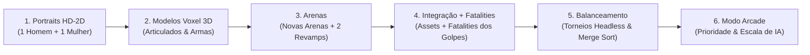

# 🗺️ Master Roadmap & Plano de Expansão: Samurai Edge Demake (Roster 12 ➔ 24)

Este documento estabelece o planejamento estratégico, o fluxo iterativo de desenvolvimento em **6 Ciclos**, as fichas dos **12 novos personagens** (6 homens e 6 mulheres), o catálogo minucioso de **Fatalities Contextuais por Golpe (Ataque a Ataque para os 24 Guerreiros)** e o cronograma de **Revamp Visual de Arenas** com partículas volumétricas para *Samurai Edge Demake*.

---

## 👥 1. O Roster Completo dos 24 Guerreiros

Com o ajuste de nomes (**Valerius** no lugar de Faust, **Raiden** masculino, **Hendrika** feminina) e a adição da 6ª guerreira feminina (**Aoi**, a caçadora Ainu de Hokkaido), o jogo totaliza **24 combatentes** divididos em perfeita simetria de gênero (12 Mulheres e 12 Homens).

```
┌──────────────────────────────────────────────────────────────────────────────────────────────────┐
│                                     ROSTER FINAL (24 GUERREIROS)                                │
├──────────────────────────────────────────────────────────────────────────────────────────────────┤
│ VETERANOS (12):                                                                                  │
│ • Homens:  Kenshi | Musashi | Hanzo | Joe & Doberman | Saitou | Teppo                            │
│ • Mulheres: Murasaki | Kasumi | Okuni | Tomoe | Anne | Julie                                     │
├──────────────────────────────────────────────────────────────────────────────────────────────────┤
│ NOVOS COMBATENTES (12 — 6 Ciclos de 1 Homem + 1 Mulher):                                         │
│ • Ciclo 1: Ren (Monge Shaolin) [M]             & Chiyo (Kunoichi 2 Nodachi) [F]                  │
│ • Ciclo 2: Benkei (Guardião Naginata) [M]       & O-Rin (Menestrel Shamisen) [F]                 │
│ • Ciclo 3: Goro (Fazendeiro da Kuwa) [M]        & Ichi (Lâmina Cega Shikomizue) [F]              │
│ • Ciclo 4: Valerius (Necromante Prussiano) [M]  & Seimei (Onmyoji dos Talismãs) [F]              │
│ • Ciclo 5: Daiki (Peregrino do Bastão) [M]      & Aoi (Caçadora Ainu de Hokkaido) [F]            │
│ • Ciclo 6: Raiden (Rikishi do Sumô) [M]         & Hendrika (Alquimista Holandesa) [F]            │
└──────────────────────────────────────────────────────────────────────────────────────────────────┘
```

---

## 🔄 2. A Estrutura do Novo Roadmap Iterativo

Cada um dos 6 ciclos seguirá rigorosamente o fluxo de entrega definido:



### Protocolo de Cada Ciclo:
1. **Design de Portrait**: Geração e desenho dos retratos de busto HD-2D circular e retangular em `assets/portraits/` para os dois novos personagens do ciclo.
2. **Design de Modelo Voxel 3D**: Criação do rig paramétrico, proporções anatômicas (~5.7 cabeças), paleta de cores e articulações em `src/entities/voxel_models.py`.
3. **Arenas (Novas + 2 Revamps)**: Criação das arenas temáticas da dupla e aplicação de revamp visual completo com partículas dinâmicas (faíscas, névoa, folhas, pó, brasas) em 2 arenas clássicas.
4. **Integração & Fatalities**: Implementação das classes dos lutadores, registro na tela de seleção e adição das **animações de morte elaboradas (Fatalities)** para os veteranos do ciclo e para a nova dupla.
5. **Testes de Balanceamento**: Execução automatizada de baterias de 1500+ duelos em `simulate_tournament.py` com IA para assegurar taxa de vitória entre 45% e 55%.
6. **Inclusão no Modo Arcade**: Inserção dos lutadores na árvore de duelos do Modo Arcade, bosses e regras de progressão de dificuldade.

---

## 💀 3. Catálogo Oficial de Fatalities Ataque a Ataque (24 Guerreiros)

Cada fatality é acionado de forma **contextual de acordo com o ataque que desferiu o golpe letal**. Em todas as opções, a **Morte Atual Clássica (colapso dramático Kurosawa)** permanece como uma variação disponível.

### 3.1 Os 12 Lutadores Veteranos

| # | Guerreiro | Ataque Letal | Fatality Específico Elaborado | Opção Clássica |
| :-: | :--- | :--- | :--- | :--- |
| **1** | **Kenshi** | **Primário** (*Iai Flash*) | **DIAGONAL_KENSHIN_SPLIT**: Peito partido em ângulo de 45° com atraso dramático e jato arterial vertical após embainhar a lâmina. | Colapso dramático Kurosawa com espada embainhada. |
| | | **Secundário** (*Ryuu Tsui Sen*) | **VERTICAL_BISECTION**: O corte aéreo descendente divide a vítima verticalmente ao meio do crânio à virilha. | Queda de joelhos com impacto esmagador no solo. |
| **2** | **Musashi** | **Primário** (*Combo de Cortes*) | **DUAL_IMPALE_X_SPREAD**: Musashi empala o peito do rival com a katana, em seguida com a wakizashi, e abre as duas lâminas em 'X' partindo o peito do rival. | Queda pesada de joelhos com as lâminas cravadas. |
| | | **Secundário** (*Parry / Reflexão*) | **REFLECTED_TORSO_CLEAVE**: O golpe/projétil refletido desfere um corte diagonal com separação do torso do rival. | Vítima cambaleia e tomba de costas. |
| **3** | **Hanzo** | **Ranged** (*Arremesso Kunai*) | **FOREHEAD_PIN**: A kunai crava na testa entre os olhos; o impacto arremessa a cabeça e o corpo da vítima estatelada de costas. | Queda simples com kunai cravada (*STAB_FALL*). |
| | | **Melee** (*Tanto sem Kunai*) | **HEART_THROAT_STAB**: Estocada dupla fulminante no coração e corte transversal na garganta, a vítima cai de joelhos sufocando. | Queda clássica para frente. |
| **4** | **Joe** | **Secundário** (*Bote Yamato*) | **YAMATO_MAUL_DECAP**: O Doberman Yamato salta derrubando o rival de costas no solo imobilizando-o, e Joe arremessa uma shuriken pesada que decapita o rival caído. | Mordida letal com queda (*MAULED*). |
| | | **Primário** (*Shuriken Fatal*) | **SHURIKEN_PIN**: Estrelas de metal cravadas no peito e garganta arremessando o rival para trás. | Colapso de costas. |
| **5** | **Saitou** | **Primário** (*Gatotsu Investida*) | **HEART_IMPALE_LUNGE**: Katana perfura o tórax saindo pelas costas; o ímpeto arrasta a vítima por 1m e a projeta no solo com jorro arterial. | Perfuração simples (*SAITOU_IMPALE*). |
| | | **Secundário** (*Zeroshiki*) | **TORSO_BLAST_THRUST**: Estocada explosiva de tronco à queima-roupa perfura o abdômen e arremessa a vítima de costas pelo ar. | Queda seca de costas. |
| **6** | **Teppo** | **Primário Tiro** (*Tanegashima*) | **HEADSHOT_EXPLODE**: Crânio e peito desintegrados por impacto balístico com densa nuvem de fumaça e faíscas. | Queda por bala no peito (*BLUNT_FALL*). |
| | | **Primário Melee** (*Coronhada*) | **JAW_CRUSH_FALL**: Coronha pesada de carvalho quebra a mandíbula; a vítima gira 180° no ar e desaba de bruços. | Queda atordoado no solo. |
| | | **Secundário** (*Mina Pólvora*) | **POWDER_CHAR**: Detonação incendeia a vítima, que dá 2 passos e cai carbonizada em cinzas. | Queda chamuscada. |
| **7** | **Murasaki** | **Primário** (*Kama Strike*) | **CLEAN_DECAP**: Foice curva contorna o pescoço e decepa a cabeça em arco alto em movimento fluído contínuo. | Decapitação padrão (*MURASAKI_DECAP*). |
| | | **Secundário** (*Chain Pull*) | **CHAIN_PULL_BISECTION**: A corrente laça o pescoço puxando com violência, e Murasaki fatia a cintura ao passar direto em bissecção horizontal. | Puxão simples com queda. |
| **8** | **Kasumi** | **Primário** (*Bomba Cerâmica*) | **SHRAPNEL_DISINTEGRATION**: A explosão faz o corpo se desfazer em dezenas de fragmentos voxel incandescentes arremessados com fumaça e faíscas. | Queda chamuscada (*KASUMI_EXPLODE*). |
| | | **Secundário** (*Mina Remota*) | **MINE_BLAST_INCINERATION**: A mina detona aos pés; onda de choque e fogo consome o rival. | Queda por explosão de solo. |
| **9** | **Okuni** | **Primário** (*Leques Tessen*) | **TESSEN_DECAP**: Leques de ferro afiados fecham em tesoura navalha no pescoço, decapitando com chuva de pétalas de cerejeira. | Queda cortada pelos leques. |
| | | **Veneno** (*Dokukiri 10s*) | **DOKUKIRI_MELT**: Vômito de sangue púrpura com dissolução completa do corpo em névoa espectral e vestes vazias no chão. | Colapso no solo (*OKUNI_MELT*). |
| **10** | **Tomoe** | **Primário** (*Flecha Yumi*) | **PINNED_TO_EARTH**: Flecha pesada crava no peito, projeta a vítima para trás e a prega ao solo ou bambu mais próximo com haste vibrando. | Queda com flecha fincada (*ARROW_PIN*). |
| | | **Secundário** (*Hamaya Sagrada*) | **HAMAYA_HOLY_PIERCE**: Flecha de luz dourada atravessa o tórax deixando partículas de kami e a vítima desaba de joelhos purificada. | Queda estatelada no solo. |
| **11** | **Anne** | **Primário** (*Alfanje 180°*) | **WAIST_BISECTION**: O corte em meia-lua divide o rival na cintura; o tronco superior desliza lateralmente caindo no chão. | Colapso deitada de lado (*PIRATE_CLEAVE*). |
| | | **Secundário** (*Tiro de Canhão*) | **CANNONBALL_OBLITERATION**: Bola de ferro maciço esmaga o rival de cima a baixo em cratera de pó e estilhaços. | Queda por impacto de canhão. |
| **12** | **Julie** | **Primário** (*Flèche Thrust*) | **HUNDRED_STAB_BARRAGE**: Após a primeira estocada, Julie desfere entre 20 e 40 estocadas a uma velocidade alucinante; a vítima jorra sangue e cai de bruços em poça carmesim. | Queda elegante de duelo. |
| | | **Secundário** (*Flintlock*) | **FLINTLOCK_CHEST_BLAST**: Tiro de pederneira abre rombo fumegante no centro do peito arremessando o rival para trás. | Queda clássica por tiro. |

---

### 3.2 Os 12 Novos Combatentes

| # | Guerreiro | Ataque Letal | Fatality Específico Elaborado | Opção Clássica |
| :-: | :--- | :--- | :--- | :--- |
| **13** | **Ren** | **Primário** (*Combo 3 Dragões*) | **HYAKURETSU_BODY_EXPLOSION**: Sucessão de dezenas de socos em velocidade supersônica (estilo Hokuto no Ken), breve pausa dramática e explosão completa do corpo do rival. | Queda desmaiado por golpe de palma atordoante. |
| | | **Secundário** (*Kiai da Montanha*) | **WALL_SMASH_FATAL**: Onda esférica de choque arremessa o rival contra obstáculos/armadilhas estilhaçando o corpo no impacto. | Empurrão defensivo sem fatality. |
| **14** | **Chiyo** | **Primário** (*Tesoura 2 Nodachi*) | **TRIPLE_SCISSOR_CLEAVE**: As duas lâminas de 1,60m cortam simultaneamente na cintura e no pescoço, separando cabeça e tronco em três partes simétricas. | Desabamento de joelhos. |
| | | **Secundário** (*Dança Mai*) | **MAI_X_CLEAVE**: Surge do vórtice de pós-imagens com corte giratório duplo fatiando o peito em 'X' profundo. | Queda com lâminas embainhadas. |
| **15** | **Benkei** | **Primário** (*Varredura Naginata*) | **SWEEP_AND_CLEAVE**: Lâmina curva decepa as duas pernas na altura das coxas e na recuperação desce um corte vertical letal no peito. | Queda pesada por corte de ponta. |
| | | **Secundário** (*Arremesso Lança*) | **SKEWERED_LANCE_FLAG**: A Naginata transpassa o tórax e crava no chão, erguendo o corpo em ângulo oblíquo como troféu de guerra. | Queda perfurada à distância. |
| **16** | **O-Rin** | **Primário** (*Lâminas Kamaitachi*) | **SONIC_SLICER**: Ondas de vácuo sônicas fatiam a vítima em 3 segmentos horizontais que deslizam em cascata após 1 segundo de silêncio. | Queda lenta ouvindo a última nota musical. |
| | | **Secundário** (*Acorde Ressonante*) | **RESONANCE_BURST**: Onda grave de choque à queima-roupa estoura os tímpanos e crânio da vítima com sangramento arterial facial e colapso seco. | Colapso por choque sonoro. |
| **17** | **Goro** | **Primário** (*Descida da Kuwa*) | **KUWA_SKULL_CLEAVE**: A enxada racha o crânio e crava na caixa torácica; Goro apoia a bota no peito para arrancar a lâmina com estalo ósseo. | Queda atordoado pelo peso do ferro. |
| | | **Secundário** (*Pisotão Sísmico*) | **EARTH_STOMP_CRUSH**: O tremor quebra os joelhos do rival e Goro esmaga o crânio no solo com pisada colossal de bota. | Desestabilização sem fatality. |
| **18** | **Ichi** | **Primário** (*Gyaku-Iai Cego*) | **BLIND_CAROTID_SLICE**: Corte imperceptível na carótida; Ichi embainha a lâmina na bengala com um clique oco de madeira e só então o sangue jorra em leque com colapso do rival. | Desabamento silencioso para a frente. |
| | | **Secundário** (*Postura Escuta*) | **BLIND_SPINE_PIERCE**: Esquiva do golpe do rival e estocada cega nas costas atravessando a espinha dorsal e o coração. | Contra-ataque simples. |
| **19** | **Valerius** | **Primário** (*Foice Fúnebre*) | **SOUL_REAP**: A foice corta o peito; a carne do rival congela em cinza cadavérico e Valerius ceifa uma sombra espectral brilhante enquanto o corpo desaba oco. | Colapso asfixiado pelo frio dos mortos. |
| | | **Secundário** (*Summons Mortos*) | **DRAGGED_TO_GRAVE**: Os esqueletos agarram o rival e mãos emergem do solo puxando o corpo para dentro da terra funerária. | Queda puxada pelos mortos. |
| **20** | **Seimei** | **Primário** (*Ofuda Cortante*) | **SEAL_STASIS_COLLAPSE**: O talismã crava na testa/peito brilhando com kanjis dourados sagrados; a vítima congela em transe místico e desaba de joelhos. | Queda paralisada pelo selo. |
| | | **Secundário** (*Detonação Selos*) | **OFUDA_PURIFICATION_PILLAR**: Pilar de fogo sagrado azul/branco incinera o rival, desintegrando o corpo em cinzas prateadas e borboletas de luz. | Queima espiritual simples. |
| **21** | **Daiki** | **Primário** (*Estocada Bastão*) | **THROAT_TEMPLE_CRUSH**: Estocada quebra a laringe com estalo seco e giro na têmpora projeta a vítima no solo sem ar. | Queda por contusão de madeira. |
| | | **Secundário** (*Salto com Vara*) | **METEOR_STAFF_CRUSH**: Desce do ar cravando o bastão e os dois pés no peito do rival, estilhaçando a caixa torácica contra o solo rachado. | Rasteira sem fatality. |
| **22** | **Aoi** | **Primário** (*Lança Makiri*) | **SPEAR_HEART_SLIDE**: Aoi crava a lança no coração, finca a lança no chão e a vítima desliza lentamente por ela ficando de joelhos transpassada enquanto o sangue forma poça no solo. | Queda com lança cravada no peito. |
| | | **Secundário** (*Armadilha Urso*) | **TRAP_AND_EXECUTE**: A mandíbula de ferro mastiga e decepa a perna da vítima que cai no chão, seguida por estocada vertical da lança na garganta. | Imobilização simples. |
| **23** | **Raiden** | **Primário** (*Palmas Tsuppari*) | **TSUPPARI_TEMPLE_CRUSH**: Bofetada dupla nas duas têmporas simultâneas estala o crânio; a vítima gira no ar e desaba no chão com sangue facial. | Nocaute limpo por esmagamento muscular. |
| | | **Secundário** (*Carga Haridate*) | **EARTH_SHATTER_SLAM**: Raiden agarra o rival no ar, ergue-o sobre a cabeça e o esmaga de costas no solo rachado partindo a coluna. | Queda por arremesso. |
| **24** | **Hendrika** | **Primário Ranged** (*Fósforo*) | **PHOSPHORUS_INCINERATION**: O fogo químico branco queima a vítima, que dá 2 passos cambaleantes em desespero e cai de joelhos carbonizada em cinzas. | Morte em chamas químicas. |
| | | **Primário Melee** (*Estilete*) | **SURGICAL_INCISION**: Corte cirúrgico na carótida, Hendrika limpa a lâmina de aço com lenço de linho branco e o rival cai em poça de sangue. | Colapso por corte arterial. |
| | | **Secundário** (*Vapor Ácido*) | **ACID_DISSOLUTION**: Asfixia e dissolução cáustica da pele e vestes com fumaça esverdeada. | Queda asfixiada no chão. |

---

## 🌸 4. Cronograma de Revamp Visual das 12 Arenas Clássicas

| Ciclo | Arena 1 para Revamp | Melhorias Visuais & Partículas | Arena 2 para Revamp | Melhorias Visuais & Partículas |
| :---: | :--- | :--- | :--- | :--- |
| **Ciclo 1** | **Nagashino Field** (`nagashino_field` - Teppo) | • Fumaça volumétrica contínua subindo dos canhões.<br>• Brasas incandescentes flutuando no vento.<br>• Lama com reflexos úmidos e marcas de passos com respingos.<br>• Banners de clã tremulando ao vento com física. | **Shadow Cave** (`shadow_cave`) | • Gotas de água caindo do teto da caverna com ondulações no solo.<br>• Tochas procedurais projetando luz dinâmica e sombras longas nos pilares de pedra.<br>• Poeira de esporos brilhantes suspensa no ar. |
| **Ciclo 2** | **Forest Camp** (`forest_camp`) | • Fogueiras centrais com estalos de faíscas dinâmicas.<br>• Folhas secas outonais sopradas pela passagem dos lutadores.<br>• Luz da lua filtrada pela copa das árvores (*God rays* isométricos). | **Baroque Court** (`baroque_court`) | • Chafariz de mármore com partículas de spray de água espumante.<br>• Pétalas de rosas brancas e vermelhas flutuando nos canteiros.<br>• Azulejos de mármore xadrez com reflexos especulares das lâminas. |
| **Ciclo 3** | **Ganryū Island** (`ganryu_island`) | • Névoa costeira volumétrica baixa sobre a areia.<br>• Espuma dinâmica de maré batendo contra as pedras da praia.<br>• Grama de duna balançando de acordo com a direção do vento. | **Iga Rooftops** (`iga_rooftops`) | • Névoa noturna densa nos becos entre os telhados.<br>• Telhas que soltam fragmentos de argila ao receberem impactos.<br>• Lua cheia de alto contraste projetando silhuetas nítidas. |
| **Ciclo 4** | **Mist Temple** (`mist_temple`) | • Camadas duplas de neblina animada com densidade variável.<br>• Pétalas de lótus flutuando no tanque koi com peixes animados.<br>• Lanternas de pedra acesas com chama trêmula. | **Kabuki Stage** (`kabuki_stage`) | • Cortinas de teatro que ondulam com o deslocamento de ar dos golpes.<br>• Chuva de confetes dourados (*Hana-fubuki*) no centro do palco.<br>• Iluminação de lanternas de papel projetando tons rubros quentes. |
| **Ciclo 5** | **Storm Pirate Deck** (`pirate_deck`) | • Chuva pesada em diagonal com respingos nas tábuas do convés.<br>• Ondas espumantes colidindo nas laterais do casco do navio.<br>• Relâmpagos dinâmicos que iluminam a tela com flashes estroboscópicos. | **Mountain Shrine** (`mountain_shrine`) | • Folhas douradas de ginkgo caindo suavemente sobre os degraus de pedra.<br>• Fumaça de incenso subindo dos caldeirões rituais.<br>• Vibração visual no ar ao bater no sino de bronze sagrado. |
| **Ciclo 6** | **Sacred Bamboo** (`bamboo` - Kenshi) | • Partículas de serragem verde e folhas ao fatiar bambus.<br>• Reflexo do céu e dos bambus no lago Zen com distorção senoidal.<br>• Vagalumes noturnos interagindo com a lâmina. | **Kyoto: Burning Bakumatsu** (`kyoto` - Murasaki) | • Fagulhas crepitantes caindo dos telhados das machiyas em chamas.<br>• Ondas de distorção de calor térmico no ar.<br>• Rastro de poeira e poças de sangue refletindo as chamas nas pedras. |

---

## 📅 5. Resumo Executivo dos 6 Ciclos

| Ciclo | Nova Dupla (1M + 1F) | Novas Arenas da Dupla | Revamp de 2 Arenas Atuais | Fatalities Implementados no Ciclo |
| :---: | :--- | :--- | :--- | :--- |
| **1** | **Ren** (Shaolin) & **Chiyo** (2 Nodachi) | Mosteiro das Nuvens & Jardim Carmesim | **Nagashino Field** & **Shadow Cave** | **Teppo**, **Anne**, **Ren**, **Chiyo** |
| **2** | **Benkei** (Naginata) & **O-Rin** (Shamisen) | Ponte Gojo & Beco Yoshiwara | **Forest Camp** & **Baroque Court** | **Kenshi**, **Musashi**, **Benkei**, **O-Rin** |
| **3** | **Goro** (Fazendeiro) & **Ichi** (Lâmina Cega) | Arrozais Terraciados & Moinho na Chuva | **Ganryū Island** & **Iga Rooftops** | **Saitou**, **Hanzo**, **Goro**, **Ichi** |
| **4** | **Valerius** (Necromante) & **Seimei** (Onmyoji) | Cemitério Barroco & Santuário Heian | **Mist Temple** & **Kabuki Stage** | **Murasaki**, **Kasumi**, **Valerius**, **Seimei** |
| **5** | **Daiki** (Bastão) & **Aoi** (Caçadora Ainu) | Floresta dos Pinheiros & Taiga de Ezo | **Storm Pirate Deck** & **Mountain Shrine** | **Okuni**, **Tomoe**, **Daiki**, **Aoi** |
| **6** | **Raiden** (Sumô) & **Hendrika** (Alquimista) | Dohyo Sagrado & Armazém de Dejima | **Sacred Bamboo** & **Kyoto Bakumatsu** | **Joe**, **Julie**, **Raiden**, **Hendrika** |
