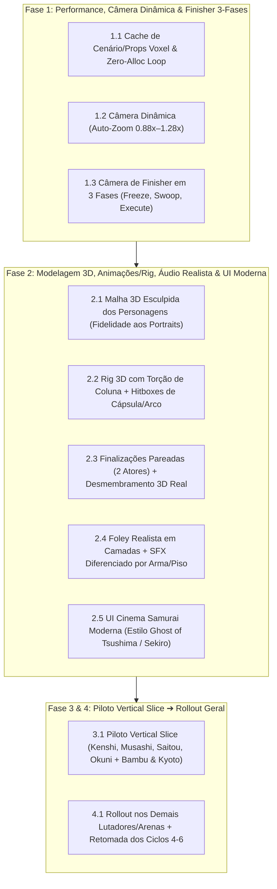
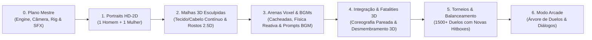
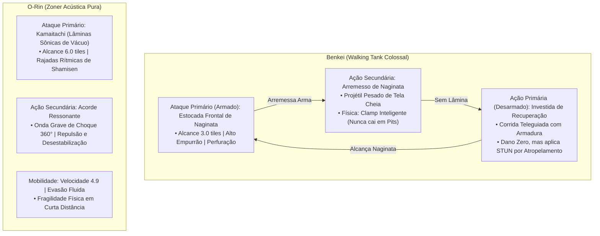
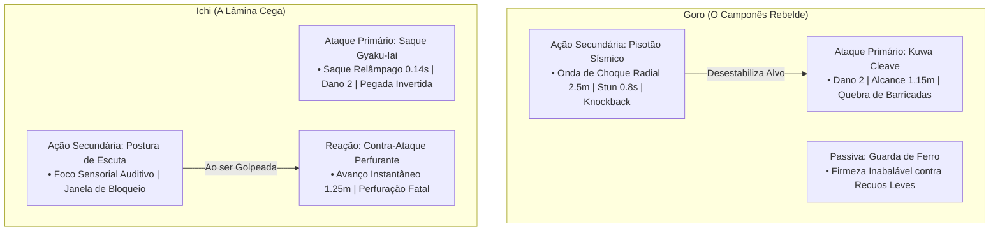

# 🗺️ Master Roadmap & Plano de Expansão: Samurai Edge Demake (Roster 12 ➔ 24)

> **Prioridade Estratégica Atual:** **PRIORIDADE MÁXIMA — PLANO MESTRE DE MODERNIZAÇÃO, PERFORMANCE & FIDELIDADE VISUAL**  
> Os itens do Plano Mestre abaixo têm precedência absoluta sobre a continuidade da expansão do roster (Ciclos 4 a 6). A engine, o sistema de câmeras, os modelos dos personagens, as colisões, as arenas voxel, os efeitos sonoros e os menus serão modernizados primeiro na base existente e nos lutadores do piloto antes de prosseguir com novos combatentes.

---

## ⚡ 0. PLANO MESTRE DE MODERNIZAÇÃO & PERFORMANCE (PRIORIDADE MÁXIMA)

Este plano consolida as melhorias prioritárias acordadas para elevar a fidelidade técnica e estética de *Samurai Edge Demake*, mantendo 100% da base em **Python / Pygame** (sem perda de lógica de combate, IA, testes ou Modo Arcade).


```mermaid
flowchart TD
    subgraph Foundation["Fase 1: Performance, Câmera Dinâmica & Finisher 3-Fases"]
        M1["1.1 Cache de Cenário/Props Voxel & Zero-Alloc Loop"]
        M2["1.2 Câmera Dinâmica (Auto-Zoom 0.88x–1.28x)"]
        M3["1.3 Câmera de Finisher em 3 Fases (Freeze, Swoop, Execute)"]
    end
    subgraph CombatAudioUI["Fase 2: Modelagem 3D, Animações/Rig, Áudio Realista & UI Moderna"]
        M4["2.1 Malha 3D Esculpida dos Personagens (Fidelidade aos Portraits)"]
        M5["2.2 Rig 3D com Torção de Coluna + Hitboxes de Cápsula/Arco"]
        M6["2.3 Finalizações Pareadas (2 Atores) + Desmembramento 3D Real"]
        M7["2.4 Foley Realista em Camadas + SFX Diferenciado por Arma/Piso"]
        M8["2.5 UI Cinema Samurai Moderna (Estilo Ghost of Tsushima / Sekiro)"]
    end
    subgraph Rollout["Fase 3 & 4: Piloto Vertical Slice ➔ Rollout Geral"]
        M9["3.1 Piloto Vertical Slice (Kenshi, Musashi, Saitou, Okuni + Bambu & Kyoto)"]
        M10["4.1 Rollout nos Demais Lutadores/Arenas + Retomada dos Ciclos 4-6"]
    end
    Foundation --> CombatAudioUI --> Rollout
```

> [!IMPORTANT]
> **Diretriz Anti-Aberração Visual em Câmeras 3D:**  
> Personagens, feições faciais, fitas de tecido/cabelo e pedaços de corpos desmembrados passam a usar **projeção pura de vértices 3D no espaço de mundo** (`camera.apply(wx, wy, wz)`), eliminando completamente recortes de superfície 2D com `pygame.transform.rotate` ou distorções escaladas na rotação/zoom da câmera.

---

### 0.1 Os 9 Pilares de Melhoria + 3 Recursos de Alto Impacto

#### 1. Performance & Otimização Low-End PC / Mobile
* **Problema:** `arena_generator.py` redesenha 484 tiles e dezenas de props estáticos (`draw_voxel_box` + `draw_face_texture` com chamadas de linhas em CPU) todo frame; `_draw_pit` e `cinematic_director.py` alocam superfícies `SRCALPHA` de tela cheia a cada frame.
* **Solução:**
  * **Cache de Terreno e Props Estáticos (`src/world/arena_cache.py` [NOVO])**: Pré-renderizar a camada de solo e props estáticos (rochas, árvores, fachadas, lanternas) em uma superfície cacheada quando `azimuth == 0`. O loop principal faz blit direto do cache, ativando desenho voxel 3D ao vivo apenas quando houver rotação de câmera (`azimuth != 0`), destruição de prop ou perigo dinâmico.
  * **Zero Per-Frame Allocations**: Pré-alocar e reutilizar buffers de vinheta, filtros monocromáticos, sombras e partículas.
  * **Governador Automático de FPS (`src/effects/quality.py`)**: Monitorar a média de tempo de quadro. Se exceder 17.5ms (<57 FPS em PCs modestos ou mobile), reduzir automaticamente densidade de fumaça/fog e linhas de textura distantes.

#### 2. Modelagem dos Personagens & Fidelidade aos Portraits
* **Problema:** Os personagens atuais usam caixas retangulares empilhadas (`cbox`/`obox`) com contornos pretos rígidos em cada junta, e a função `face()` é vazia (`return`), deixando rostos sem expressão nem semelhança com os portraits 2D.
* **Solução:**
  * **Primitivas de Malha 3D Esculpidas (`src/isometric/mesh_primitives.py` [NOVO], `src/entities/model_kit.py`)**:
    * Troncos cônicos com ombros largos afinando na cintura; membros com frustums octogonais/tapered; cabeças esculpidas com maxilar e queixo definidos.
    * **Rostos 2.5D com Fidelidade ao Retrato**: Olhos, sobrancelhas, maquiagem teatral Kumadori (Okuni), cicatrizes (Kenshi), delineados (O-Rin) e bandanas projetados como polígonos 3D precisos na face frontal.
  * **Fitas Contínuas de Tecido e Cabelo 3D (`src/isometric/cloth.py`)**: Hakamas, quimonos, capas e rabos de cavalo construídos em faixas contínuas de quads conectados (`draw_ribbon_mesh_3d`), com contornos apenas na silhueta externa (sem linhas internas de tijolo).
  * **Shaders de Materiais**: Brilho anisotrópico em seda/cetim, especularidade metálica na lâmina/armadura e sombreamento de dobras vincadas no hakama.

#### 3. Arenas Voxel: Materiais, Detalhes & Texturas
* **Abordagem:** Preservar a identidade voxel consagrada das arenas, mas elevar o detalhamento e acabamento:
  * **Props em Múltiplas Camadas Voxel**: Rochas com formações em degraus, musgo e seixos; árvores com copas em camadas cônicas orgânicas e raízes expostas; telhados com beirais curvos tradicionais e lanternas suspensas.
  * **Acabamento de Solo**: Transições de espuma nas margens d'água, chanfros nas calçadas de pedra de Kyoto e poças com reflexos especulares das tochas/chamas.

#### 4. Áudio & Efeitos Sonoros Realistas (Foley em Camadas)
* **Problema:** Os arquivos `.wav` atuais são ruídos sintetizados procedurais estáticos idênticos para todas as armas.
* **Solução:**
  * **Biblioteca de Foley Realista (`assets/sounds/sfx/`, `tools/build_realistic_sfx.py`)**:
    * Substituição de bleeps por amostras acústicas de aço temperado de verdade, lâminas pesadas cortando o ar, impacto seco de madeira, ressonância profunda de taiko/gongo, pólvora de canhão/arcabuz encorpada e sons viscerais de corte.
  * **Diferenciação por Arma e Terreno (`src/audio/sound_events.py`, `src/audio/sound_manager.py`)**:
    * Eventos separados para katanas rápidas, naginatas pesadas, florete agudo, bastão de madeira, corrente e shamisen.
    * Passos diferenciados em tempo real de acordo com o piso (grama, madeira de ponte, cascalho, água rasa, lama).
  * **Micro-Variação em Tempo Real**: Variação aleatória de pitch (±6%) e volume (±8%) em cada golpe para eliminar repetição robótica.

#### 5. Animações dos Personagens, Colisões & Finalizações Pareadas
* **Problema:** Rig rígido sem movimento de coluna/pelve; hitboxes circulares simples não casam com estocadas longas ou cortes em arco; finalizações desconectadas (vítima fica a 1 metro da espada).
* **Solução:**
  * **Rig com Articulação de Tronco & Easing Marcial (`src/isometric/voxel_rig.py`)**:
    * Movimento de pelve (peso na passada), inclinação do torso ao correr e **torção de cintura/ombro** durante os golpes.
    * Curvas de animação em 3 fases (*Antecipação ➔ Impacto Rápido ➔ Recuperação fluida*).
  * **Hitboxes por Cápsula e Setor de Arco (`src/combat/hitboxes.py` [NOVO], `src/combat/collision.py`)**:
    * Cápsulas orientadas para estocadas (Gatotsu do Saitou, Julie, Benkei) e arcos angulares para cortes curvos (Kenshi, Musashi, Anne).
    * Tecla de depuração `F3` para inspecionar hitboxes/hurtboxes e frame data no treino.
  * **Coreografia de Finalização Pareada (2 Atores) (`src/effects/cinematic_director.py`)**:
    * Ao acertar o golpe fatal, agressor e vítima são suavemente magnetizados na posição relativa perfeita de contato (`ideal_distance` e ângulo livre de paredes).
    * A vítima reage fisicamente ao ponto de corte (ajoelhar, transpassar no peito, tombar de costas).
  * **Física de Desmembramento 3D Real (`src/entities/voxel_corpse.py`)**:
    * Substituição completa da rotação de imagem 2D por sub-modelos 3D físicos independentes (cabeça, torso, membros, arma cravada) que caem, quicam e rolam com física 3D tridimensional pura.

#### 6. Animações e Física Reativa das Arenas
* **Solução:**
  * **Vento e Deslocamento de Ar em Combate**: Golpes próximos, dashes rápidos e explosões empurram o vento local, fazendo bambus, grama de duna, cortinas noren, faixas e folhagens dobrarem e soltarem pétalas/folhas.
  * **Água e Lama Interativas**: Passos e deslizamentos na água geram ondas circulares isométricas concêntricas e respingos.
  * **Destruição Voxel Direcional**: Biombos shoji, cercas de bambu e fardos de feno estilhaçam em blocos voxel que voam na direção do golpe e repousam no chão.
  * **Deslizamento Suave em Obstáculos**: Eliminar travamentos secos ao esbarrar em paredes/rochas, aplicando vetor tangente de deslizamento.

#### 7. Câmera Dinâmica de Gameplay (Auto-Zoom Suave & Enquadramento)
* **Solução (`src/isometric/camera.py`, `main.py`):**
  * Rotação mantida estritamente fixa (0°) durante o combate normal.
  * **Auto-Zoom Inteligente por Distância (`0.88x` a `1.28x`)**:
    * Combate próximo corpo-a-corpo (`distância <= 3.0 tiles`): zoom suave até `1.28x` para destacar detalhes das lâminas e roupas.
    * Combate em média distância (`3.0 a 8.0 tiles`): zoom padrão `1.00x` a `1.15x`.
    * Combate em longa distância com projéteis (`distância >= 9.0 tiles`): zoom abre até `0.88x` para enquadrar ambos os lutadores e projéteis.
  * **Micro-Zooms de Ação & Clamping**: Pequeno pulso de zoom em Parries bem-sucedidos; amortecimento por mola (*spring-damper*); trava de borda para não mostrar área vazia fora da arena.

#### 8. Câmera de Finisher em 3 Fases (Freeze, Swoop, Execute)
* **Solução (`src/effects/cinematic_director.py`):**
  * **Fase 1 — Impact Freeze (0.25s)**: No momento exato do impacto fatal, o jogo congela no tempo (lutadores, partículas e sangue parados no ar) com hitstop pesado e batimento cardíaco surdo.
  * **Fase 2 — Swoop & Órbita com Tempo Congelado (0.55s)**: Com o mundo congelado, a câmera mergulha suavemente em direção ao ponto de contato, aplica barras pretas CinemaScope `2.39:1`, fecha o zoom em `1.75x` e **rotaciona o azimute para o melhor ângulo de perfil 3/4** em relação à linha agressor-vítima (evitando que um cubra o outro).
  * **Fase 3 — Execução da Finalização**: A câmera trava no ângulo cinematográfico ideal, o tempo volta a correr em câmera lenta dramática (`0.80x`), a animação da coreografia pareada se completa, o corte desmembra a vítima em 3D e o kanji Sumi-E é carimbado.

#### 9. Menus, HUD & Mensagens de Combate Profissionais (Cinema Samurai)
* **Solução (`src/ui/`, `src/effects/particles.py`):**
  * **Adeus aos Textos Neon Flutuantes (`FloatingBanner`)**: Substituição de mensagens flutuantes arcade por **faixas horizontais de pincelada Sumi-E discretas com acentos dourados e caligrafia refinada**, surgindo de forma elegante e dissipando como névoa de tinta.
  * **Prompt de Choque de Lâminas (Clash QTE)**: O botão vermelho arcade é substituído por um **selo ritual de espadas cruzadas com círculo de tensão e caligrafia Kanji de impacto**.
  * **HUD de Vida e Rounds Moderno**: Barras de vida em paralelogramos laqueados escuros com friso dourado, dreno suave de dano fantasma e pips de round elegantes.
  * **Telas de Título, Opções, Pausa e Resultados Unificadas**: Aplicação do estilo pergaminho de alta fidelidade + madeira laqueada com iluminação de lanterna suave em todas as telas restantes.

---

### 0.2 Cronograma de Execução do Plano Mestre

| Fase | Entregáveis | Foco Principal | Status |
| :---: | :--- | :--- | :---: |
| **M-1** | **Performance & Câmeras** | • Cache de solo e props de arena (`arena_cache.py`)<br>• Zero per-frame allocations & Auto-FPS Governor<br>• Câmera dinâmica de combate (Zoom 0.88x–1.28x)<br>• Câmera de Finisher em 3 Fases (Freeze ➔ Swoop ➔ Execute) | ✅ **CONCLUÍDO** |
| **M-2** | **Modelagem 3D, Rig & Colisões** | • Primitivas 3D esculpidas & rostos 2.5D dos portraits (`mesh_primitives.py`)<br>• Fitas contínuas de tecido/cabelo (sem efeito tijolo)<br>• Rig com torção de tronco & hitboxes de cápsula/arco (`hitboxes.py`)<br>• Desmembramento 3D real (`voxel_corpse.py`) & finalizações pareadas | ✅ **CONCLUÍDO** |
| **M-3** | **Foley Realista & UI Moderna** | • Gerador e biblioteca de SFX realistas em camadas por arma e piso<br>• Micro-variação de pitch/volume em tempo real<br>• Callouts de combate em pincelada Sumi-E<br>• Redesign do Clash QTE e unificação dos menus e HUD | ✅ **CONCLUÍDO** |
| **M-4** | **Piloto Vertical Slice** | • Aplicação do novo padrão em 4 lutadores: **Kenshi**, **Musashi**, **Saitou**, **Okuni**<br>• Aplicação do novo padrão em 2 arenas: **Sacred Bamboo** e **Kyoto Bakumatsu**<br>• Validação de 60 FPS estável, jogabilidade e prévias visuais | ✅ **CONCLUÍDO** |
| **M-5** | **Rollout nos Demais Lutadores & Arenas** | • Atualização dos 14+ lutadores restantes no padrão esculpido<br>• Atualização das 16+ arenas restantes com props detalhados e física reativa<br>• Validação da suíte de 21 testes automatizados | ✅ **CONCLUÍDO** |

---

## 👥 1. O Roster Completo dos 24 Guerreiros

Com o ajuste de nomes (**Valerius** no lugar de Faust, **Raiden** masculino, **Hendrika** feminina) e a adição da 6ª guerreira feminina (**Aoi**, a caçadora Ainu de Hokkaido), o jogo totaliza **24 combatentes** divididos em perfeita simetria de gênero (12 Mulheres e 12 Homens).

```
┌──────────────────────────────────────────────────────────────────────────────────────────────────┐
│                                     ROSTER FINAL (24 GUERREIROS)                                │
├──────────────────────────────────────────────────────────────────────────────────────────────────┤
│ VETERANOS (12):                                                                                  │
│ • Homens:  Kenshi | Musashi | Hanzo | Joe & Doberman | Saitou | Teppo                            │
│ • Mulheres: Murasaki | Kasumi | Okuni | Tomoe | Anne | Julie                                     │
├──────────────────────────────────────────────────────────────────────────────────────────────────┤
│ NOVOS COMBATENTES (12 — 6 Ciclos de 1 Homem + 1 Mulher):                                         │
│ • Ciclo 1: Ren (Monge Shaolin) [M]             & Chiyo (Kunoichi 2 Kodachi) [F]                  │
│ • Ciclo 2: Benkei (Guardião Naginata) [M]       & O-Rin (Menestrel Shamisen) [F]                 │
│ • Ciclo 3: Goro (Fazendeiro da Kuwa) [M]        & Ichi (Lâmina Cega Shikomizue) [F]              │
│ • Ciclo 4: Valerius (Necromante Prussiano) [M]  & Seimei (Onmyoji dos Talismãs) [F]              │
│ • Ciclo 5: Daiki (Peregrino do Bastão) [M]      & Aoi (Caçadora Ainu de Hokkaido) [F]            │
│ • Ciclo 6: Raiden (Rikishi do Sumô) [M]         & Hendrika (Alquimista Holandesa) [F]            │
└──────────────────────────────────────────────────────────────────────────────────────────────────┘
```

---

## 🔄 2. A Estrutura do Novo Roadmap Iterativo

Com a implementação do **Plano Mestre de Modernização & Performance**, o fluxo de desenvolvimento para os ciclos restantes (Ciclos 4, 5 e 6) passa a herdar diretamente as novas malhas 3D esculpidas, o rig com torção de tronco, o áudio realista em camadas e as finalizações 3D pareadas:


```mermaid
flowchart LR
    Step0["0. Plano Mestre<br>(Engine, Câmera, Rig & SFX)"] --> Step1["1. Portraits HD-2D<br>(1 Homem + 1 Mulher)"]
    Step1 --> Step2["2. Malhas 3D Esculpidas<br>(Tecido/Cabelo Contínuo & Rostos 2.5D)"]
    Step2 --> Step3["3. Arenas Voxel & BGMs<br>(Cacheadas, Física Reativa & Prompts BGM)"]
    Step3 --> Step4["4. Integração & Fatalities 3D<br>(Coreografia Pareada & Desmembramento 3D)"]
    Step4 --> Step5["5. Torneios & Balanceamento<br>(1500+ Duelos com Novas Hitboxes)"]
    Step5 --> Step6["6. Modo Arcade<br>(Árvore de Duelos & Diálogos)"]
```

### Protocolo Atualizado de Cada Ciclo:
1. **Design de Portrait**: Geração e desenho dos retratos de busto HD-2D circular e retangular em `assets/portraits/` para os dois novos personagens do ciclo.
2. **Design de Malha 3D Esculpida**: Modelagem paramétrica com primitivas cônicas/suaves, tecidos e cabelos contínuos sem linhas de tijolo, materiais de seda/metal e reprodução das feições dos portraits em 3D.
3. **Arenas Voxel (Novas + 2 Revamps) & Prompts Musicais (Gemini)**: Criação das arenas com cache de superfície estática, física reativa de vento e água, destruição direcional e prompts especializados para BGM.
4. **Integração & Fatalities 3D Pareados**: Implementação das classes dos lutadores, alinhamento magnético agressor-vítima nos golpes letais e física tridimensional de corpos e armas cravadas.
5. **Testes de Balanceamento**: Execução automatizada de baterias de duelos em `simulate_tournament.py` com as novas hitboxes de cápsula/arco.
6. **Inclusão no Modo Arcade**: Progressão na árvore de duelos do Modo Arcade e checkpoints de dificuldade.

---

## 💀 3. Catálogo Oficial de Fatalities Ataque a Ataque (24 Guerreiros)

Cada fatality é acionado de forma **contextual de acordo com o ataque que desferiu o golpe letal**, executado através da nova **câmera de 3 fases** e com **desmembramento e física em 3D real**.

### 3.1 Os 12 Lutadores Veteranos

| # | Guerreiro | Ataque Letal | Fatality Específico Elaborado | Opção Clássica |
| :-: | :--- | :--- | :--- | :--- |
| **1** | **Kenshi** | **Primário** (*Iai Flash*) | **DIAGONAL_KENSHIN_SPLIT**: Peito partido em ângulo de 45° com atraso dramático e jato arterial vertical após embainhar a lâmina. | Colapso dramático Kurosawa com espada embainhada. |
| | | **Secundário** (*Ryuu Tsui Sen*) | **VERTICAL_BISECTION**: O corte aéreo descendente divide a vítima verticalmente ao meio do crânio à virilha. | Queda de joelhos com impacto esmagador no solo. |
| **2** | **Musashi** | **Primário** (*Combo de Cortes*) | **DUAL_IMPALE_X_SPREAD**: Musashi empala o peito do rival com a katana, em seguida com a wakizashi, e abre as duas lâminas em 'X' partindo o peito do rival. | Queda pesada de joelhos com as lâminas cravadas. |
| | | **Secundário** (*Parry / Reflexão*) | **REFLECTED_TORSO_CLEAVE**: O golpe/projétil refletido desfere um corte diagonal com separação do torso do rival. | Vítima cambaleia e tomba de costas. |
| **3** | **Hanzo** | **Ranged** (*Arremesso Kunai*) | **FOREHEAD_PIN**: A kunai crava na testa entre os olhos; o impacto arremessa a cabeça e o corpo da vítima estatelada de costas. | Queda simples com kunai cravada (*STAB_FALL*). |
| | | **Melee** (*Tanto sem Kunai*) | **HEART_THROAT_STAB**: Estocada dupla fulminante no coração e corte transversal na garganta, a vítima cai de joelhos sufocando. | Queda clássica para frente. |
| **4** | **Joe** | **Secundário** (*Bote Yamato*) | **YAMATO_MAUL_DECAP**: O Doberman Yamato salta derrubando o rival de costas no solo imobilizando-o, e Joe arremessa uma shuriken pesada que decapita o rival caído. | Mordida letal com queda (*MAULED*). |
| | | **Primário** (*Shuriken Fatal*) | **SHURIKEN_PIN**: Estrelas de metal cravadas no peito e garganta arremessando o rival para trás. | Colapso de costas. |
| **5** | **Saitou** | **Primário** (*Gatotsu Investida*) | **HEART_IMPALE_LUNGE**: Katana perfura o tórax saindo pelas costas; o ímpeto arrasta a vítima por 1m e a projeta no solo com jorro arterial. | Perfuração simples (*SAITOU_IMPALE*). |
| | | **Secundário** (*Zeroshiki*) | **TORSO_BLAST_THRUST**: Estocada explosiva de tronco à queima-roupa perfura o abdômen e arremessa a vítima de costas pelo ar. | Queda seca de costas. |
| **6** | **Teppo** | **Primário Tiro** (*Tanegashima*) | **HEADSHOT_EXPLODE**: Crânio e peito desintegrados por impacto balístico com densa nuvem de fumaça e faíscas. | Queda por bala no peito (*BLUNT_FALL*). |
| | | **Primário Melee** (*Coronhada*) | **JAW_CRUSH_FALL**: Coronha pesada de carvalho quebra a mandíbula; a vítima gira 180° no ar e desaba de bruços. | Queda atordoado no solo. |
| | | **Secundário** (*Mina Pólvora*) | **POWDER_CHAR**: Detonação incendeia a vítima, que dá 2 passos e cai carbonizada em cinzas. | Queda chamuscada. |
| **7** | **Murasaki** | **Primário** (*Kama Strike*) | **CLEAN_DECAP**: Foice curva contorna o pescoço e decepa a cabeça em arco alto em movimento fluído contínuo. | Decapitação padrão (*MURASAKI_DECAP*). |
| | | **Secundário** (*Chain Pull*) | **CHAIN_PULL_BISECTION**: A corrente laça o pescoço puxando com violência, e Murasaki fatia a cintura ao passar direto em bissecção horizontal. | Puxão simples com queda. |
| **8** | **Kasumi** | **Primário** (*Bomba Cerâmica*) | **SHRAPNEL_DISINTEGRATION**: A explosão faz o corpo se desfazer em dezenas de fragmentos voxel incandescentes arremessados com fumaça e faíscas. | Queda chamuscada (*KASUMI_EXPLODE*). |
| | | **Secundário** (*Mina Remota*) | **MINE_BLAST_INCINERATION**: A mina detona aos pés; onda de choque e fogo consome o rival. | Queda por explosão de solo. |
| **9** | **Okuni** | **Primário** (*Leques Tessen*) | **TESSEN_DECAP**: Leques de ferro afiados fecham em tesoura navalha no pescoço, decapitando com chuva de pétalas de cerejeira. | Queda cortada pelos leques. |
| | | **Veneno** (*Dokukiri 10s*) | **DOKUKIRI_MELT**: Vômito de sangue púrpura com dissolução completa do corpo em névoa espectral e vestes vazias no chão. | Colapso no solo (*OKUNI_MELT*). |
| **10** | **Tomoe** | **Primário** (*Flecha Yumi*) | **PINNED_TO_EARTH**: Flecha pesada crava no peito, projeta a vítima para trás e a prega ao solo ou bambu mais próximo com haste vibrando. | Queda com flecha fincada (*ARROW_PIN*). |
| | | **Secundário** (*Hamaya Sagrada*) | **HAMAYA_HOLY_PIERCE**: Flecha de luz dourada atravessa o tórax deixando partículas de kami e a vítima desaba de joelhos purificada. | Queda estatelada no solo. |
| **11** | **Anne** | **Primário** (*Alfanje 180°*) | **WAIST_BISECTION**: O corte em meia-lua divide o rival na cintura; o tronco superior desliza lateralmente caindo no chão. | Colapso deitada de lado (*PIRATE_CLEAVE*). |
| | | **Secundário** (*Tiro de Canhão*) | **CANNONBALL_OBLITERATION**: Bola de ferro maciço esmaga o rival de cima a baixo em cratera de pó e estilhaços. | Queda por impacto de canhão. |
| **12** | **Julie** | **Primário** (*Flèche Thrust*) | **HUNDRED_STAB_BARRAGE**: Após a primeira estocada, Julie desfere entre 20 e 40 estocadas a uma velocidade alucinante; a vítima jorra sangue e cai de bruços em poça carmesim. | Queda elegante de duelo. |
| | | **Secundário** (*Flintlock*) | **FLINTLOCK_CHEST_BLAST**: Tiro de pederneira abre rombo fumegante no centro do peito arremessando o rival para trás. | Queda clássica por tiro. |

---

### 3.2 Os 12 Novos Combatentes

| # | Guerreiro | Ataque Letal | Fatality Específico Elaborado | Opção Clássica |
| :-: | :--- | :--- | :--- | :--- |
| **13** | **Ren** | **Primário** (*Combo 3 Dragões*) | **HYAKURETSU_BODY_EXPLOSION**: Sucessão de dezenas de socos em velocidade supersônica (estilo Hokuto no Ken), breve pausa dramática e explosão completa do corpo do rival. | Queda desmaiado por golpe de palma atordoante. |
| | | **Secundário** (*Kiai da Montanha*) | **WALL_SMASH_FATAL**: Onda esférica de choque arremessa o rival contra obstáculos/armadilhas estilhaçando o corpo no impacto. | Empurrão defensivo sem fatality. |
| **14** | **Chiyo** | **Primário** (*Cortes Cruzados 2 Kodachi*) | **TRIPLE_SCISSOR_CLEAVE**: As duas lâminas curtas Kodachi cortam simultaneamente na cintura e no pescoço em velocidade relâmpago, separando cabeça e tronco em três partes. | Desabamento de joelhos. |
| | | **Secundário** (*Dança Mai*) | **MAI_X_CLEAVE**: Surge do vórtice de pós-imagens com corte giratório duplo fatiando o peito em 'X' profundo. | Queda com lâminas embainhadas. |
| **15** | **Benkei** | **Primário** (*Estocada Frontal Colossal*) | **ARMORED_HEART_IMPALE**: A lâmina pesada de Naginata perfura o tórax de ponta a ponta com o ímpeto da armadura de placas; Benkei ergue o rival pelo cabo e o projeta estatelado no chão com jorro arterial massivo. | Queda pesada por perfuração de ponta. |
| | | **Secundário** (*Arremesso da Naginata*) | **SKEWERED_LANCE_FLAG**: A Naginata transpassa o tórax em arremesso supersônico e crava no solo, erguendo o corpo em ângulo oblíquo como troféu de guerra. | Queda perfurada à distância. |
| **16** | **O-Rin** | **Primário** (*Lâminas Kamaitachi*) | **SONIC_SLICER**: Ondas de vácuo sônicas fatiam a vítima em 3 segmentos horizontais que deslizam em cascata após 1 segundo de silêncio. | Queda lenta ouvindo a última nota musical. |
| | | **Secundário** (*Acorde Ressonante*) | **RESONANCE_BURST**: Onda grave de choque à queima-roupa estoura os tímpanos e crânio da vítima com sangramento arterial facial e colapso seco. | Colapso por choque sonoro. |
| **17** | **Goro** | **Primário** (*Descida da Kuwa*) | **KUWA_SKULL_CLEAVE**: A enxada racha o crânio e crava na caixa torácica; Goro apoia a bota no peito para arrancar a lâmina com estalo ósseo. | Queda atordoado pelo peso do ferro. |
| | | **Secundário** (*Pisotão Sísmico*) | **EARTH_STOMP_CRUSH**: O tremor quebra os joelhos do rival e Goro esmaga o crânio no solo com pisada colossal de bota. | Desestabilização sem fatality. |
| **18** | **Ichi** | **Primário** (*Gyaku-Iai Cego*) | **BLIND_CAROTID_SLICE**: Corte imperceptível na carótida; Ichi embainha a lâmina na bengala com um clique oco de madeira e só então o sangue jorra em leque com colapso do rival. | Desabamento silencioso para a frente. |
| | | **Secundário** (*Postura Escuta*) | **BLIND_SPINE_PIERCE**: Esquiva do golpe do rival e estocada cega nas costas atravessando a espinha dorsal e o coração. | Contra-ataque simples. |
| **19** | **Valerius** | **Primário** (*Foice Fúnebre*) | **SOUL_REAP**: A foice corta o peito; a carne do rival congela em cinza cadavérico e Valerius ceifa uma sombra espectral brilhante enquanto o corpo desaba oco. | Colapso asfixiado pelo frio dos mortos. |
| | | **Secundário** (*Summons Mortos*) | **DRAGGED_TO_GRAVE**: Os esqueletos agarram o rival e mãos emergem do solo puxando o corpo para dentro da terra funerária. | Queda puxada pelos mortos. |
| **20** | **Seimei** | **Primário** (*Ofuda Cortante*) | **SEAL_STASIS_COLLAPSE**: O talismã crava na testa/peito brilhando com kanjis dourados sagrados; a vítima congela em transe místico e desaba de joelhos. | Queda paralisada pelo selo. |
| | | **Secundário** (*Detonação Selos*) | **OFUDA_PURIFICATION_PILLAR**: Pilar de fogo sagrado azul/branco incinera o rival, desintegrando o corpo em cinzas prateadas e borboletas de luz. | Queima espiritual simples. |
| **21** | **Daiki** | **Primário** (*Estocada Bastão*) | **THROAT_TEMPLE_CRUSH**: Estocada quebra a laringe com estalo seco e giro na têmpora projeta a vítima no solo sem ar. | Queda por contusão de madeira. |
| | | **Secundário** (*Salto com Vara*) | **METEOR_STAFF_CRUSH**: Desce do ar cravando o bastão e os dois pés no peito do rival, estilhaçando a caixa torácica contra o solo rachado. | Rasteira sem fatality. |
| **22** | **Aoi** | **Primário** (*Lança Makiri*) | **SPEAR_HEART_SLIDE**: Aoi crava a lança no coração, finca a lança no chão e a vítima desliza lentamente por ela ficando de joelhos transpassada enquanto o sangue forma poça no solo. | Queda com lança cravada no peito. |
| | | **Secundário** (*Armadilha Urso*) | **TRAP_AND_EXECUTE**: A mandíbula de ferro mastiga e decepa a perna da vítima que cai no chão, seguida por estocada vertical da lança na garganta. | Imobilização simples. |
| **23** | **Raiden** | **Primário** (*Palmas Tsuppari*) | **TSUPPARI_TEMPLE_CRUSH**: Bofetada dupla nas duas têmporas simultâneas estala o crânio; a vítima gira no ar e desaba no chão com sangue facial. | Nocaute limpo por esmagamento muscular. |
| | | **Secundário** (*Carga Haridate*) | **EARTH_SHATTER_SLAM**: Raiden agarra o rival no ar, ergue-o sobre a cabeça e o esmaga de costas no solo rachado partindo a coluna. | Queda por arremesso. |
| **24** | **Hendrika** | **Primário Ranged** (*Fósforo*) | **PHOSPHORUS_INCINERATION**: O fogo químico branco queima a vítima, que dá 2 passos cambaleantes em desespero e cai de joelhos carbonizada em cinzas. | Morte em chamas químicas. |
| | | **Primário Melee** (*Estilete*) | **SURGICAL_INCISION**: Corte cirúrgico na carótida, Hendrika limpa a lâmina de aço com lenço de linho branco e o rival cai em poça de sangue. | Colapso por corte arterial. |
| | | **Secundário** (*Vapor Ácido*) | **ACID_DISSOLUTION**: Asfixia e dissolução cáustica da pele e vestes com fumaça esverdeada. | Queda asfixiada no chão. |

---

## 🌸 4. Cronograma de Revamp Visual das 12 Arenas Clássicas

*(Beneficiadas diretamente pelo novo sistema de Cache Voxel de Alto Desempenho e Física Reativa)*

| Ciclo | Arena 1 para Revamp | Melhorias Visuais & Partículas | Arena 2 para Revamp | Melhorias Visuais & Partículas |
| :---: | :--- | :--- | :--- | :--- |
| **Ciclo 1** | **Nagashino Field** (`nagashino_field` - Teppo) | • Fumaça volumétrica contínua subindo dos canhões.<br>• Brasas incandescentes flutuando no vento.<br>• Lama com reflexos úmidos e marcas de passos com respingos.<br>• Banners de clã tremulando ao vento com física. | **Shadow Cave** (`shadow_cave`) | • Gotas de água caindo do teto da caverna com ondulações no solo.<br>• Tochas procedurais projetando luz dinâmica e sombras longas nos pilares de pedra.<br>• Poeira de esporos brilhantes suspensa no ar. |
| **Ciclo 2** | **Forest Camp** (`forest_camp`) | • Fogueiras centrais com estalos de faíscas dinâmicas.<br>• Folhas secas outonais sopradas pela passagem dos lutadores.<br>• Luz da lua filtrada pela copa das árvores (*God rays* isométricos). | **Baroque Court** (`baroque_court`) | • Chafariz de mármore com partículas de spray de água espumante.<br>• Pétalas de rosas brancas e vermelhas flutuando nos canteiros.<br>• Azulejos de mármore xadrez com reflexos especulares das lâminas. |
| **Ciclo 3** | **Ganryū Island** (`ganryu_island`) | • Névoa costeira volumétrica baixa sobre a areia.<br>• Espuma dinâmica de maré batendo contra as pedras da praia.<br>• Grama de duna balançando de acordo com a direção do vento. | **Iga Rooftops** (`iga_rooftops`) | • Névoa noturna densa nos becos entre os telhados.<br>• Telhas que soltam fragmentos de argila ao receberem impactos.<br>• Lua cheia de alto contraste projetando silhuetas nítidas. |
| **Ciclo 4** | **Mist Temple** (`mist_temple`) | • Camadas duplas de neblina animada com densidade variável.<br>• Pétalas de lótus flutuando no tanque koi com peixes animados.<br>• Lanternas de pedra acesas com chama trêmula. | **Kabuki Stage** (`kabuki_stage`) | • Cortinas de teatro que ondulam com o deslocamento de ar dos golpes.<br>• Chuva de confetes dourados (*Hana-fubuki*) no centro do palco.<br>• Iluminação de lanternas de papel projetando tons rubros quentes. |
| **Ciclo 5** | **Storm Pirate Deck** (`pirate_deck`) | • Chuva pesada em diagonal com respingos nas tábuas do convés.<br>• Ondas espumantes colidindo nas laterais do casco do navio.<br>• Relâmpagos dinâmicos que iluminam a tela com flashes estroboscópicos. | **Mountain Shrine** (`mountain_shrine`) | • Folhas douradas de ginkgo caindo suavemente sobre os degraus de pedra.<br>• Fumaça de incenso subindo dos caldeirões rituais.<br>• Vibração visual no ar ao bater no sino de bronze sagrado. |
| **Ciclo 6** | **Sacred Bamboo** (`bamboo` - Kenshi) | • Partículas de serragem verde e folhas ao fatiar bambus.<br>• Reflexo do céu e dos bambus no lago Zen com distorção senoidal.<br>• Vagalumes noturnos interagindo com a lâmina. | **Kyoto: Burning Bakumatsu** (`kyoto` - Murasaki) | • Fagulhas crepitantes caindo dos telhados das machiyas em chamas.<br>• Ondas de distorção de calor térmico no ar.<br>• Rastro de poeira e poças de sangue refletindo as chamas nas pedras. |

---

## 🏯 5. Novas Arenas dos Combatentes

### 5.1 Ciclo 1 — ✅ Implementadas
Ambas estão registradas em `ARENA_SPECS` (`src/world/arenas.py`), mapeadas em `ARENA_BY_FIGHTER` (`src/roster.py`) e são as arenas da **Edição Demo** (`DEMO_ARENAS` em `src/edition.py`, com `shaolin_temple` como fallback).

| | **Pátio dos Sinos Shaolin** | **Jardim dos Lírios Carmim** |
| :--- | :--- | :--- |
| **ID / Constante** | `shaolin_temple` / `ARENA_SHAOLIN` | `higanbana_garden` / `ARENA_HIGANBANA` |
| **Subtítulo** | *O Templo das Mil Contas* | *O Bosque do Adeus Noturno* |
| **Lutador** | **Ren** (Monge Shaolin) | **Chiyo** (Kunoichi) |
| **Perigo** | Nenhum | Moderado (Névoa Espessa, Água Rasa) |
| **Layout** | Borda de pedra escura ➔ terraço ➔ lajes polidas ➔ círculo central de cascalho (raio 4.5). | Tapete de lírios-aranha ➔ lago escuro em elipse (água rasa, velocidade ×0.5) ➔ passarela de pedra N–S ➔ plataforma circular com canteiro de lírios no centro. |
| **Props** | 2 sinos de bronze, 4 incensários, 4 lanternas de pedra, 4 pinheiros, 2 estátuas Jizo. | 2 torii (norte/sul), 8 bambus sombrios, 4 lanternas de pedra, 5 bancos de névoa, 2 estátuas Jizo. |
| **Iluminação** | Ambiente dourado quente (força 0.88, vinheta 0.15); lanternas âmbar com cintilação leve. | Ambiente roxo noturno (força 0.38, vinheta 0.45); lanternas carmesim com cintilação forte. |
| **Atmosfera & Partículas** | Fumaça de incenso, raios de sol, poeira; 42 partículas à deriva (`drift_petals=0.65`), ginkgo dourado. | Névoa, banco de neblina, vagalumes; 55 partículas à deriva (`drift_petals=0.95`), pétalas carmesim. |
| **Tática** | Bater no sino reverbera ondas sonoras; o piso limpo favorece esquivas rápidas. | Névoa e pétalas camuflam aproximações; a água rasa atrasa a corrida. |
| **BGM** | *Courtyard of the Sacred Bronze Bells* — 118 BPM, Ré Dórico (`bgm_shaolin_temple`) | *Dance of the Crimson Spider Lilies* — 136 BPM, Fá# menor In-sen (`bgm_higanbana_garden`) |

### 5.2 Ciclo 2 — ✅ Implementadas
Ambas estão registradas em `ARENA_SPECS` (`src/world/arenas.py`), mapeadas em `ARENA_BY_FIGHTER` (`src/roster.py`) e com trilhas sonoras integradas (`bgm_gojo_bridge.mp3` e `bgm_yoshiwara_alley.mp3`).

| | **Ponte Gojo** | **Beco Yoshiwara** |
| :--- | :--- | :--- |
| **ID / Constante** | `gojo_bridge` / `ARENA_GOJO_BRIDGE` | `yoshiwara_alley` / `ARENA_YOSHIWARA` |
| **Subtítulo** | *A Travessia das Mil Lâminas* | *O Labirinto das Sombras Rubras* |
| **Lutador** | **Benkei** (Guardião Naginata) | **O-Rin** (Menestrel Shamisen) |
| **Perigo** | **ALTO (Queda Letal no Rio Kamo / Pits)** | **MODERADO (Obstáculos Destrutíveis / Biombos)** |
| **Layout** | Ponte horizontal central de tábuas de carvalho rústico (faixa central entre o Rio Kamo). Vãos abertos nas muretas onde empurrões/golpes fortes causam queda fatal na correnteza. | Beco estreito longitudinal pavimentado em paralelepípedos úmidos pós-chuva com poças reflexivas. Fachadas de machiyas de dois andares delimitando paredes de madeira. |
| **Props** | Muretas baixas de carvalho com vãos abertos, katanas e lanças troféu cravadas nos postes da ponte, lanternas de bronze com tochas, estátuas Jizo nas cabeceiras da ponte. | Biombos de papel shoji destrutíveis com colisão, lanternas chōchin vermelhas suspensas em beirais, cortinas noren ondulantes e barris de madeira. |
| **Iluminação** | Noite fria de luar prateado (lua cheia de alto contraste, força 0.42, vinheta 0.35); tochas quentes de bronze projetando chamas com cintilação. | Noite chuvosa em chiaroscuro; iluminação rubra e âmbar intensa das lanternas vermelhas projetando sombras longas nas machiyas molhadas (força 0.50, vinheta 0.40). |
| **Atmosfera & Partículas** | Névoa densa do rio subindo pelas frestas das tábuas, folhas secas sopradas pelo vento fluvial, poeira de madeira e respingos d'água; 48 partículas à deriva. | Gotejamento de chuva dos telhados, vapor subindo das pedras molhadas, faíscas e estilhaços de papel/madeira ao quebrar biombos; 52 partículas à deriva. |
| **Tática** | Controle cirúrgico de espaçamento; empurrar o oponente em direção aos vãos abertos da mureta; arremesso de naginata contra postes sem risco de queda no rio. | Confinamento do beco favorece ricochetes e rajadas de Kamaitachi; destruir biombos para abrir espaço de esquiva ou prensar o oponente contra as paredes. |
| **BGM** | *The Guardian of Gojo Bridge* — 108 BPM, Si Frígio (`bgm_gojo_bridge.mp3`) | *Echoes of the Crimson Pleasure Quarter* — 140 BPM, Sol# menor In-sen (`bgm_yoshiwara_alley.mp3`) |

### 5.3 Especificações de Combate e Balanceamento dos Guerreiros (Ciclo 2)


```mermaid
flowchart TD
    subgraph Benkei["Benkei (Walking Tank Colossal)"]
        B1["Ataque Primário (Armado): Estocada Frontal de Naginata<br>• Alcance 3.0 tiles | Alto Empurrão | Perfuração"]
        B2["Ação Secundária: Arremesso de Naginata<br>• Projétil Pesado de Tela Cheia<br>• Física: Clamp Inteligente (Nunca cai em Pits)"]
        B3["Ação Primária (Desarmado): Investida de Recuperação<br>• Corrida Teleguiada com Armadura<br>• Dano Zero, mas aplica STUN por Atropelamento"]
        B1 -->|Arremessa Arma| B2
        B2 -->|Sem Lâmina| B3
        B3 -->|Alcança Naginata| B1
    end
    subgraph ORin["O-Rin (Zoner Acústica Pura)"]
        O1["Ataque Primário: Kamaitachi (Lâminas Sônicas de Vácuo)<br>• Alcance 6.0 tiles | Rajadas Rítmicas de Shamisen"]
        O2["Ação Secundária: Acorde Ressonante<br>• Onda Grave de Choque 360° | Repulsão e Desestabilização"]
        O3["Mobilidade: Velocidade 4.9 | Evasão Fluida<br>• Fragilidade Física em Curta Distância"]
    end
```

### 5.4 Ciclo 3 — Arrozais Terraciados & Moinho na Chuva

Trilhas sonoras e prompts especializados registrados em [`GEMINI_MUSIC_PROMPTS.md`](GEMINI_MUSIC_PROMPTS.md).

| | **Arrozais Terraciados** | **Moinho na Chuva** |
| :--- | :--- | :--- |
| **ID / Constante** | `rice_paddies` / `ARENA_RICE_PADDIES` | `rain_mill` / `ARENA_RAIN_MILL` |
| **Subtítulo** | *A Fúria dos Campos Alagados* | *O Pranto das Águas do Moinho* |
| **Lutador** | **Goro** (Fazendeiro da Kuwa) | **Ichi** (Lâmina Cega Shikomizue) |
| **Perigo** | **MODERADO (Lamaçais com Redução de Velocidade / Obstáculos Destrutíveis)** | **ALTO (Correnteza do Rio / Queda no Moinho)** |
| **Layout** | Encosta montanhosa esculpida em terraços escalonados de arrozais alagados ao pôr do sol crepuscular. Espelhos d'água reflexivos, caminhos de terra batida e lamaçais, degraus de contenção de pedra rústica. | Moinho de água abandonado com grande roda de madeira giratória à beira de um riacho caudaloso sob chuva contínua. Pontes de madeira estreitas e margens de cascalho escorregadio. |
| **Props** | Espantalhos rústicos de palha, feixes de feno secando destrutíveis, ferramentas agrícolas fincadas, cestos de bambu e lanternas de pedra campestres. | Roda d'água de madeira animada com respingos, sacas de grãos, pilares de sustentação de carvalho, lanternas de bronze sob beirais e pedras de rio musgosas. |
| **Iluminação** | Pôr do sol dourado e alaranjado dramático com névoa baixa no solo (força 0.65, vinheta 0.30); tons terrosos quentes e reflexos crepusculares na água. | Noite cinzenta de tempestade contínua; iluminação fria azulada e dessaturada (força 0.40, vinheta 0.45), com flashes ocasionais e névoa d'água. |
| **Atmosfera & Partículas** | Fagulhas de terra/poeira, folhas de arroz secas sopradas pelo vento, névoa rasteira alaranjada; 45 partículas à deriva. | Chuva contínua em ângulo diagonal, respingos ao bater no solo e nas tábuas, névoa d'água da roda do moinho; 60 partículas à deriva. |
| **Tática** | Os espelhos d'água e lamaçais afetam levemente a tração; Goro aproveita o terreno para prensar oponentes com o Pisotão Sísmico e quebrar fardos de feno. | A chuva constante e a correnteza exigem controle estrito de borda; a roda d'água e os pilares de madeira servem para interceptar investidas lineares. |
| **BGM** | *Wrath of the Terraced Earth* — 116 BPM, Ré Menor Min'yo (`bgm_rice_paddies.mp3`) | *The Blind Blade in the Weeping Mill* — 124 BPM, Lá Menor Miyako-bushi (`bgm_rain_mill.mp3`) |

### 5.5 Especificações de Combate e Balanceamento dos Guerreiros (Ciclo 3)


```mermaid
flowchart TD
    subgraph Goro["Goro (O Camponês Rebelde)"]
        G1["Ataque Primário: Kuwa Cleave<br>• Dano 2 | Alcance 1.15m | Quebra de Barricadas"]
        G2["Ação Secundária: Pisotão Sísmico<br>• Onda de Choque Radial 2.5m | Stun 0.8s | Knockback"]
        G3["Passiva: Guarda de Ferro<br>• Firmeza Inabalável contra Recuos Leves"]
        G2 -->|Desestabiliza Alvo| G1
    end
    subgraph Ichi["Ichi (A Lâmina Cega)"]
        I1["Ataque Primário: Saque Gyaku-Iai<br>• Saque Relâmpago 0.14s | Dano 2 | Pegada Invertida"]
        I2["Ação Secundária: Postura de Escuta<br>• Foco Sensorial Auditivo | Janela de Bloqueio"]
        I3["Reação: Contra-Ataque Perfurante<br>• Avanço Instantâneo 1.25m | Perfuração Fatal"]
        I2 -->|Ao ser Golpeada| I3
    end
```

---

## 📅 6. Resumo Executivo Global dos 6 Ciclos

> **Nota de Sequenciamento:** A execução das fases **M-1 a M-5 do Plano Mestre de Modernização** precede e abastece os ciclos **4, 5 e 6**, garantindo que os novos lutadores já sejam criados sob a nova malha esculpida e com áudio realista.

| Ciclo | Nova Dupla (1M + 1F) | Novas Arenas da Dupla | Revamp de 2 Arenas Atuais | Fatalities Implementados no Ciclo | Status |
| :---: | :--- | :--- | :--- | :--- | :---: |
| **MASTER** | **Piloto: Kenshi, Musashi, Saitou, Okuni** | **Sacred Bamboo & Kyoto Bakumatsu** | **Cache de Terreno, Props Esculpidos & Som** | **Coreografia 3D Pareada + Desmembramento 3D Real** | ✅ Concluído |
| **1** | **Ren** (Shaolin) & **Chiyo** (2 Kodachi) | **Pátio dos Sinos Shaolin** & **Jardim dos Lírios Carmim** | **Nagashino Field** & **Shadow Cave** | **Teppo**, **Anne**, **Ren**, **Chiyo** | ✅ Concluído |
| **2** | **Benkei** (Naginata) & **O-Rin** (Shamisen) | **Ponte Gojo** & **Beco Yoshiwara** | **Forest Camp** & **Baroque Court** | **Kenshi**, **Musashi**, **Benkei**, **O-Rin** | ✅ Concluído |
| **3** | **Goro** (Fazendeiro) & **Ichi** (Lâmina Cega) | Arrozais Terraciados & Moinho na Chuva | **Ganryū Island** & **Iga Rooftops** | **Saitou**, **Hanzo**, **Goro**, **Ichi** | ✅ Concluído |
| **4** | **Valerius** (Necromante) & **Seimei** (Onmyoji) | Cemitério Barroco & Santuário Heian | **Mist Temple** & **Kabuki Stage** | **Murasaki**, **Kasumi**, **Valerius**, **Seimei** | 📅 Na Fila pós-Master |
| **5** | **Daiki** (Bastão) & **Aoi** (Caçadora Ainu) | Floresta dos Pinheiros & Taiga de Ezo | **Storm Pirate Deck** & **Mountain Shrine** | **Okuni**, **Tomoe**, **Daiki**, **Aoi** | 📅 Na Fila pós-Master |
| **6** | **Raiden** (Sumô) & **Hendrika** (Alquimista) | Dohyo Sagrado & Armazém de Dejima | **Sacred Bamboo** & **Kyoto Bakumatsu** | **Joe**, **Julie**, **Raiden**, **Hendrika** | 📅 Na Fila pós-Master |
